# Day 1 - Lab 01: Register and Scan Data Sources using Microsoft Purview Data Map

## Estimated Duration: 150 Minutes

## Lab Overview

In this lab, you will configure Microsoft Purview and perform end-to-end registration and scanning of an Azure SQL Database using Microsoft Purview Data Map. You will provision the Purview
account, configure permissions, prepare a structured data source,
register it, execute a scan, and validate metadata in Unified Catalog.

## Lab Objectives

In this lab, you will perform the following:

- **Task 1:** Create and Configure Microsoft Purview Account  
- **Task 2:** Verify and Assign Data Curator Role in Microsoft Purview
- **Task 3:** Create and Prepare Azure SQL Database  
- **Task 4:** Create Sample Tables and Insert Data  
- **Task 5:** Grant Microsoft Purview Access to SQL Database  
- **Task 6:** Register Azure SQL Database in Microsoft Purview Data Map  
- **Task 7:** Configure and Execute a Scan  

## Task 1: Create and Configure Microsoft Purview Account

In this task, you will create a Microsoft Purview account in Azure. This
account is required before accessing the Data Map and Unified Catalog
experiences in the Microsoft Purview portal.

1. On the **Azure Portal** page, in the **Search resources, services
    and docs (G+/)** box at the top of the portal, enter **Microsoft Purview accounts (1)**, and then select **Microsoft Purview accounts (2)** under services.

    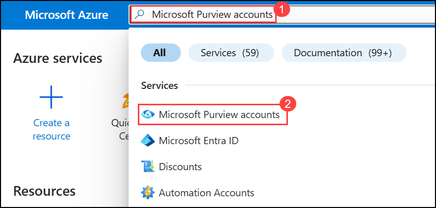

1. On the Microsoft Purview accounts page, click **+ Create**.

    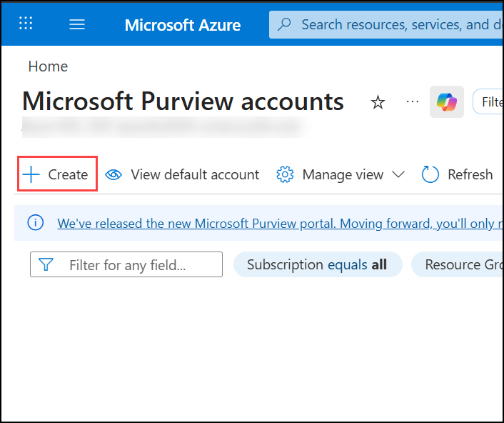

1. On the **Basics** tab, configure the required settings as listed below, and then select **Review + Create (5)**.

    | Setting            | Value |
    |--------------------|-------|
    | Subscription       | Select the default **Subscription (1)** |
    | Resource Group     | Select an existing **Resource Group (2)** |
    | Account name       | **purview-<inject key="DeploymentID" enableCopy="false"/> (3)** |
    | Region             | Select **<inject key="Region" enableCopy="false"/> (4)** |

    

1. And once the validation passes select **Create**.

    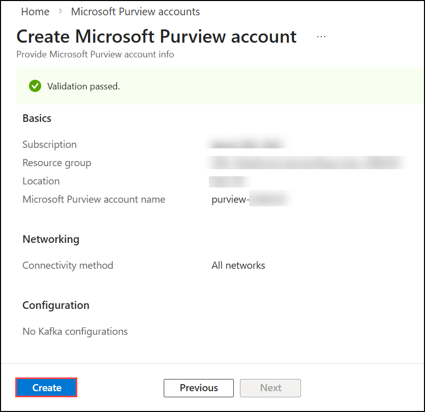

    > **Note:** Deployment may take several minutes to complete.

1. After the deployment is complete, select **Go to resource** to open the newly created **Microsoft Purview account**.

    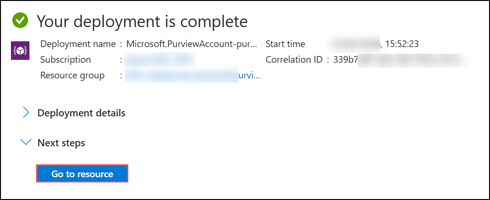

1. On the **Overview** page, scroll to the bottom and select **Microsoft Purview governance portal (New)**. 

    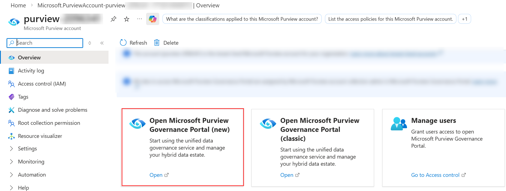

## Task 2: Verify and Assign Data Curator Role in Microsoft Purview

In this task, you will verify that your user account has been assigned the **Data Curator** role at the collection level in Microsoft Purview. The Data Curator role is required to register data sources, configure scans, manage metadata, and perform governance operations within the Data Map. Without this role, you will not be able to proceed with source registration and scanning tasks in this lab.

1. From the left navigation pane of the **Microsoft Purview portal**, click on **Solutions (1)** and select **Data Map (1)**.

    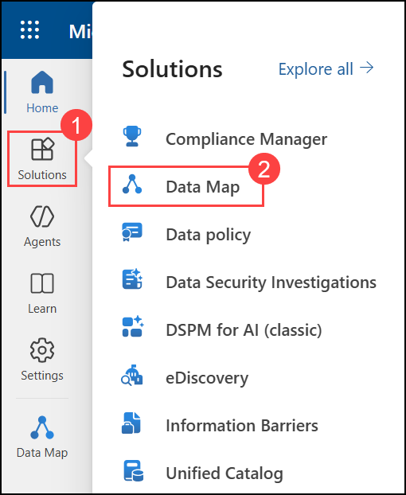

1. Inside Data Map select **Domains (1)** to open the Collections management page.On the **Collections** page, locate and select the root collection **purview-<inject key="DeploymentID" enableCopy="false"/> (2)**. Click on the collection name to open its configuration view.

1. On the selected collection page, click on the **Role assignments (3)** tab located near the top of the page to view governance role assignments for this collection.

1. Scroll down to the **Data curators (4)** section and verify whether your user account appears in the list. Ensure that your display name and email ID are visible and that the **Type** column shows **ODL_User<inject key="DeploymentID" enableCopy="false"/> (5)**.

    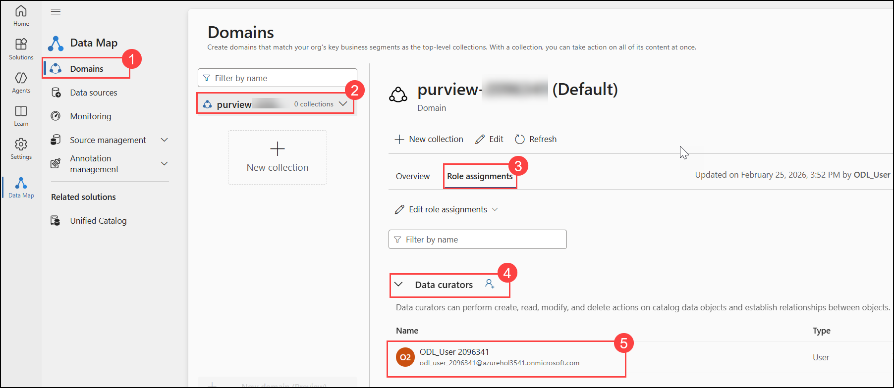

    >**Note:**If your user account does not appear under the Data curators section, follow the steps below:

    1. If your user account does not appear under the **Data curators** section, click on **Edit role assignments**, then click the **+ Add (User icon)** option under Data curators.

         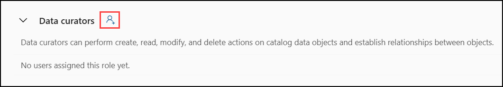

    1. In the search box that appears, enter the email ID **ODL_User<inject key="DeploymentID" enableCopy="false"/> (1)** of the required user, select the appropriate user account from the search results, and then click **OK (2)** to assign the Data Curator role.

          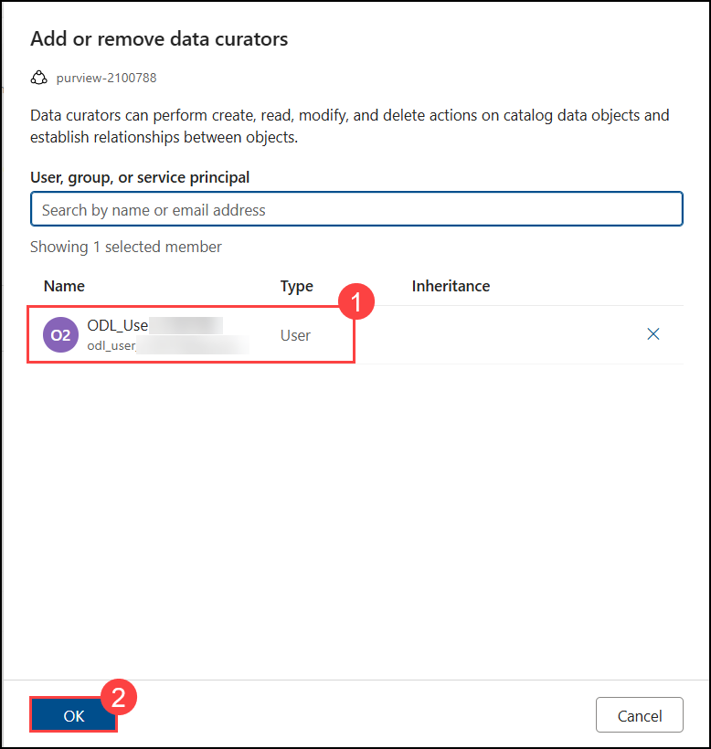

    1. Refresh the page and confirm that the user now appears under the **Data curators** section.

    > **Important:** Managed Identity is required for secure authentication when scanning Azure SQL Database.

## Task 3: Create Azure SQL Database (Data Source Preparation)

In this task, you will create an Azure SQL Database that will be
registered and scanned in Microsoft Purview.

1.  Navigate back to **Azure Portal** page, in the search box at the top, enter **SQL databases (1)** and select **Azure SQL databases (2)** under services.

    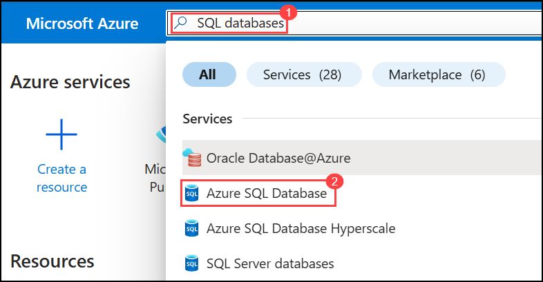

1.  Click **+ Create (1)**, expand the drop-down menu, and select **SQL database (Free Offer) (2)**.

    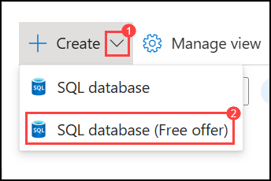

1. On the **Basics** tab of the **Create SQL Database** page, configure the required settings as follows: and Click **Review + Create (5)**

   - Under **Subscription (1)**, select the Default Azure subscription from the dropdown list.

   - Under **Resource group (2)**, select the existing resource group that was created for this lab environment.

   - In the **Database name (3)** field, enter  
     **PurviewDB-<inject key="DeploymentID" enableCopy="false"/>**  
     to uniquely identify the database for this deployment.

   - Under the **Server** section, click **Create new (4)** to create a new logical SQL Server that will host the database.

        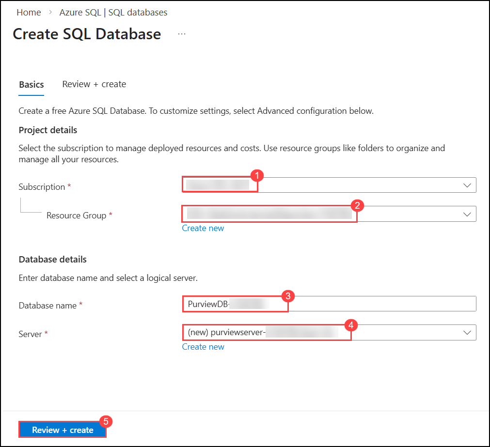

1. On the **Create SQL Server** pane that appears, configure the server settings as follows:

   - In the **Server name (1)** field, enter  
     **purviewserver-<inject key="DeploymentID" enableCopy="false"/> (2)**  
     to ensure the server name is unique within Azure.

   - Under **Location (3)**, keep the default region selected (this should match the region of your resource group unless otherwise required).

   - Under **Authentication method (4)**, ensure that **Use Microsoft Entra-only authentication (5)** is selected.  
     This ensures that authentication to the SQL Server will be managed through Microsoft Entra ID and not through SQL authentication.

   - Review the configuration and click **OK (6)** to create the SQL Server and return to the database configuration page.

     

1.  select **Create**.

    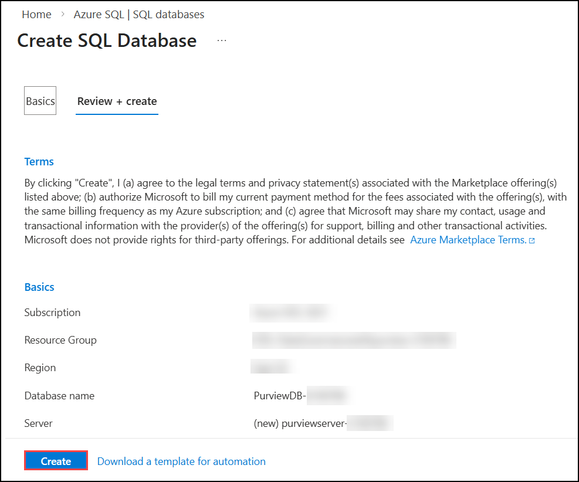

1.  After the deployment is complete, select **Go to resource** to open the newly created **SQL Server**.

    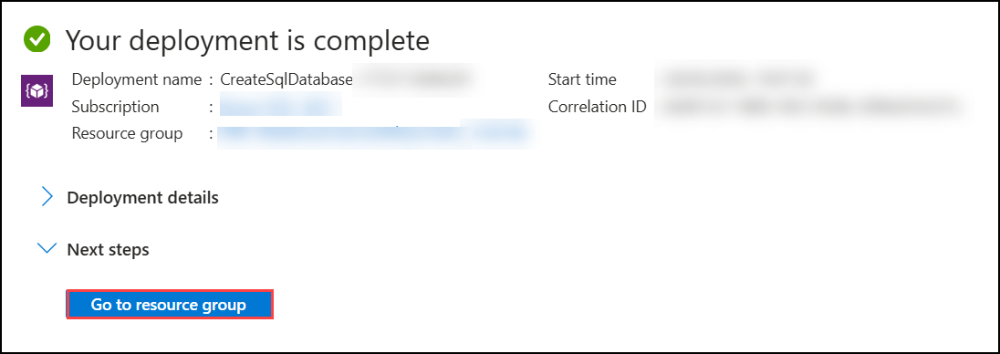

1. Navigate to the **SQL Server resource**, and from the left navigation pane expand **Security (12)**, then select **Networking (13)** to open the networking configuration page.

1. On the same **Networking** page, scroll down to the **Firewall rules** section and click **+ Add your client IPv4 address (14)** to allow your current machine to connect to the SQL Server.

1. Scroll further down to the **Exceptions** section and ensure that the checkbox **Allow Azure services and resources to access this server (15)** is selected. Then click **Save (16)** to apply the changes.

## Task 4: Create Sample Tables and Insert Data

In this task, you will create a sample table and insert data to ensure
Microsoft Purview has metadata available to discover during scanning.

1. Open the  **purviewserver-<inject key="DeploymentID" enableCopy="false"/> (1)**.

1. From the left navigation pane, select **Query editor (Preview) (2)** and sign in using Microsoft Entra authentication option

1. In the query editor window, paste the following SQL script:

``` sql
CREATE TABLE Customers (
    CustomerID INT PRIMARY KEY,
    FullName NVARCHAR(100),
    Email NVARCHAR(100),
    PhoneNumber NVARCHAR(20),
    SSN NVARCHAR(20)
);

INSERT INTO Customers VALUES
(1, 'John Doe', 'john@email.com', '9876543210', '123-45-6789'),
(2, 'Jane Smith', 'jane@email.com', '9876543222', '987-65-4321');
```

1.  Click **Run (3)** to execute the script.

    > **Note:** Columns such as Email and SSN help demonstrate automatic classification during scanning.

## Task 5: Grant Microsoft Purview Access to SQL Database

In this task, you will grant the Microsoft Purview managed identity
access to the SQL database so that it can perform metadata scanning.

1.  Open the **PurviewDB-<inject key="DeploymentID" enableCopy="false"/> database (1)**.

1.  From the left navigation pane, select **Access control (IAM) (2)**.

1.  Click **+ Add (3)** and select **Add role assignment (4)**.

1.  Select the **Reader role (5)**.

1.  Under Assign access to, select **Managed identity (6)**.

1.  Select the **Microsoft Purview Account (7)**.

1.  Click **Review + Assign (8)**.

## Task 6: Register Azure SQL Database in Microsoft Purview Data Map

In this task, you will register the Azure SQL Database as a data source
inside Microsoft Purview Data Map.

1.  Open a browser and navigate to **https://purview.microsoft.com**.

1.  From the left navigation pane of the Microsoft Purview portal,
    select **Data Map (1)**.

1.  Under Data Map, select **Sources (2)**.

1.  On the Sources page, click **+ Register (3)**.

1.  From the list of available source types, select **Azure SQL Database (4)** and click **Continue (5)**.

1.  On the registration page:

    -   Enter **SQLpurview-<inject key="DeploymentID" enableCopy="false"/> (6)** as the source name.
    -   Select the appropriate **Subscription (7)**.
    -   Select the **SQL Server (8)**.
    -   Select the **Database (9)**.

1.  Click **Register (10)**.

    


## Task 7: Configure and Run a Scan

In this task, you will configure a full scan using Managed Identity
authentication and execute the scan to ingest metadata into Microsoft
Purview.

1.  From the **Sources** page, select the registered source
    **SQLpurview-<inject key="DeploymentID" enableCopy="false"/> (1)**.

1.  On the source overview page, click **New Scan (2)**.

1.  In the **Scan name (3)** field, enter **SQL-Weekly-<inject key="DeploymentID" enableCopy="false"/>**.

1.  Under **Authentication method (4)**, select **Managed Identity**.

1.  Under **Scan level (5)**, select **Auto detect (By default)**.

1.  Click **Test connection (7)** to validate connectivity.

> **Note:** Test connection may take 5–10 minutes. Wait until validation completes.

> **Note:** If you encounter an error during Test connection, run the following SQL query in the Azure SQL Database

```
    -- Create user for Purview (if not already created)
    CREATE USER [purview-<inject key="DeploymentID" enableCopy="false"/>] FROM EXTERNAL PROVIDER;

    -- Required minimum roles for scanning
    ALTER ROLE db_datareader ADD MEMBER [purview-<inject key="DeploymentID" enableCopy="false"/>];
    ALTER ROLE db_ddladmin ADD MEMBER [purview-<inject key="DeploymentID" enableCopy="false"/>];

    -- Optional but often required for metadata access
    GRANT VIEW DEFINITION TO [purview-<inject key="DeploymentID" enableCopy="false"/>];

```

1.  After successful validation, click **Run (8)**.

    > **Important:** The first scan is a full scan. Subsequent scans can be configured as incremental scans.

## Review

In this lab, you have:

-   Created and configured Microsoft Purview
-   Assigned required roles and enabled Managed Identity
-   Created Azure SQL Database and sample data
-   Registered the data source in Data Map
-   Configured and executed a scan

You have successfully completed Lab 01: Register and Scan Data Sources
using Microsoft Purview Data Map.