# Lab 1: Purview Environment Setup & Core Configuration 

### Objective:
Configure Microsoft Purview by validating access roles, organizing governance structure using collections and domains, and enabling the Unified Catalog experience.

### Estimated Duration: 20 minutes

### Task 1: Validate Microsoft Purview Account and Access Roles

In this task, you will verify access to the Microsoft Purview account and confirm that the required roles are assigned.

1. In the **Azure portal** home page, scroll down and select **Resource groups**.

    

1. In the **Resource groups** pane, review the list and select **rg-purview-governance-lab**.

     

1. Locate **purview-2146201** and click on it.

    

1. Click **Open Microsoft Purview Governance Portal** to launch the portal in a new tab.

    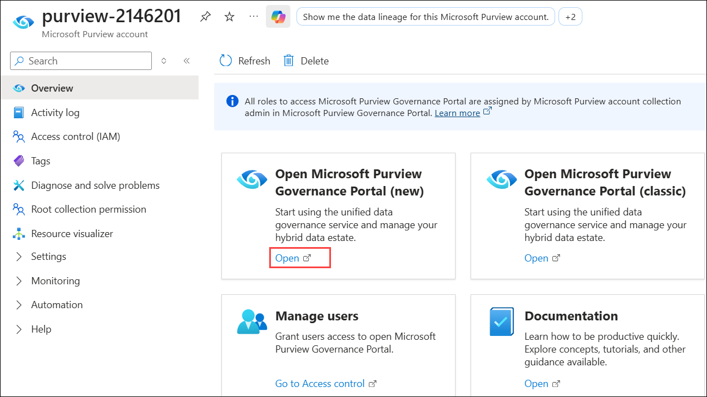

1. When **Welcome to the new Microsoft Purview portal!** pop-up appears, click on **Get started**.

   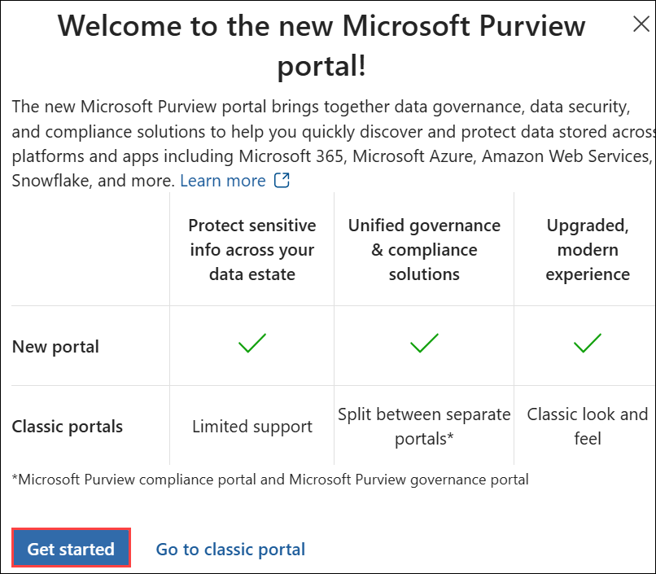
   
1. On the **Microsoft Purview** portal, from the left navigation pane select **Solutions** (1) and then select **Data Map** (2).

   

1. Under **Data Map**, select **Domains (1)**, ensure **purview (2)** is listed, and then click on **Role assignments (3)**.

   

1. Review all the roles assigned to your user account.

   
   
   

### Task 2: Configure Collections, Domains, and Ownership Model (20 min)

1. Now pevioosult task we have cteate the purview and rolle assigneme t now let woke on creating collect and Domain and asisgne to odl user id

1. On the **Data Map**, click on **+ New collection**, name it as **Contoso Data Estate**, in the **Collection domain** search and select the domain, then click on **Create**.

    

1. Once Contoso Data Estate is created, you will see it under **Collections**. Select the ellipsis (**...**) **(1)** next to Contoso Data Estate, then click **+ New sub-collection (2)**.

    

1. On the **New collection** pane, provide **Collection Name** as Fabric Sources, then under **Collection domain** search and select the domain, and click on **Create**.

    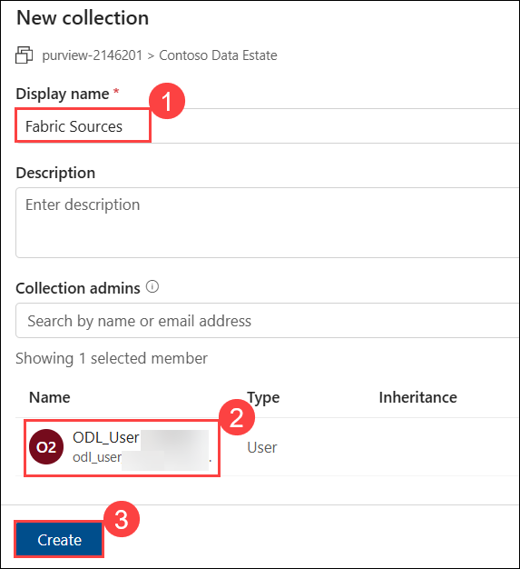

1. Repeat the same steps to create the following collections:   

    | Collection Name | 
    |----------------|
    | `Databricks Sources`| 
    | `Shared Assets` |

   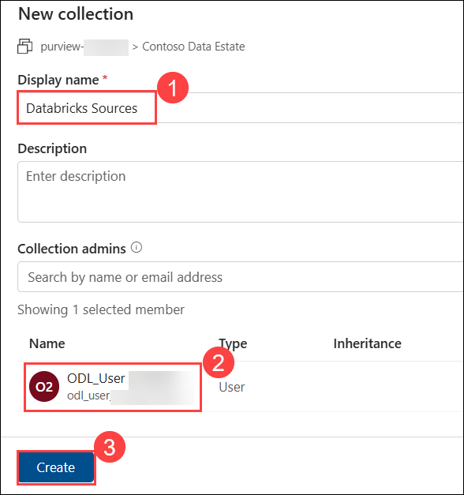

   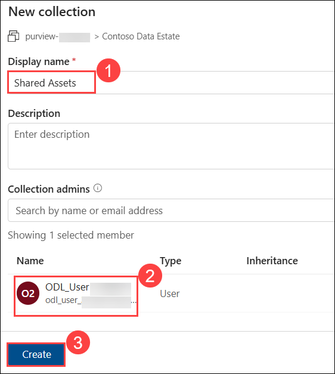

5. Now you should be able to see all **Collections (1)**. Next, let’s create domains. Click on **+ New domain (Preview) (2)**.

   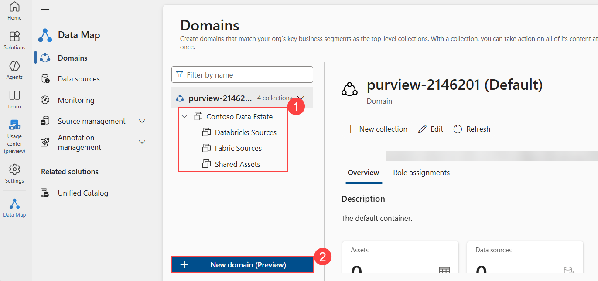
   
7. Create the following domains with the given values:

     - **Name**: Sales & Commerce | **Description**: All sales, orders, and customer data | under **Collection domain**, search and select the domain, then click on **Create**.

        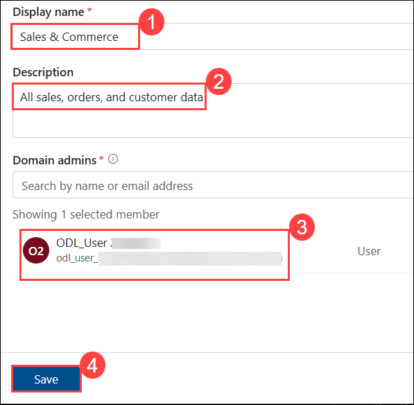
       
    - **Name**: Human Resources | **Description**: Employee PII and HR data | under **Collection domain**, search and select the domain, then click on **Create**.

        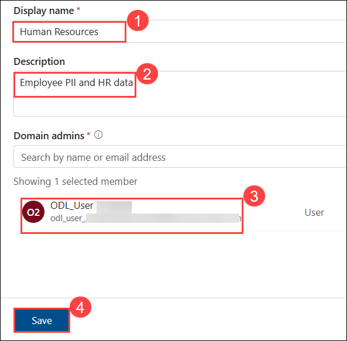

9. Now **Set Data Ownership**. This has already been done by assigning ownership to your user account while creating the collections and domains. Now, you can explore the assigned roles and permissions.  

1. Click on any of the **Collections** or **Domain**  and select **Role assignments**. You should see your user account listed, as ownership was assigned during the creation of the collection.

    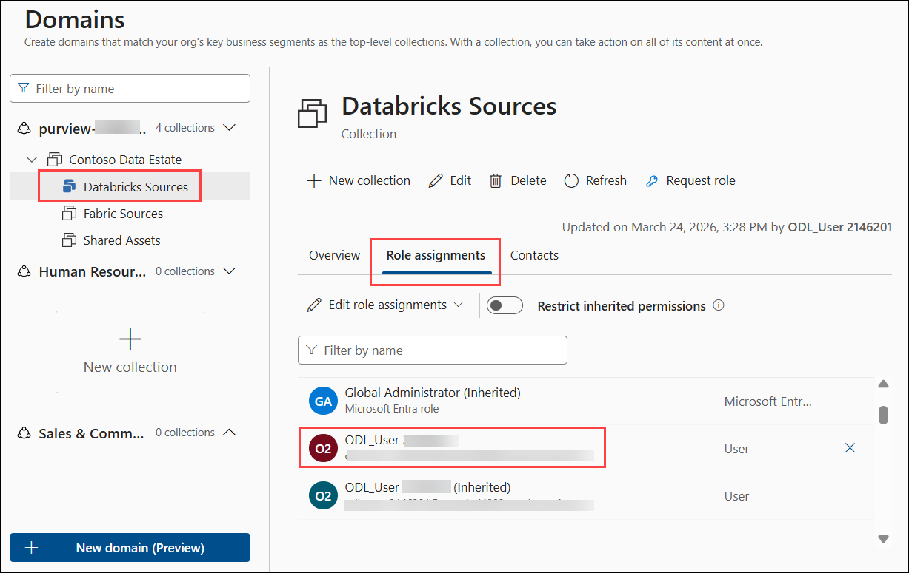

     
    
  **> Note:** You can assign ownership either while creating a collection or domain, or after creation by editing the collection or domain and updating the ownership settings. 

### Task 3: Enable Unified Catalog Experience

> **What is Unified Catalog?** Unified Catalog is the business friendly layer on top of Data Map. It lets business users discover data assets, browse data products, and access the enterprise glossary  without needing to understand the technical Data Map structure.

1. In your tenant, the **Unified Catalog** experience is already enabled. In this task, you will review its features.

1. In the **Microsoft Purview portal**, from the left navigation pane, click on **Unified Catalog**. On the overview page, review the available features and explore different sections to understand the interface.

     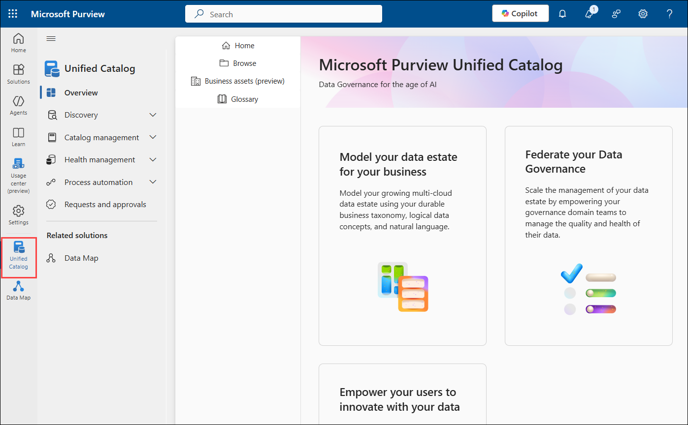
    
1. You can also navigate to **Settings** → **Account** to review the account type and configuration.

    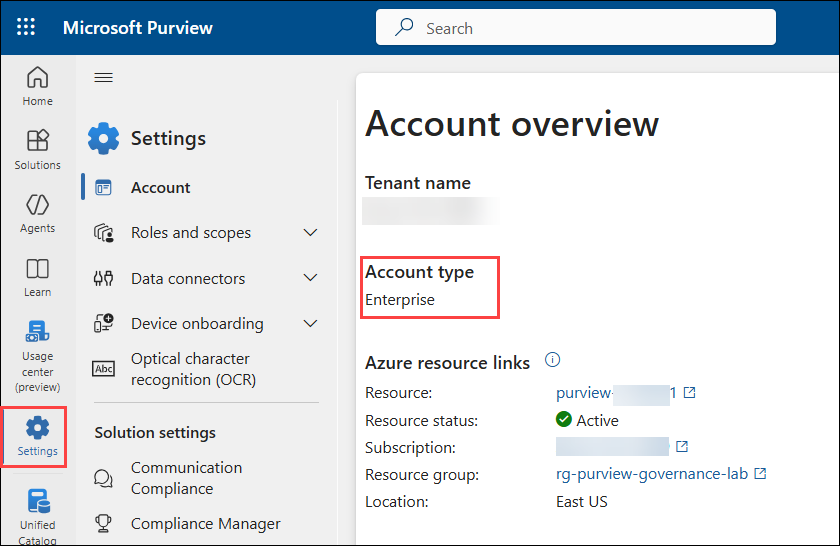 

