# Lab 1: Purview Environment Setup & Core Configuration 

## Lab Overview

In this lab, you will explore how to set up and validate your data governance environment using Microsoft Purview. You will begin by verifying access roles and permissions, then organize your data estate using collections and domains. Finally, you will explore the Unified Catalog experience to understand how business users interact with governed data.

This lab focuses on building the foundational structure required for effective data governance, ensuring that access, organization, and discoverability are properly configured before working with actual data assets.

> **Note:** This lab involves guided configuration steps, but some components may already be preconfigured to simulate a real-world governance environment.

## Lab Objectives

In this lab, you will perform the following:

- **Task 1:** Validate Microsoft Purview account and access roles  
- **Task 2:** Configure collections, domains, and ownership model  
- **Task 3:** Explore and understand the Unified Catalog experience  

### Estimated Duration: 20 minutes

### Task 1: Validate Microsoft Purview Account and Access Roles

In this task, before working with governance features, you will verify that you have the correct permissions. You will access the Microsoft Purview portal and review assigned roles to ensure you can perform governance operations.

**Why it matters:**
Without proper roles, you won’t be able to create collections, domains, or manage data access.

In this task, you will verify access to the Microsoft Purview account and confirm that the required roles are assigned.

1. In the **Azure portal** home page, scroll down and select **Resource groups**.

    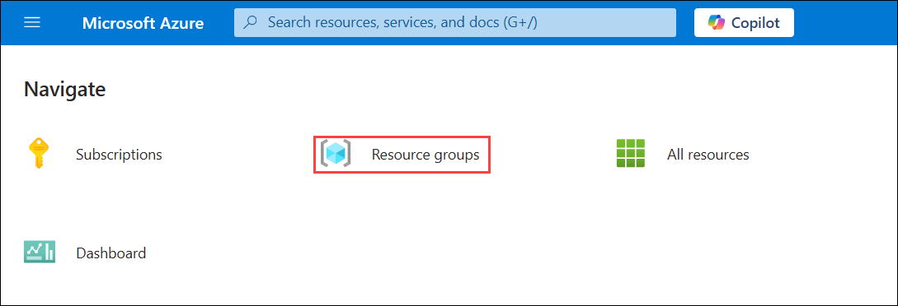

1. In the **Resource groups** pane, review the list and select **rg-purview-governance-lab**.

     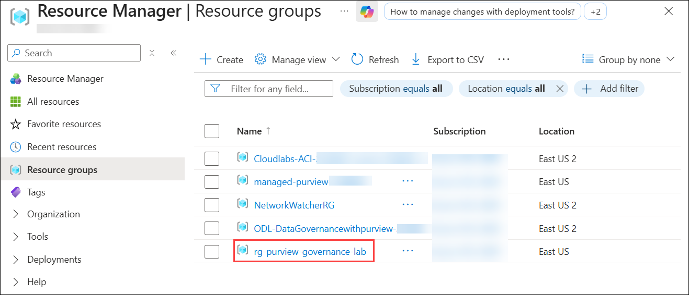

1. Locate **purview-<inject key="DeploymentID" enableCopy="false"/>** and click on it.

    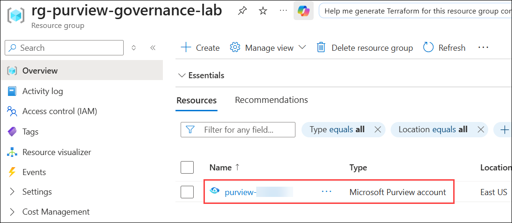

1. Click **Open Microsoft Purview Governance Portal** to launch the portal in a new tab.

    

   **>Important**: If you are unable to launch the **Open Microsoft Purview Governance Portal**, use the portal link https://purview.microsoft.com/. From the new Purview portal, follow the steps below to enable the unified portal experience:

    - From the left navigation pane, select **Settings** > **Account**, then click the **Upgrade** button to update the portal experience from **Classic** to **Enterprise**.

1. When **Welcome to the new Microsoft Purview portal!** pop-up appears, click on **Get started**.

   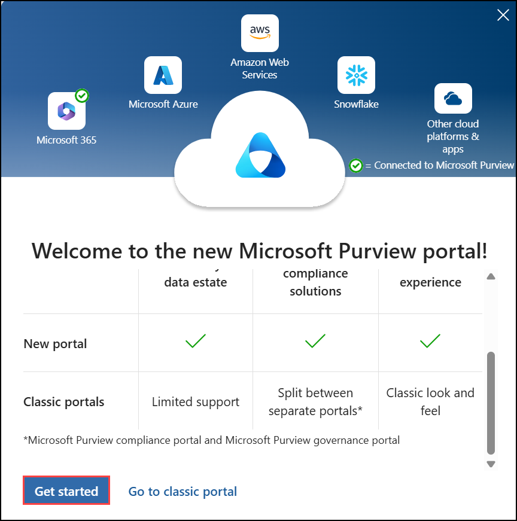
   
1. On the **Microsoft Purview** portal, from the left navigation pane select **Solutions (1)** and then select **Data Map (2)**.

   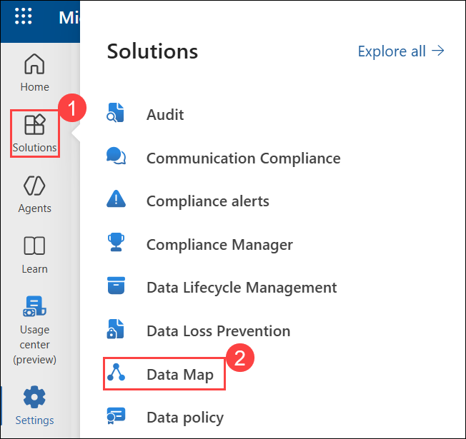

1. Under **Data Map**, select **Domains (1)**, ensure **purview (2)** is listed, and then click on **Role assignments (3)**.

   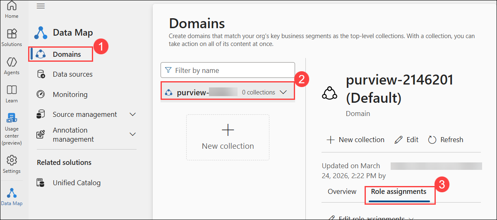

1. Review all the roles assigned to your <inject key="AzureAdUserEmail" enableCopy="true"/> account.

   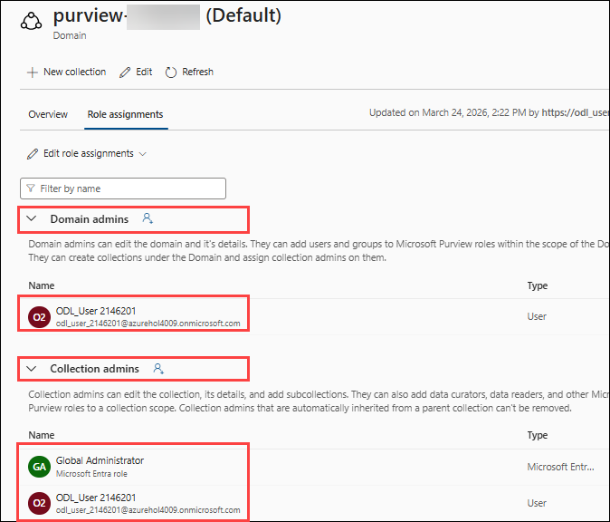
   
   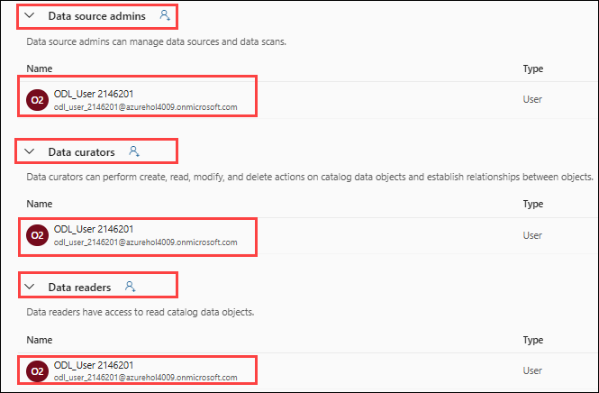

1. Notice that **Domain admins** is not assigned. To assign the role, click the **+ Add (1)** icon next to **Domain admins**. In the search bar, search for and select **<inject key="AzureAdUserEmail" enableCopy="true"/> (2) (3)**, then click **OK (4)**.

   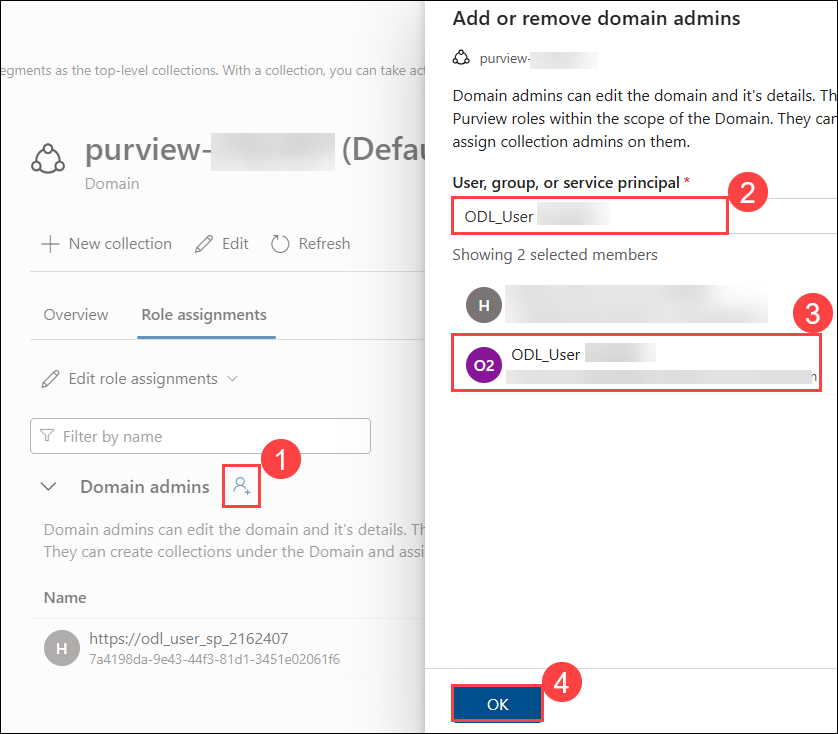

### Task 1.1: Assign User to Data Governance Role Group

1. In the **Microsoft Purview portal**, go to **Settings (1)** > expand **Roles and scopes (2)** → select **Role groups (3)**.

    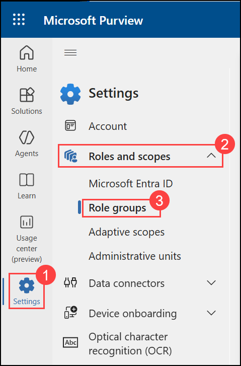

1. Search for **Data Governance (1)**, then press **Enter** to view the results. Select the **Data Governance role group (2)**, and click **Edit (3)**.

    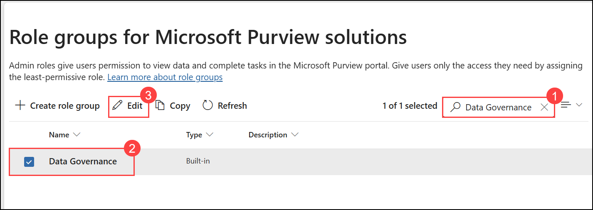

1. Click **Choose users (1)**, select the required user (2), and click **Select (3)**.

      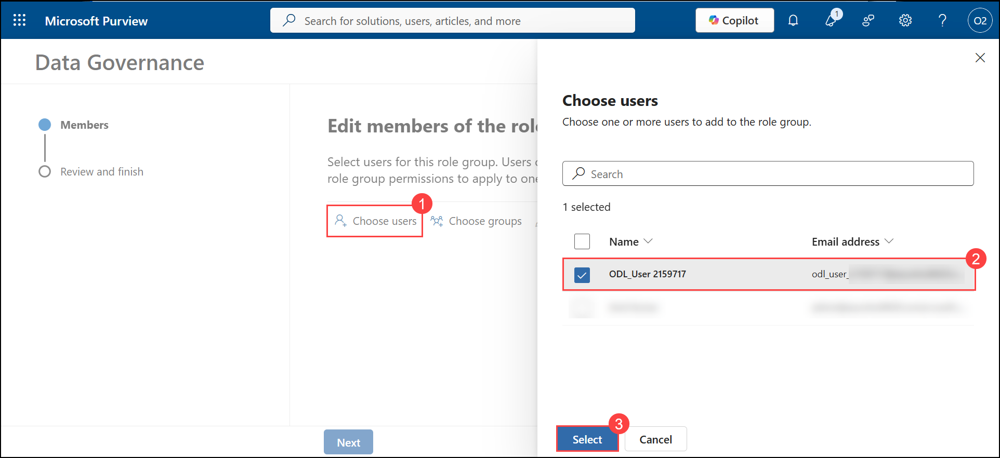

1. On the **Edit members of the role group** page, click on **Next** 

1. Review the details and click **Save** to assign the user to the role group.

      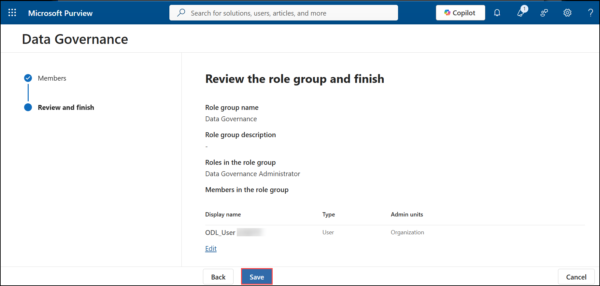

1. On the **You successfully updated the role group** page, click on **Done**.

   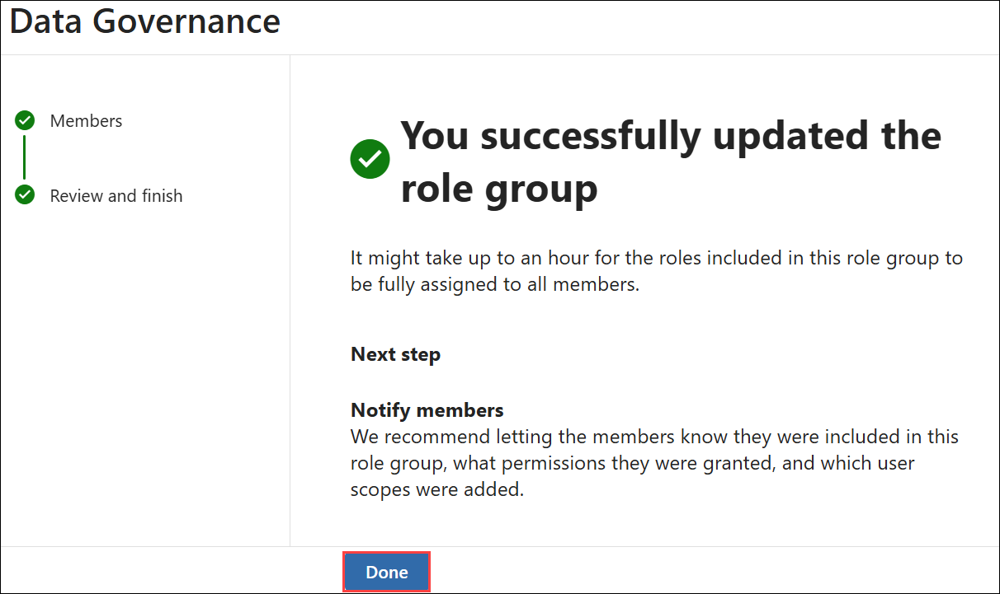

1. Now, access the **Data Governance Administrators** role to review and explore additional options in the **Unified Catalog**.

2. From the portal, click the **Settings (1)** icon in the top-right corner, then select **Unified Catalog (2)**.

    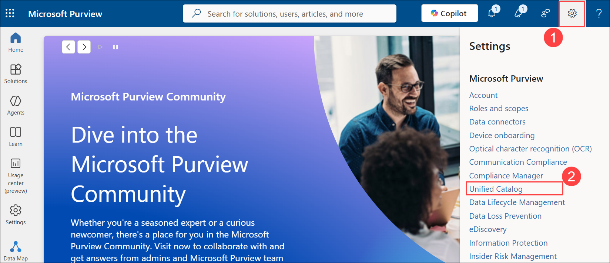
   
4. You will be navigated to the **Unified Catalog**. Review the **Roles and permissions** pane.

    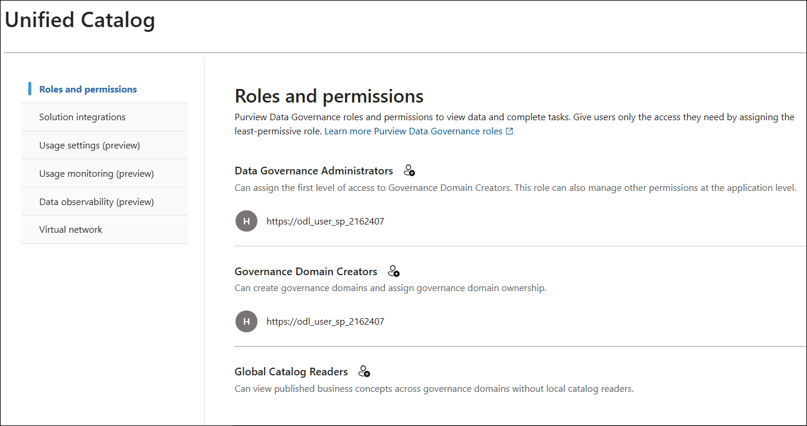
   
6. Under the **Roles and permissions** pane, review each role. For **Data Governance Administrators**, click the **+ Add (1)** icon, search for and select your <inject key="AzureAdUserEmail" enableCopy="true"/> **(2) (3)**, then click **Add (4)**.

    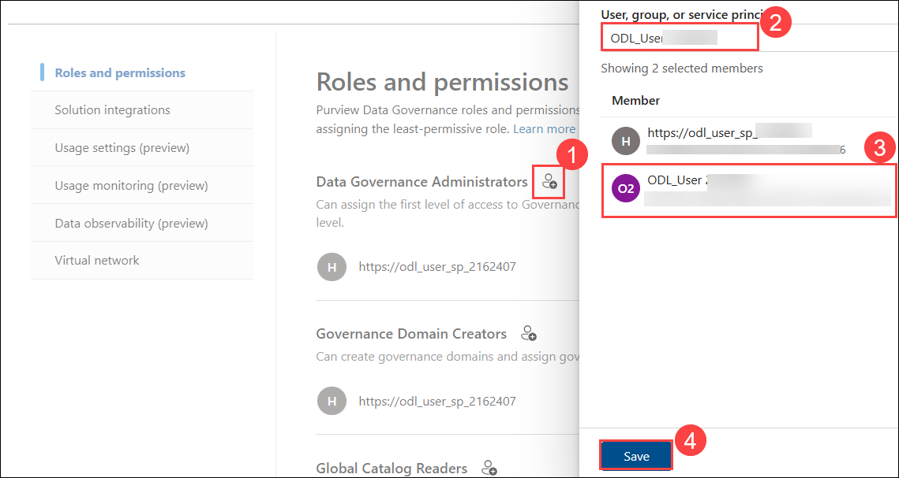

7. Repeat the same steps for the remaining roles:
   - **Governance Domain Creators**
   - **Global Catalog Readers**
   - **Data Health Owners**
   - **Data Health Readers**

### Task 2: Configure Collections, Domains, and Ownership Model (20 min)

This task focuses on structuring your data environment logically using collections and domains. You will organize data sources (like Fabric and Databricks) and categorize them into business domains.

1. Now pevioosult task we have cteate the purview and rolle assigneme t now let woke on creating collect and Domain and asisgne to odl user id

1. In the **Domains** page, click **New collection (1)**, enter **Contoso Data Estate (2)**, under **Collection admins (3)** search for **ODL-User** and select **<inject key="AzureAdUserEmail" enableCopy="true"/>**, ensure **ODL_User<inject key="DeploymentID" enableCopy="false"/> (4)** is selected, and then click **Create (5)**.

    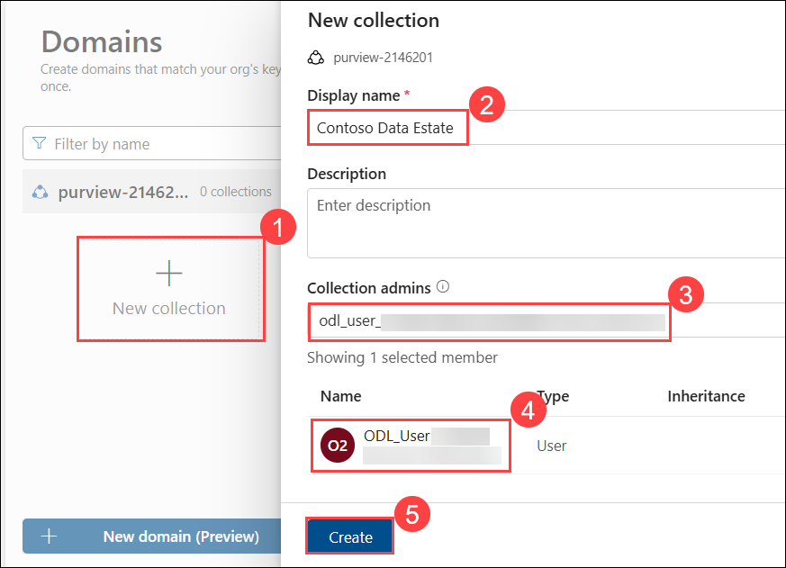

1. Once Contoso Data Estate is created, you will see it under **Collections**. Select the ellipsis (**...**) **(1)** next to Contoso Data Estate, then click **+ New sub-collection (2)**.

    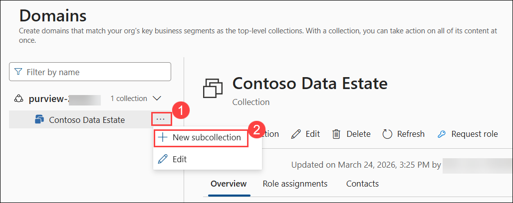

1. On the **New collection** pane, provide **Collection Name** as **Fabric Sources (1)**,  under **Collection admins (2)** search for **ODL-User** and select **<inject key="AzureAdUserEmail" enableCopy="true"/>**, ensure **ODL_User<inject key="DeploymentID" enableCopy="false"/> (3)** is selected, and then click **Create (4)**

    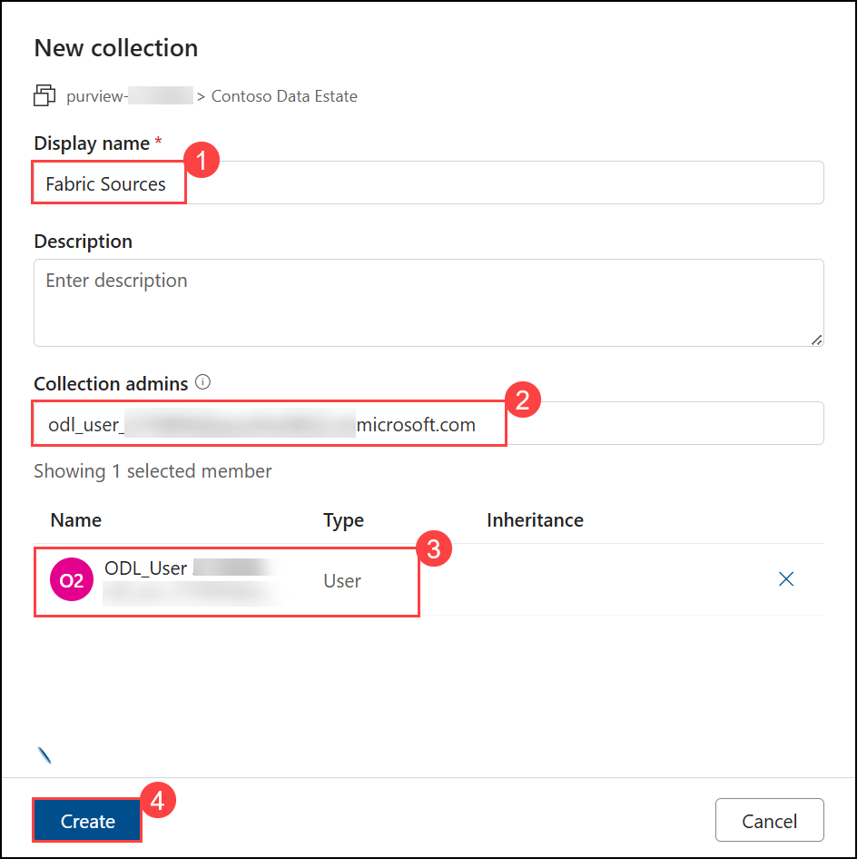

1. Repeat the same steps to create the following collections:   

    | Collection Name        |
    |------------------------|
    | `Databricks Sources`   |
    | `Shared Assets`        |

   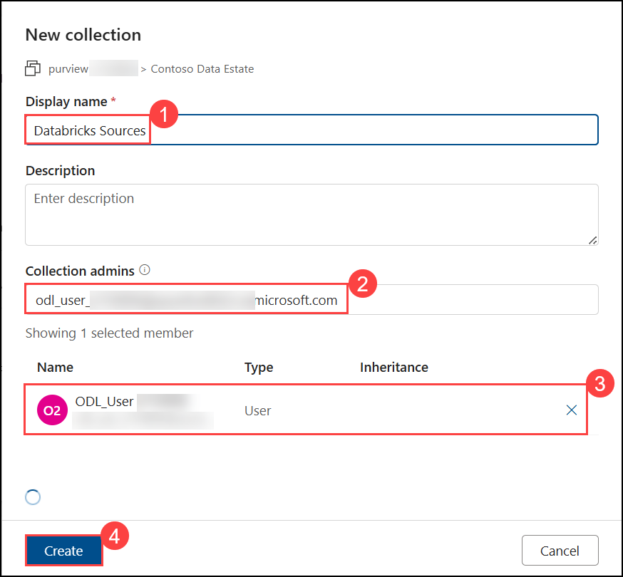

   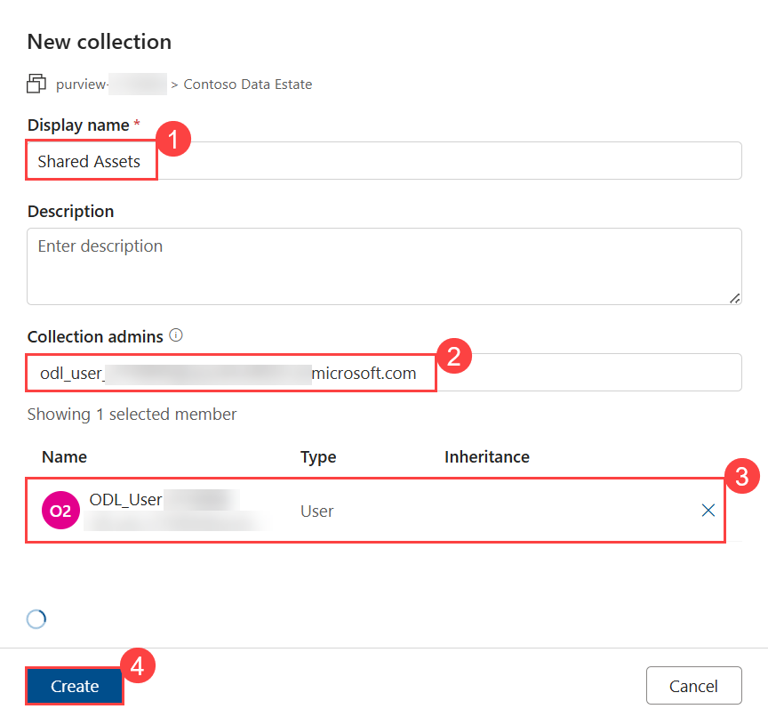

1. Verify that the collections **Databricks Sources**, **Fabric Sources**, and **Shared Assets** are successfully created under **Contoso Data Estate**.

     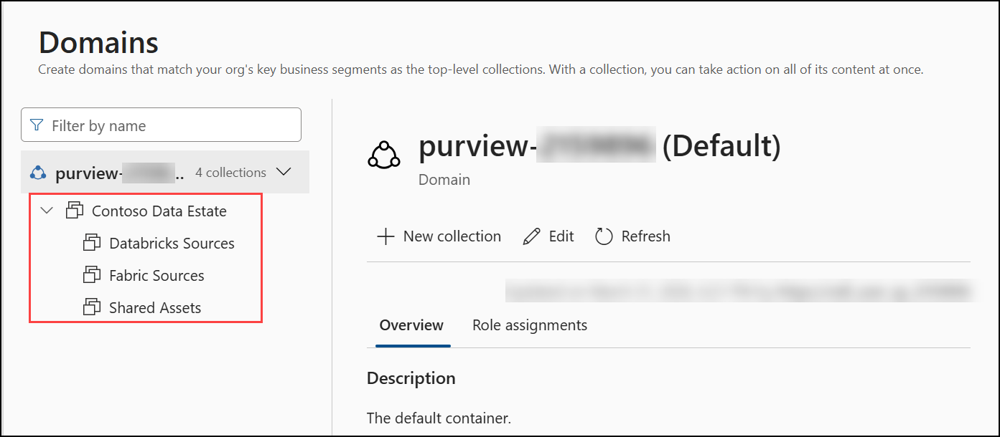

1. In the **Domains** page, click **New domain (1)**, enter **Sales & Commerce (2)**, provide the description as **All sales, orders, and customer data (3)**, verify the user under **Domain admins (4)** is selected as **ODL_User<inject key="DeploymentID" enableCopy="false"/> (5)**, and then click **Create (6)**.

    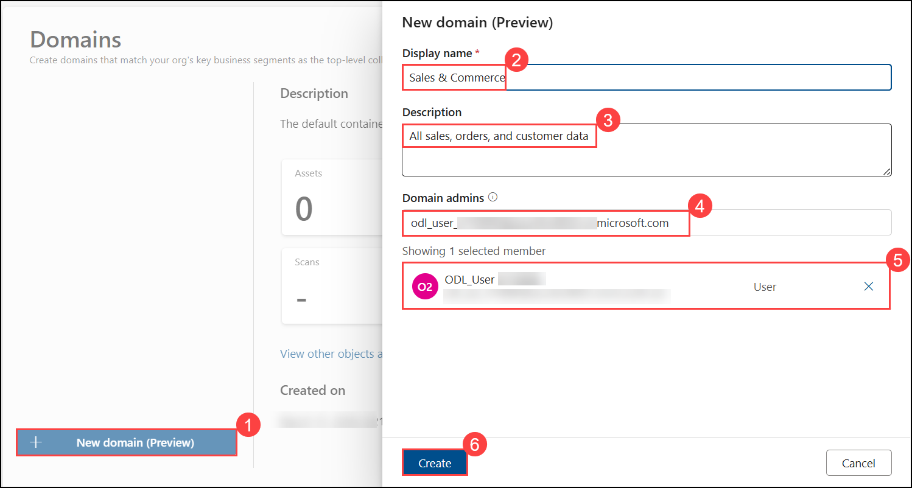
       
1. In the **Domains** page, click **New domain (1)**, enter **Human Resources (2)**, provide the description as **Employee PII and HR data (3)**, verify the user under **Domain admins (4)** is selected as **ODL_User<inject key="DeploymentID" enableCopy="false"/> (5)**, and then click **Create (6)**.

    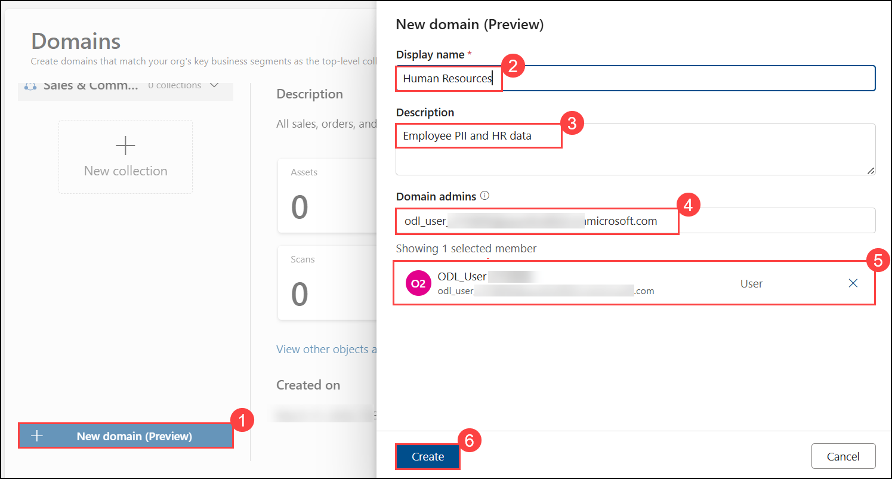

1. Now **Set Data Ownership**. This has already been done by assigning ownership to your user account while creating the collections and domains. Now, you can explore the assigned roles and permissions.  

1. Click on any of the **Collections** or **Domain (1)**  and select **Role assignments (2)**. You should see your **user account (3)** listed, as ownership was assigned during the creation of the collection.

    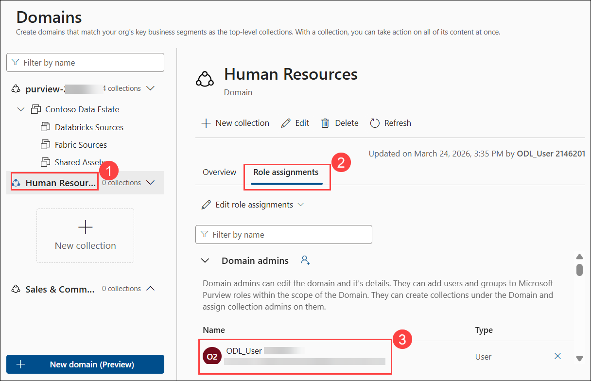 
    
    >**Note:** You can assign ownership either while creating a collection or domain, or after creation by editing the collection or domain and updating the ownership settings. 

### Task 3: Enable Unified Catalog Experience

In this task, you explore the Unified Catalog, a business-friendly interface that sits on top of the technical Data Map.

> **What is Unified Catalog?** 
> Unified Catalog is the business friendly layer on top of Data Map. It lets business users discover data assets, browse data products, and access the enterprise glossary  without needing to understand the technical Data Map structure.

1. In your tenant, the **Unified Catalog** experience is already enabled. In this task, you will review its features.

1. In the **Microsoft Purview portal**, from the left navigation pane select **Solutions (1)** and click **Unified Catalog (2)**. On the overview page, **review** the available features and explore the interface.

     

     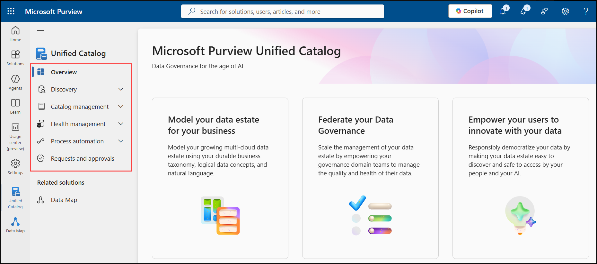
    
1. In the **Microsoft Purview portal**, from the left navigation pane select **Settings (1)**, click **Account (2)**, and review the **Account type (3)** on the overview page.

    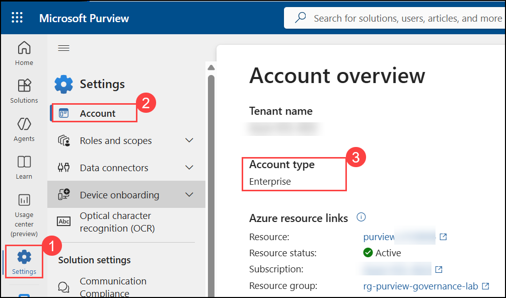 

## Summary

In this lab, you set up and validated your Microsoft Purview governance environment by verifying access roles and permissions, organizing the data estate using collections and domains, assigning ownership for governance control, and exploring the Unified Catalog experience for business-friendly data discovery.

## Click Next to continue to the next lab.

