# Day 1 Lab 2: Connect Microsoft Fabric to Purview

## Before You Begin: Create a Fabric Workspace with Data

> **What is Microsoft Fabric?** Fabric is Microsoft's unified analytics platform. A single workspace can contain Lakehouses (for data engineering), Warehouses (for SQL analytics), Notebooks, Pipelines, and Semantic Models — all stored in OneLake.

**Step 1: Open Fabric Portal and Create a Workspace**

1. In a new browser tab, navigate to **`https://app.fabric.microsoft.com`**

1. On **Enter your email, we'll check if you need to create a new account.** enter your **Email/Username:** <inject key="AzureAdUserEmail" enableCopy="true"/>.

   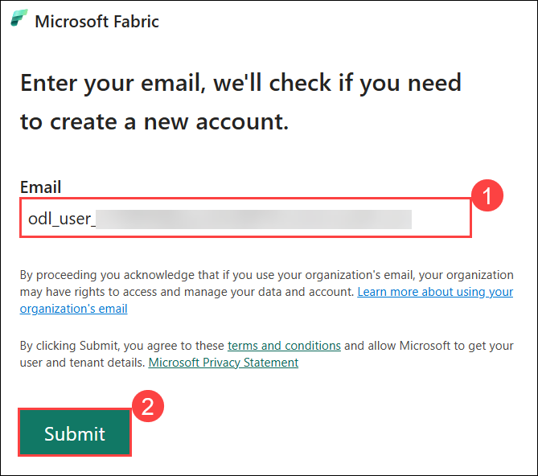

1. On the Fabric portal, from the top-right corner, select the **Profile icon (1)**, then click on **Free trial (2)**.
   
    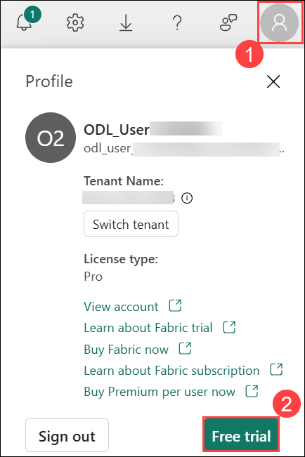
   
3. On the **Activate your 60-day free Fabric trial capacity** window, click on **Activate**.

   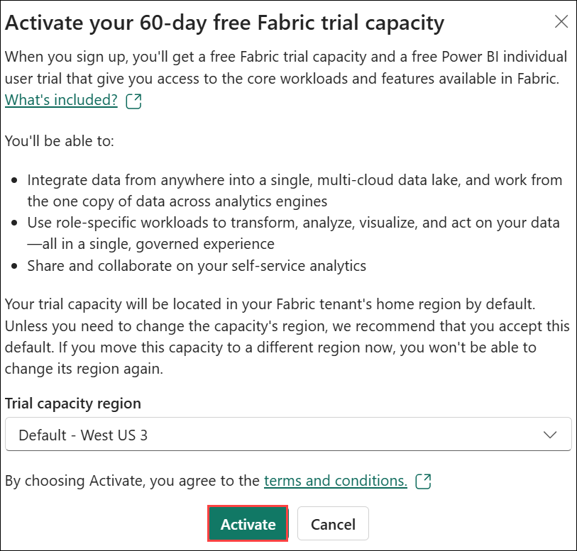

5. When the **Successfully upgraded to a free Microsoft Fabric trial** message appears, click on **OK**.

   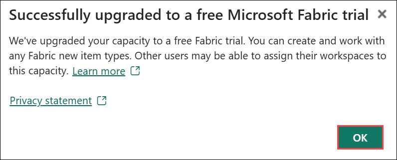

7. When the **Invite teammates to try Fabric to extend your trial** pop-up appears, click on **Cancel (X)**.

1. At the top of the page, click on **Settings (1)**. From the dropdown, under **Governance and Insights**, select **Admin portal (2)**.

   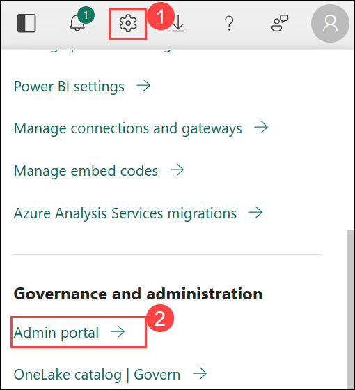

3. Ensure you are in **Tenant settings (1)**. In the search bar, search for **Admin API (2)** and verify that all four related settings.
4. Expand each and enable the toggle for all 4 
   
1. In the left sidebar, click **Workspaces** → **+ New workspace**.

    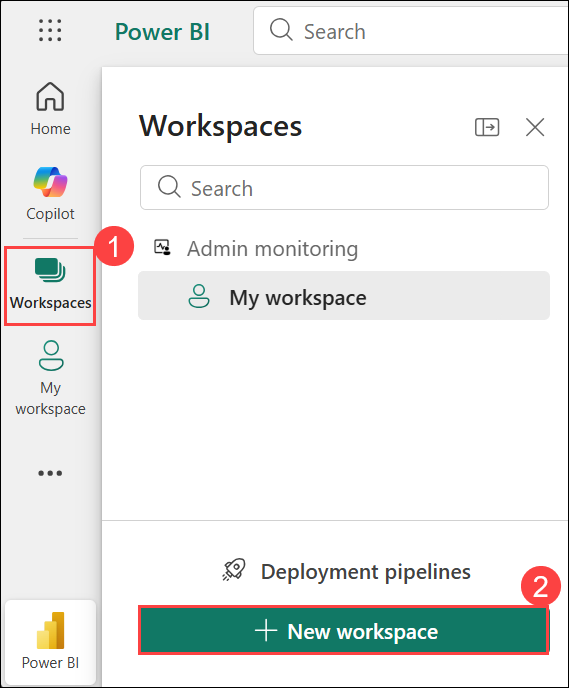

1. Configure:

   - **Name**: **`Purview-Lab-WS` (1)**
   - Expand **Advanced** then select the **License mode** to **Trial (2)**.
   - Click **Apply (3)**

       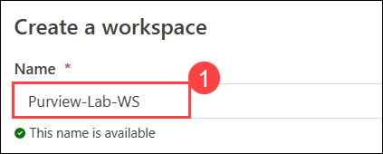

       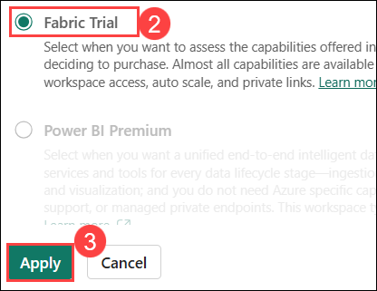

13. You should now be inside the `Purview-Lab-WS` workspace.

     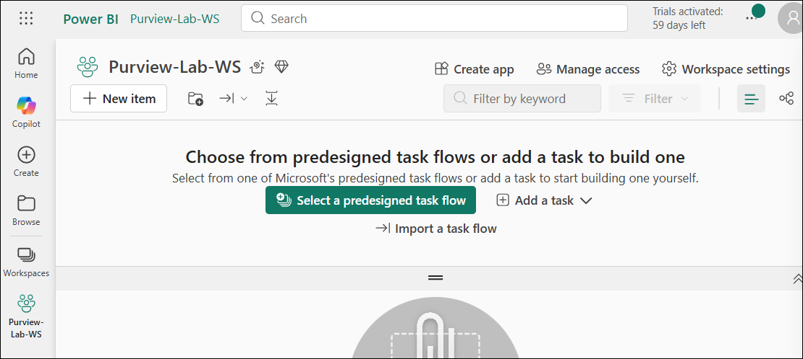

**Step 2: Create a Lakehouse with Sample Data**

1. Click **+ New item** then search and select **Lakehouse**.
    
    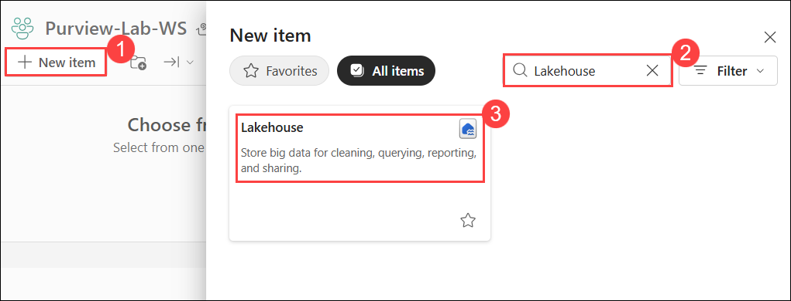
   
1. On the **New Lakehouse** pane, provide **Name**- **`PurviewLakehouse` (1)**, then click **Create (2)**.

   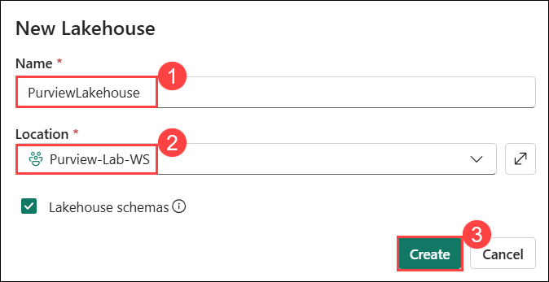
   
1. Once the Lakehouse opens, click **Start with a sample**.

   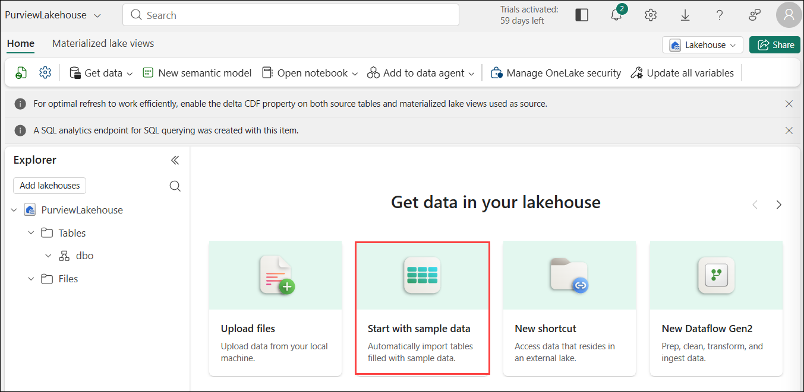
   
1. Select **Retail Data Model from Wide World Importers**.

    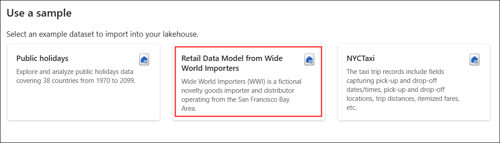
    
    - Wait for the data loading to complete (1 - 2 minutes)

15. After loading, expand **Tables** in the Explorer pane. You should see tables like:
    
    - `dimension_city`, `dimension_customer`, `dimension_employee`, `dimension_stock_item`
    - `fact_sale`, `fact_order`, `fact_purchase`
    - And several more dimension/fact tables

      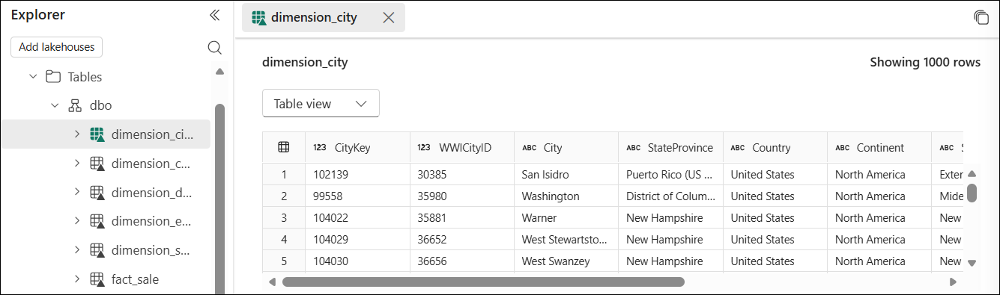
   
**Step 2: Upload Vendors Data to Fabric Lakehouse**

1. Now, add another file that contains vendors tables.

2. Click on **Files**, then select **Get data**, and click on **Upload files**.

   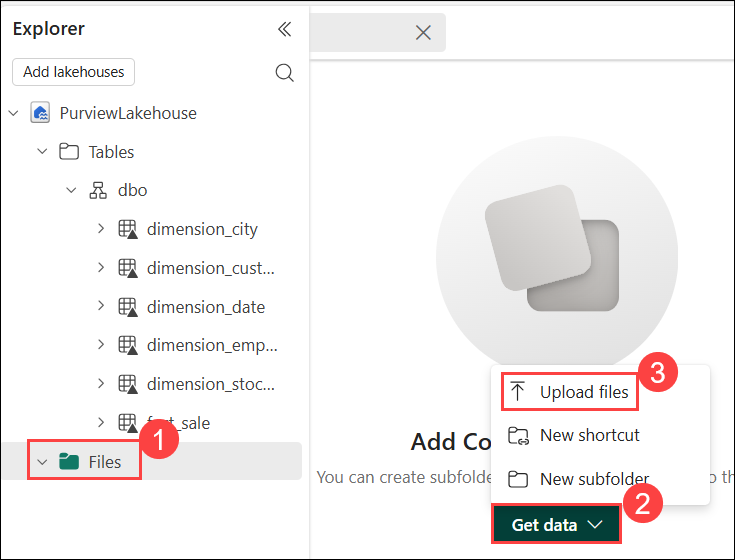
    
3. Click the **file icon**, then select the `vendors.csv` file.

4. Verify the file then click on **Upload**.

6. Once the upload is complete, click **Close** from the top-right corner.

9. Once uploaded, you should see `vendors.csv` in the Files section.
   
11. Right-click **`vendors.csv` (1)** > select **Load to Tables (2)** > **New table (3)**.

     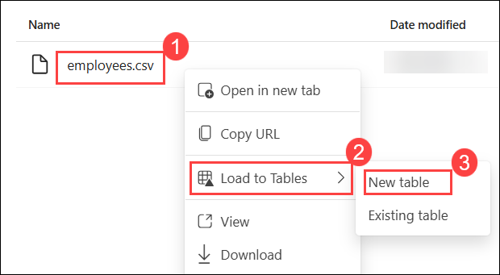
    
1. On **Load file to new table**  keep all settings as it is then click **Load**.

   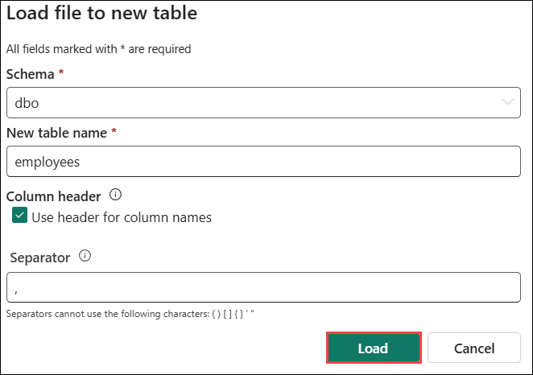
   
1. Wait for the load to complete — the `vendors` table now appears under **Tables**

     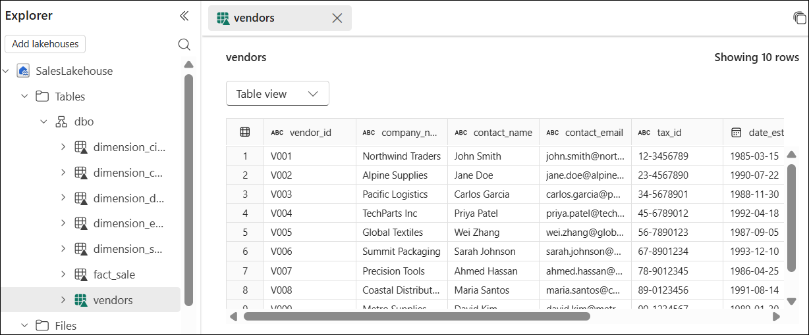

1. Click on `vendors` → verify the data: 10 rows with columns.

**Step 4: Create a Semantic Model from the Lakehouse**

1. While still in the Lakehouse, click **New semantic model** in the top toolbar. Provide **Name**: `PurviewLakehouse` (same name as the Lakehouse). In the table selection, **select all tables**, then click **Create**.

    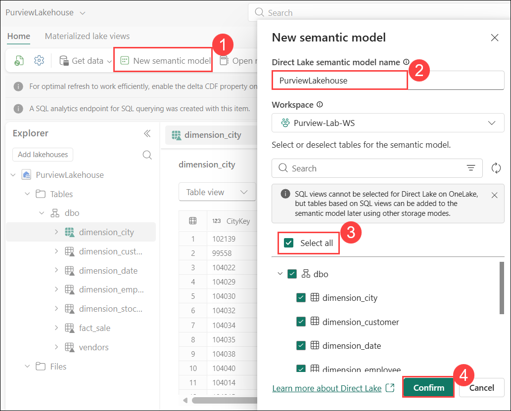
    
    - Wait for the semantic model to be created (a few seconds)
    - This creates the BI/reporting layer on top of the Lakehouse Delta tables

**Step 5: Create a Warehouse with Sales Data**

1. Go back to the workspace click **+ New item (1)** then search and select **Warehouse (2) (3)**.

    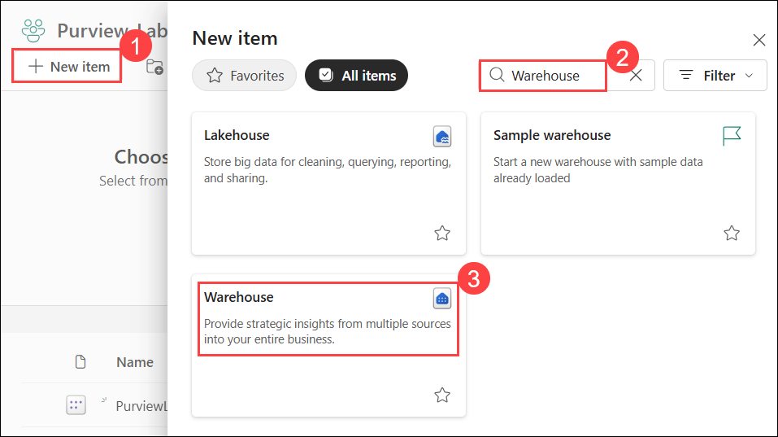
    
1. On the **New warehouse** window, provide **Name**: **`PurviewsWarehouse` (1)**, then click **Create (2)**.

    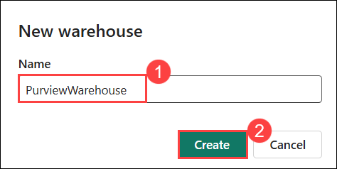

1. Once the Warehouse opens, click **New SQL query** (top toolbar). Copy and paste the entire SQL script from the file **warehouse-sales-orders.sql** (provided with the lab materials). Click **Run (▶)** and wait for the query to complete.

    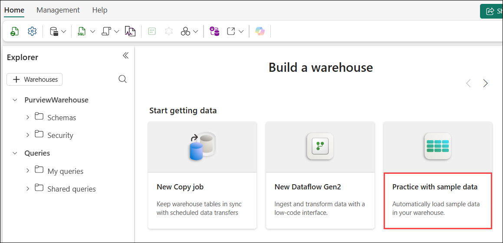

1. In the **Explorer** pane, right-click **Tables**, click **Refresh**, expand **dbo**, then **Tables**, and verify that the `sales_orders` table appears with 15 records.

    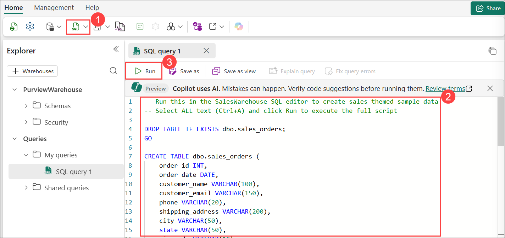

**Step 6: Create a Data Pipeline**

> This pipeline moves vendor data from the Lakehouse to the Warehouse. You'll use it in Lab 4 to demonstrate data lineage in Purview.

1. Go back to the workspace, click **+ New item (1)**, search for and select **Pipeline (2) (3)**.

    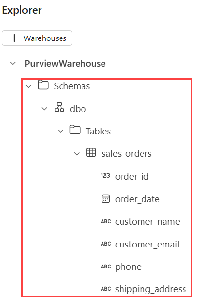
    
1. On the **New pipeline** pane, provide **Name** **`Vendor-ETL-Pipeline` (2)**, then click **Create (2)**.

    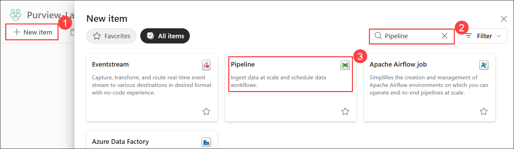

1. In the pipeline canvas from the top menu, click **Copy data (1)** and select **Add copy data activity (2)**

   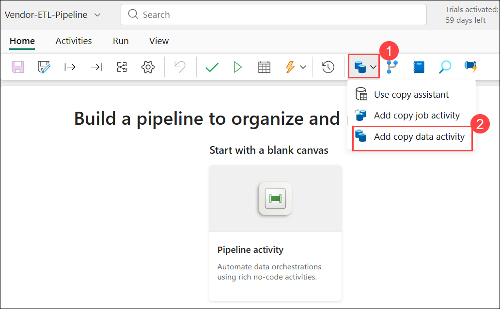
   
1. Click on the **Source (1)** tab. For **Connection**, select the dropdown **(2)**, then click on **Browse all (2)**.
   
   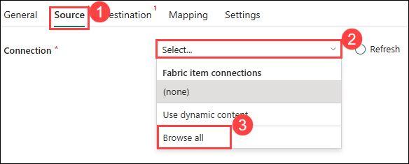
   
     - Select **Microsoft Fabric Lakehouse** named **`PurviewLakehouse`**
     - Under **Table**, browse and select: **`dbovendors`**

       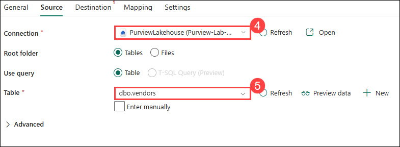

1. Click on **Destination** tab. Next to **Connection**, select the dropdown, then click on **Browse all (2)**.

   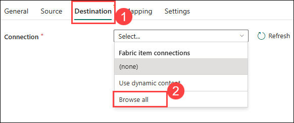
   
     - Select **Microsoft Fabric Warehouse** → select **`PurviewWarehouse`**
     - Under **Table option**, select **Auto create table**
     - Enter **Table name**: **`stg_vendors`**

       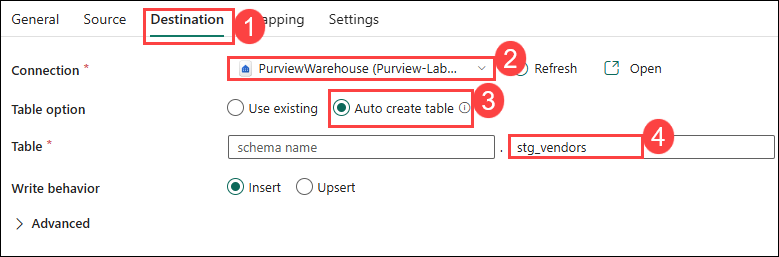

1. Click **Run** → click **Save and run** if prompted.

    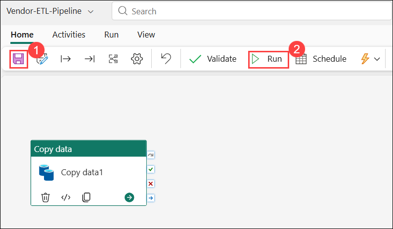
    
1. Wait for the pipeline to complete (1-2 minutes) → verify **Status: Succeeded**.

     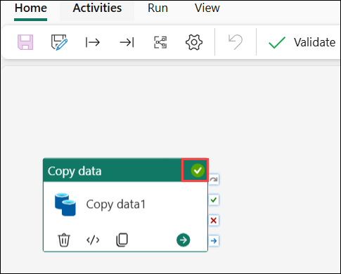
    
1. Go back to the workspace → click **PurviewWarehouse** → expand **dbo** → **Tables** → verify `stg_vendors` appears with 10 vendor records.

    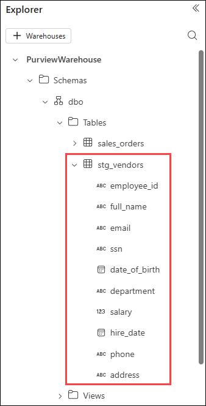

      **Expected Result**: **`Purview-Lab-WS**` workspace now contains 6 items:
      - `PurviewLakehouse`:  Wide World Importers retail data + vendors table (Lakehouse)
      - `PurviewLakehouse`:  SQL analytics endpoint (auto-created)
      - `PurviewLakehouse`:  Semantic model (includes vendors table)
      - `PurviewWarehouse`:  Sample warehouse data + stg_vendors (Warehouse)
      - `Vendor-ETL-Pipeline`:  Data pipeline (Lakehouse → Warehouse)
      - `vendors.csv`:  Uploaded file in Lakehouse Files
      
### Creating sceciirty grouo 

1. Open the **Azure portal** in a new browser tab. Use the search bar to find and select **Groups**.

    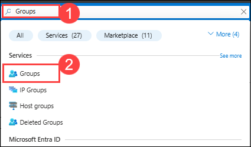

3. On the **Groups overview (1)** page, click on **+ New group (2)**.

    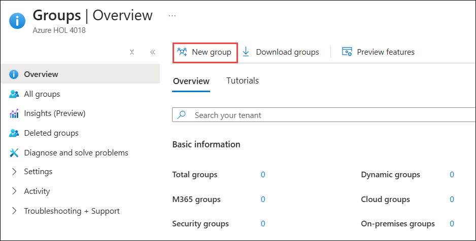
   
5. Fill in the following details:

   - **Group type (1)**: Security  
   - **Group name (2)**: `Purview-security-Group`  
   - **Microsoft Entra roles can be assigned to the group (3)**: Yes  

      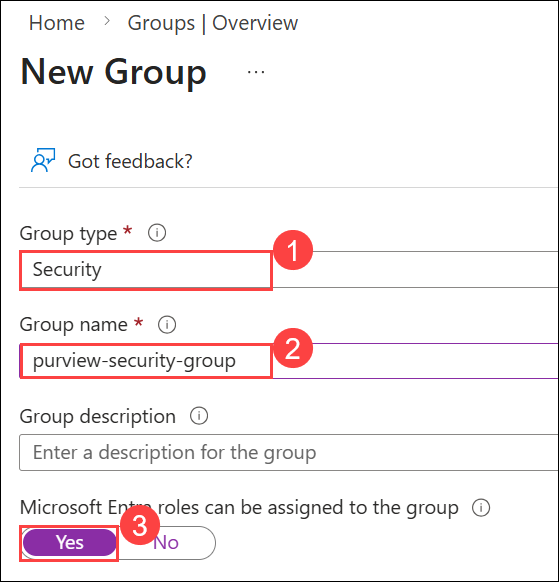
     
6. Under **Owners**, click **No owner selected**, then in the search bar, search for and select your user account **<inject key="AzureAdUserEmail" enableCopy="true"/>**.

   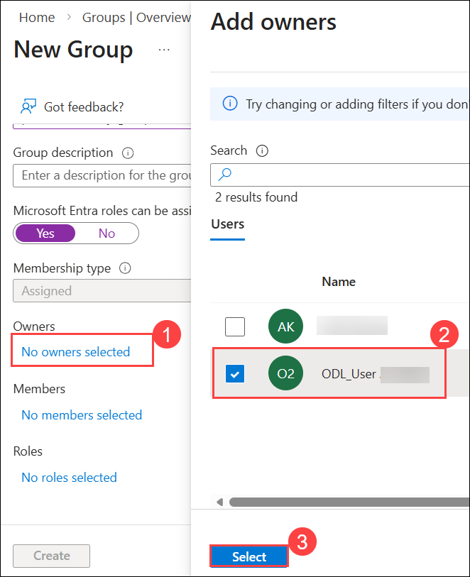

8. Under **Members**, click **No member selected**, then search for and select the managed identity: **Purview-<inject key="DeploymentID" enableCopy="false"/>**.

   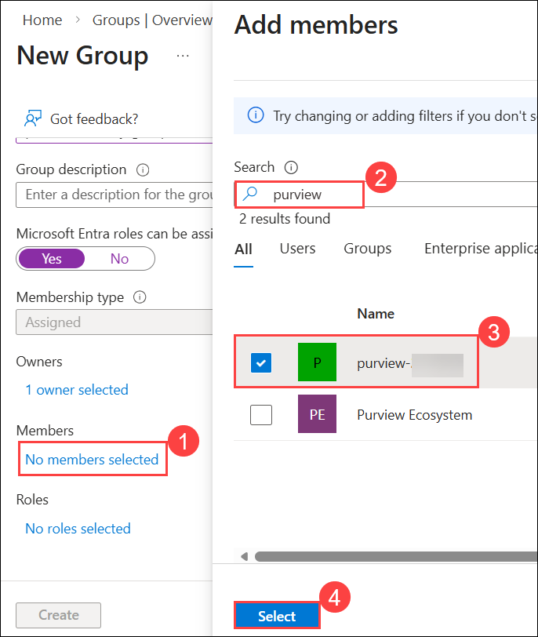

10. Click **Create** to finish creating the group.

    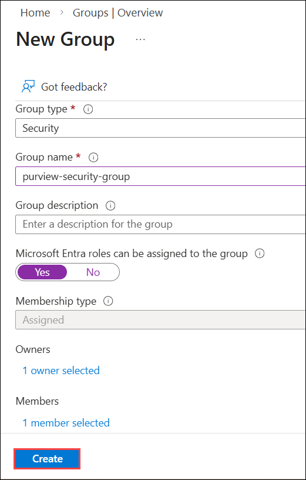

12. When prompted by the pop-up, select **Yes**.

    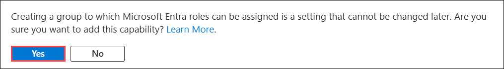

1. Back on the **Groups | Overview** page, from the left navigation pane, select **All groups** and review the newly created group.

   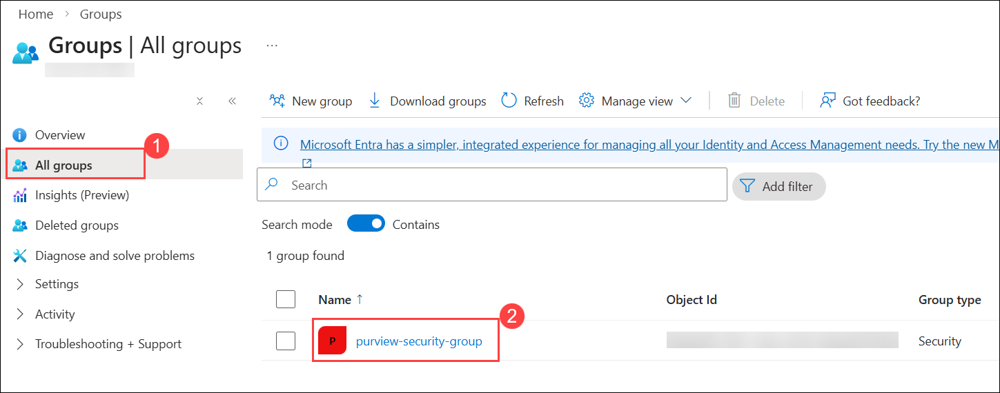

### Assign  
                           
1. At the top of the page, click on **Settings (1)**. Under **Governance and administration**, select **Admin portal (2)**.

    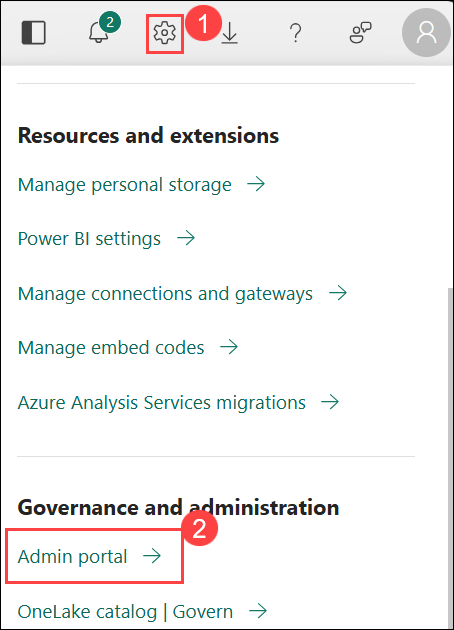
   
1. Ensure you are in **Tenant settings (1)**. In the search bar, search for **Admin API (2)**, press **Enter**, and make sure you are in the **Admin API settings** pane.

    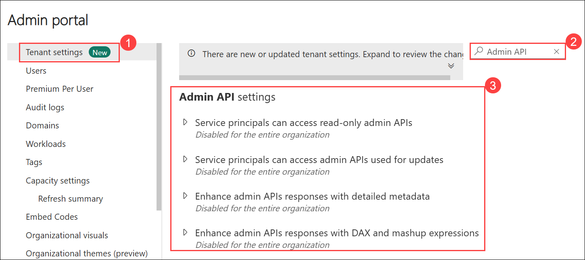
   
3. Expand all four settings and enable the toggles. Verify that all four related settings are **enabled (3)**.

4. For the first two settings, select **Specific security group**, search for and select **Purview-security-Group**.

5. For the remaining two settings, select **Entire organization**.

6. Click **Apply** to save the changes after enabling the toggles.

   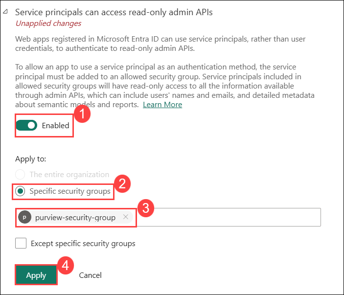
               

=============================================================================================================
**Step 3: Re-Scan Fabric to Discover the New Table**

14. Switch to **Purview portal** → **Data Map** → **Data sources** → click `Purview-Fabric`
15. Click **+ New scan** (or re-run the existing scan):
    - **Name**: `Scan-Fabric-Updated`
    - **Credential**: Microsoft Purview MSI (system)
    - Scope: `Purview-Lab-WS` workspace
    - Scan rule set: System default
    - Trigger: Once
16. Click **Save and Run**
17. Wait for **Completed** status (3-5 minutes)

**Step 4: Verify All Assets in the Data Catalog**

18. Go to **Data Catalog** → search for `employees`
19. Confirm the new `employees` table appears (source: Microsoft Fabric)
20. Also search for `dimension_customer` and `fact_sale` — all existing WWI tables should still be there
21. Search for `customer` → confirm Databricks `samples.tpch.customer` also appears

**Step 3: Create a Semantic Model from the Lakehouse**

14. While still in the Lakehouse, click **New semantic model** in the top toolbar
15. **Name**: `Purview-Lakehouse` (same name as the Lakehouse)
16. In the table selection, **select all tables** (dimension_city, dimension_customer, fact_sale, etc.)
17. Click **Create**
    - Wait for the semantic model to be created (a few seconds)
    - This creates the BI/reporting layer on top of the Lakehouse Delta tables

**Step 4: Create a Warehouse with Sample Data**

18. Go back to the workspace → click **+ New item** → select **Warehouse**
19. **Name**: `Purview-Warehouse` → click **Create**
20. Once the Warehouse opens, click **Sample warehouse** (or **Load sample data**)
    - This loads a **NYC Taxi** sample dataset
    - Wait for the data loading to complete (1-2 minutes)
21. After loading, expand **dbo** → **Tables** in the Explorer pane. You should see tables like:
    - `Date`, `Geography`, `HackneyLicense`, `Medallion`, `Time`, `Trip`, `Weather`

**Expected Result**: `Purview-Lab-WS` workspace now contains 4 items:
- `Purview-Lakehouse` — Wide World Importers retail data (Lakehouse)
- `Purview-Lakehouse` — SQL analytics endpoint (auto-created)
- `Purview-Lakehouse` — Semantic model (you just created this)
- `Purview-Warehouse` — NYC Taxi transportation data (Warehouse)

---

## Task 1: Register Microsoft Fabric as a Data Source (10 min)

> **How Fabric registration works**: Fabric is registered at the **tenant level** — one registration covers all workspaces in your tenant. You don't register individual workspaces or items.

**Step 1: Register Fabric in Purview**

1. Switch to the **Purview portal** tab (`https://purview.microsoft.com`)
2. Click **Data Map** in the left sidebar
3. Click **Data sources** → click **Register**
4. In the source type list, search for and select **Fabric** → click **Continue**
5. Configure the registration:
   - **Name**: `Purview-Fabric`
   - **Tenant**: your Azure AD tenant (auto-populated)
   - **Collection**: select `Fabric Sources` (the sub-collection you created in Lab 1)
6. Click **Register**
7. Verify `Purview-Fabric` appears under `Fabric Sources` in the data map

**Expected Result**: Fabric tenant registered as a source in Purview Data Map.

---

## Task 2: Configure Fabric Workspace Connection (15 min)

> **Authentication**: Purview uses its Managed Identity to scan Fabric via admin APIs. The Fabric Admin Portal requires a **security group** for service principal API access — the "Entire organization" option is greyed out. You must create a group containing the Purview MSI.

**Step 1: Create a Security Group for Purview in Entra ID**

1. Open a new tab → navigate to **Microsoft Entra admin center** (`https://entra.microsoft.com`)
2. In the left sidebar, click **Groups** → **All groups** → **+ New group**
3. Configure:
   - **Group type**: **Security**
   - **Group name**: `Purview-Scan-Group`
   - **Group description**: `Security group for Purview MSI to access Fabric admin APIs`
   - **Membership type**: **Assigned**
4. Click **No members selected** → in the search box, type `purview-{deploymentId}`
   - Select the **Purview Managed Identity** service principal (it will appear as the Purview account name)
   - Click **Select**
5. Click **Create**
6. Wait ~1 minute for the group to be created

**Step 2: Configure Fabric Admin Portal**

7. Go to **Fabric portal** (`https://app.fabric.microsoft.com`)
8. Click **Settings** (gear icon, top right) → **Admin portal**
   > If you don't see Admin portal, ask your lab instructor — the lab account should have Fabric Admin privileges
9. Go to **Tenant settings** → scroll to **Admin API settings**
10. Enable **Allow service principals to use read-only admin APIs**:
    - Toggle to **Enabled**
    - Select **Specific security groups**
    - In the **Enter security groups** box, type `Purview-Scan-Group` → select it
    - Click **Apply**
11. Enable **Enhance admin APIs responses with detailed metadata**:
    - Toggle to **Enabled**
    - Select **Specific security groups** → enter `Purview-Scan-Group` → select it
    - Click **Apply**
12. Enable **Enhance admin APIs responses with DAX and mashup expressions**:
    - Toggle to **Enabled**
    - Select **Specific security groups** → enter `Purview-Scan-Group` → select it
    - Click **Apply**
13. Scroll to **OneLake settings** → enable **Users can access data stored in OneLake with apps external to Fabric**:
    - Toggle to **Enabled** → apply to **The entire organization** (this setting allows org-wide)
    - Click **Apply**

> **Important**: After changing tenant settings, wait **~15 minutes** for them to propagate before testing the scan connection.

**Step 3: Test the Connection**

14. Switch back to **Purview portal** → **Data Map** → **Data sources** → click on your Fabric source
15. Click **+ New scan**:
    - **Credential**: verify it shows **Microsoft Purview MSI (system)** (this is the default — no change needed)
    - Click **Test connection**
16. Wait for result — all checks should pass:
    - **Access**: ✅ Passed
    - **Assets (+lineage)**: ✅ Passed
    - **Detailed metadata (Enhanced)**: ✅ Passed
    > If any test fails, go back to Step 2, verify the security group contains the Purview MSI, and wait 15 more minutes
17. **Do not proceed with the scan yet** — click **Cancel** (we'll configure the full scan in Task 3)

**Expected Result**: Security group created with Purview MSI. Admin API settings enabled for the security group. Connection test passes all 3 checks.

---

## Task 3: Scan Fabric Lakehouse and Warehouse (20 min)

> Your workspace contains 2 items: **Purview-Lakehouse** (Delta tables) and **Purview-Warehouse** (SQL tables). Purview scans at the **workspace level** — select the workspace and it scans all items inside.

**Step 1: Create the Scan**

1. In **Purview portal** → **Data Map** → **Data sources** → click on your Fabric source
2. Click **+ New scan** and configure:
   - **Name**: `Scan-Fabric-Full`
   - **Credential**: verify it shows **Microsoft Purview MSI (system)**
   - **Integration runtime**: Azure AutoResolveIntegrationRuntime
3. Click **Continue** → **Scope**: expand the tree and select your `Purview-Lab-WS` workspace
   - The scope is at the **workspace level** — you select the workspace, and Purview automatically scans all items inside it (Lakehouse, Warehouse, semantic models, etc.)
   - ✅ Check the box next to `Purview-Lab-WS`
   > If the workspace doesn't appear, wait 15 minutes and retry — Fabric Admin API indexing takes time for new workspaces
4. Click **Continue** → **Scan rule set**: select **System default** (Fabric)
5. **Scan trigger**: select **Once**
6. Click **Continue** → review → click **Save and Run**

**Step 2: Monitor Scan Progress**

7. Go to **Data sources** → `Purview-Fabric` → **Recent scans**
8. Wait for **Completed** status (typically 3-5 minutes)
9. Review scan summary — it should show ~20 assets discovered:

   | Artifact | What Purview Discovers |
   |----------|----------------------|
   | **Purview-Lakehouse** (Lakehouse) | Lakehouse item + Delta tables at sub-item level: `dimension_customer`, `dimension_city`, `dimension_date`, `dimension_employee`, `dimension_stock_item`, `fact_sale` |
   | **Purview-Lakehouse** (Lakehouse Paths) | Files at sub-item level: `city_safety_seattle.csv`, `nyc_taxi_green_2020_11.parquet`, `public_holidays.parquet`, etc. |
   | **Purview-Lakehouse** (SQL analytics endpoint) | Auto-created SQL endpoint (item level) |
   | **Purview-Warehouse** (Warehouse) | Warehouse container asset (item level only — individual SQL tables are NOT shown as separate assets) |
   | **Purview-Lab-WS** | Fabric Workspace (container asset) |

   > **Known limitation**: Per [Microsoft documentation](https://learn.microsoft.com/en-us/purview/register-scan-fabric-tenant), *"For all Fabric items besides Power BI, only item level metadata and lineage can be scanned. For Lakehouse tables and files, sub-item level metadata scanning is available but sub-item level lineage isn’t supported."* This means: Lakehouse tables appear individually, but Warehouse tables do not — only the Warehouse container is cataloged.

**Step 3: Verify Lakehouse Assets**

10. Go to **Unified Catalog** → **Discovery** → **Data assets**
11. Search for `dimension_customer` → click on the **Lakehouse Table** result
12. Review:
    - **Schema**: column names and data types (Customer Key, Customer, Category, Buying Group, Postal Code, etc.)
    - **Properties**: OneLake path, format (Delta), workspace name
    - **Hierarchy** (right side): Fabric Capacity → Purview-Lab-WS → Purview-Lakehouse → dimension_customer
13. Go back → search for `fact_sale` → review the sales fact table

**Step 4: Verify Warehouse Assets**

14. In the asset list, click on **Purview-Warehouse** (asset type: **Warehouses**)
15. Review the Warehouse asset page:
    - **Overview**: fully qualified name (Fabric URL)
    - **Collection path** (right side): purview-{deploymentId} → Contoso Data Estate → Fabric Sources
    - **Hierarchy** (right side): Purview-Lab-WS (Fabric Workspace) → Purview-Warehouse (Warehouses)
    - Click through **Properties**, **Lineage**, **Related** tabs
16. Note: Individual Warehouse tables (Date, Trip, Geography, etc.) are **not** listed as separate assets. This is a [known Microsoft limitation](https://learn.microsoft.com/en-us/purview/register-scan-fabric-tenant) — Warehouse scanning is **item level only**. Sub-item scanning is only supported for Lakehouse.
17. Compare the two scan results:
    - **Lakehouse** → Purview shows each table as a separate asset with full schema (columns, data types)
    - **Warehouse** → Purview shows only the Warehouse container as a single asset
    - This is an important governance insight: different Fabric item types have different levels of catalog granularity

**Expected Result**: Scan discovers ~20 assets. Lakehouse tables are individually cataloged with schemas. Warehouse is cataloged as a container asset. All visible in Unified Catalog.

---

## Task 4: Discover Fabric Semantic Models in Unified Catalog (15 min)

> **What is a Semantic Model?** A semantic model (shown as **Power BI Dataset** in Purview) is the BI/reporting layer on top of Lakehouse Delta tables. You created one in "Before You Begin". Purview discovers it automatically during the workspace scan.

**Step 1: Find the Semantic Model**

1. In **Unified Catalog** → **Discovery** → **Data assets**
2. Search for `Purview-Lakehouse` → you should see 3 asset types:
   - `Purview-Lakehouse` (Lakehouse)
   - `Purview-Lakehouse` (SQL analytics endpoint)
   - `Purview-Lakehouse` (**Power BI Dataset**) ← this is the semantic model
3. Click on the **Power BI Dataset** asset
4. Review the asset detail page:
   - **Fully qualified name**: Power BI URL (e.g., `https://app.powerbi.com/groups/.../datasets/...`)
   - **Collection path**: purview-{deploymentId} → Contoso Data Estate → Fabric Sources
   - **Hierarchy**: Fabric Capacity → Purview-Lab-WS → Purview-Lakehouse (Power BI Dataset)

**Step 2: Explore Semantic Model Schema**

5. Click the **Schema** tab on the semantic model asset
6. Review the tables and columns — these mirror the Lakehouse tables you selected:
   - `dimension_customer`, `dimension_city`, `dimension_employee`, `fact_sale`, etc.
   - Each table shows columns with Power BI data types (text, whole number, decimal, date)
7. Note: The semantic model is the **business-friendly view** of the same data:
   - Lakehouse = raw Delta storage layer
   - SQL analytics endpoint = SQL query layer
   - Semantic model (Power BI Dataset) = BI/reporting layer

**Step 3: Browse All Fabric Asset Types**

8. Go back to **Data assets** → use the **Asset type** filter to explore each type:

   | Asset Type in Purview | Example | What You See |
   |----------------------|---------|-------------|
   | **Lakehouse Table** | `dimension_customer`, `fact_sale` | Schema with columns and data types |
   | **Lakehouse Path** | `city_safety_seattle.csv` | File path, format |
   | **Warehouses** | `Purview-Warehouse` | Container asset |
   | **SQL analytics endpoint** | `Purview-Lakehouse` | Endpoint with Fabric URL |
   | **Power BI Dataset** | `Purview-Lakehouse` | Semantic model with schema |
   | **Fabric Workspace** | `Purview-Lab-WS` | Workspace container |

9. Key governance takeaway: Purview discovers **all Fabric layers** from a single workspace scan — storage, SQL, BI, and container assets. Each has different metadata depth. In Lab 3, you'll add Databricks assets to search across both platforms.

**Expected Result**: Semantic model (Power BI Dataset) visible in Unified Catalog with full schema. All Fabric asset types browseable.

---

## Lab 2 Summary

| Task | What You Did | Time |
|------|-------------|------|
| 1 | Registered Fabric tenant as a data source | 10 min |
| 2 | Created security group, configured Fabric admin APIs, tested connection | 15 min |
| 3 | Scanned Fabric workspace — discovered Lakehouse tables, Warehouse, and all assets | 20 min |
| 4 | Discovered semantic model (Power BI Dataset) and browsed all Fabric asset types | 15 min |
| | **Total** | **60 min** |

**Next**: Lab 3 — Connect Databricks Unity Catalog to Purview
