# Day 1 - Lab 2: Connect Microsoft Fabric to Purview

## Lab Overview

In this lab, you will connect Microsoft Fabric to Microsoft Purview and enable data discovery across your Fabric environment. You will begin by creating and configuring a Fabric workspace with sample and custom data, including Lakehouse, Warehouse, and Semantic Models. You will then register Microsoft Fabric as a data source in Purview, configure and run a scan, and validate how different Fabric assets are discovered and cataloged in the Unified Catalog.

This lab demonstrates how Microsoft Purview integrates with Microsoft Fabric to provide centralized data governance, visibility, and lineage across analytics workloads.

## Lab Objectives

In this lab, you will perform the following:

- **Task 1:** Create and configure a Microsoft Fabric workspace with data  
- **Task 2:** Register Microsoft Fabric as a data source in Purview  
- **Task 3:** Configure and run a scan for Fabric data  
- **Task 4:** Validate discovered assets in Unified Catalog  
- **Task 5:** Explore Semantic Models and understand asset representation  

### Estimated Duration: 120 minutes

## Before You Begin: Create a Fabric Workspace with Data

> **What is Microsoft Fabric?** Fabric is Microsoft's unified analytics platform. A single workspace can contain Lakehouses (for data engineering), Warehouses (for SQL analytics), Notebooks, Pipelines, and Semantic Models — all stored in OneLake.

### Task 1: Register Microsoft Fabric as a data source

## Creating Security Group

1. In the Azure portal search bar, type **Groups (1)** and select **Groups (2)** from the results.

    

1. On the **Groups overview (1)** page, click on **+ New group (2)**.

    
   
1. Fill in the following details:

   - **Group type (1)**: Security  
   - **Group name (2)**: `Purview-security-Group`  
   - **Microsoft Entra roles can be assigned to the group (3)**: Yes  

      

1. In the **New Group** page, under **Owners (1)** click **No owners selected**, in the **Add owners** pane select **<inject key="AzureAdUserEmail" enableCopy="true"/> (2)**, and then click **Select (3)**.

   

1. In the **New Group** page, under **Members (1)** click **No members selected**, in the **Add members** pane search for **purview (2)**, select the **Purview-<inject key="DeploymentID" enableCopy="false"/> (3)**, and then click **Select (4)**.

   

1. Click **Create** to finish creating the group.

    

1. When prompted by the pop-up, select **Yes**.

    

1. Back on the **Groups | Overview** page, from the left navigation pane, select **All groups (1)** and review the newly created **Purview-security-Group (2)**.

   

1. Open a new browser tab and navigate to the following URL:

    ```
    https://app.fabric.microsoft.com
    ```

1. On the **Enter your email, we'll check if you need to create a new account** page, enter your **Email/Username (1)** as **<inject key="AzureAdUserEmail" enableCopy="true"/>**, and then click **Submit (2)**.

   

1. On the Fabric portal, from the top-right corner, select the **Profile icon (1)**, then click on **Free trial (2)**.
   
    
   
1. On the **Activate your 60-day free Fabric trial capacity** window, click on **Activate**.

   

1. When the **Successfully upgraded to a free Microsoft Fabric trial** message appears, click on **OK**.

   

1. When the **Invite teammates to try Fabric to extend your trial** pop-up appears, click on **Cancel (X)**.
                           
1. At the top of the page, click on **Settings (1)**. Under **Governance and administration**, select **Admin portal (2)**.

    
   
1. Ensure you are in **Tenant settings (1)**. In the search bar, search for **Admin API (2)**, press **Enter**, and make sure you are in the **Admin API settings** pane.

    
   
1. Expand each of the four settings and turn the toggle to **Enabled (1)**, ensuring all settings are enabled.

1. For the first two settings, select **Specific security groups (2)** and choose **purview-security-group (3)**.

1. For the remaining two settings, select **Entire organization**.

1. Click **Apply (4)** to save the changes.

   
   
1. In the **Power BI** portal, click **Workspaces (1)** from the left navigation pane, and then click **New workspace (2)**.

    

1. Configure:

   - **Name**: **`Purview-Lab-WS` (1)**
   - Expand **Advanced** then select the **License mode** to **Trial (2)**.
   - Click **Apply (3)**

       

       

1. You should now be inside the `Purview-Lab-WS` workspace.

     

### Task 2: Create a Lakehouse with Sample Data

1. In the workspace, click **New item (1)**, search for **Lakehouse (2)**, and then select **Lakehouse (3)**.
    
    
   
1. On the **New Lakehouse** pane, provide **Name**- **`PurviewLakehouse` (1)**, then click **Create (2)**.

   
   
1. Once the Lakehouse opens, click **Start with a sample**.

   
   
1. Select **Retail Data Model from Wide World Importers**.

    
    
    - Wait for the data loading to complete (1 - 2 minutes)

1. After loading, expand **Tables** in the Explorer pane. You should see tables like:
    
    - `dimension_city`, `dimension_customer`, `dimension_employee`, `dimension_stock_item`
    - `fact_sale`, `fact_order`, `fact_purchase`
    - And several more dimension/fact tables

      
   
### Task 2.1: Upload Vendors Data to Fabric Lakehouse

1. Now, add another file that contains vendors tables.

1. In the Lakehouse explorer, expand **Files (1)**, click **Get data (2)**, and then select **Upload files (3)**.

   
    
1. In the **Upload files** pane, click the folder icon (1), navigate to **Documents (2)**, select the **vendor file (3)**, and then click **Open (4)**.

    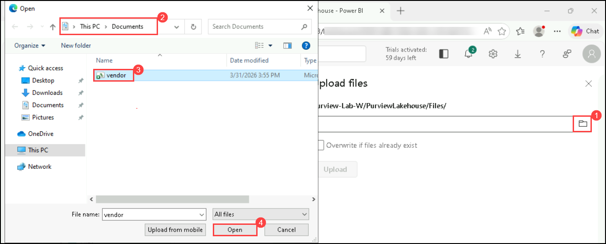

1. Verify the file then click on **Upload**.

    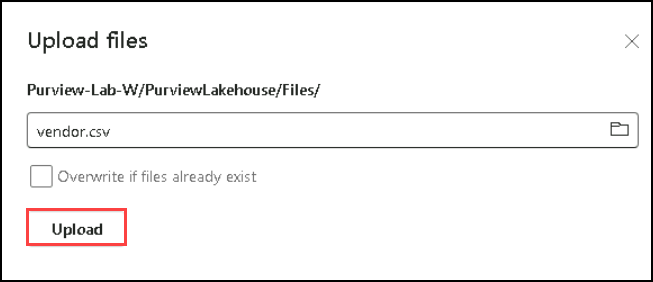

1. Once the upload is complete, click **Close** from the top-right corner.

    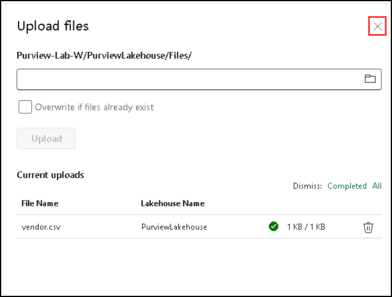

1. Once uploaded, you should see `vendors.csv` in the Files section.
   
1. In the **Files** section, right-click the **vendors.csv file (1)**, select **Load to Tables (2)**, and then choose **New table (3)**.

     
    
1. On **Load file to new table**  keep all settings as it is then click **Load**.

   
   
1. Wait for the load to complete the `vendors` table now appears under **Tables** and verify the data: 10 rows with columns.

     

**Task 3: Create a Semantic Model from the Lakehouse**

1. In the Lakehouse, click **New semantic model (1)**, enter **PurviewLakehouse (2)** as the name, select **Select all (3)** to include all tables, and then click **Confirm (4)**.

    
    
    - Wait for the semantic model to be created (a few seconds)
    - This creates the BI/reporting layer on top of the Lakehouse Delta tables

### Task 3.1: Create a Warehouse with Sales Data**

1. Go back to the workspace click **+ New item (1)** then search **Warehouse (2)** and select **Warehouse (3)**.

    
    
1. On the **New warehouse** window, provide **Name**: **`PurviewsWarehouse` (1)**, then click **Create (2)**.

    

1. In the warehouse page, under **Start getting data**, click **Practice with sample data**.

    

1. In the warehouse, click **New SQL query (1)**.

     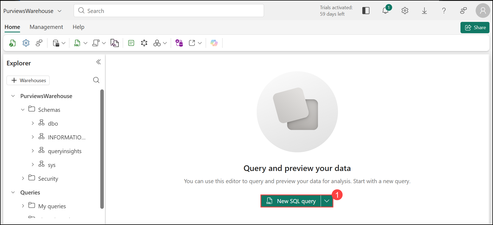

1. In the SQL editor, paste the provided **SQL script (2)** and click **Run (3)** to execute the query.

    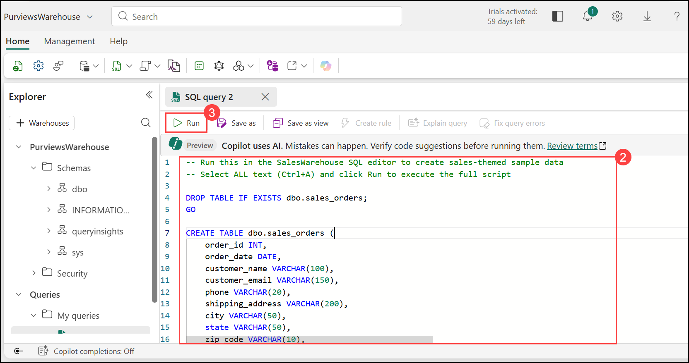

1. In the **Explorer** pane, expand **Schemas (1)**, then **dbo (2)**, then **Tables (3)**, select **sales_orders (4)**, and verify that the table displays data with **15 records (5)**.

    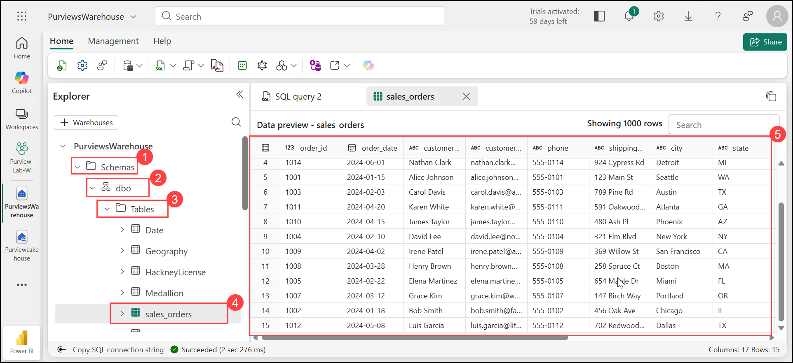

    > **Note:** If you do not see the `sales_orders` table, right-click **Schemas (1)** and select **Refresh (2)**, then check again.

     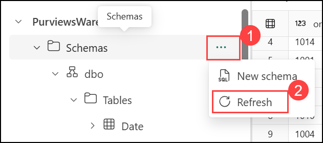

### Task 3.2: Create a Data Pipeline

> This pipeline moves vendor data from the Lakehouse to the Warehouse. You'll use it in Lab 4 to demonstrate data lineage in Purview.

1. Go back to the workspace, click **+ New item (1)**, search for **Pipeline (2)** and select **Pipeline (3)**.

    
    
1. On the **New pipeline** pane, provide **Name** **`Vendor-ETL-Pipeline` (2)**, then click **Create (2)**.

    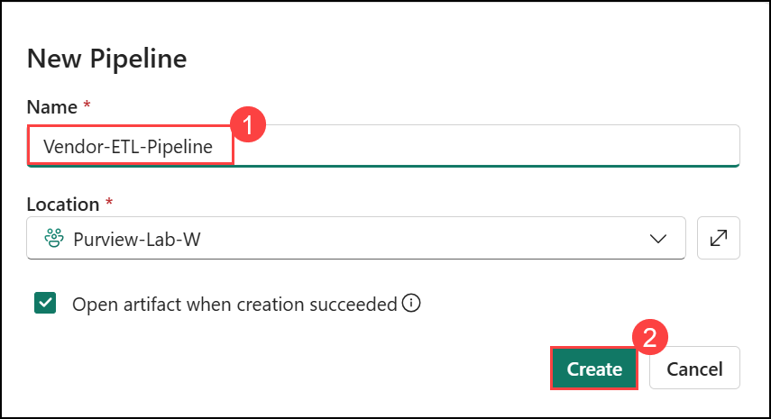

1. In the pipeline canvas from the top menu, click **Copy data (1)** and select **Add copy data activity (2)**

   
   
1. Click on the **Source (1)** tab. For **Connection**, select the dropdown **(2)**, then click on **Browse all (3)**.
   
   
   
     - Select **Microsoft Fabric Lakehouse** named **`PurviewLakehouse` (4)**
     - Under **Table**, browse and select: **`dbovendors`(5)**

       

1. Click on **Destination (1)** tab. Next to **Connection**, select the dropdown, then click on **Browse all (2)**.

   
   
     - Select **Microsoft Fabric Warehouse** and select **`PurviewWarehouse` (2)**
     - Under **Table option**, select **Auto create table (3)**
     - Enter **Table name**: **`stg_vendors`(4)**

       

1. Click **Save (1)** and click **Run (2)** 

    
    
1. Wait for the pipeline to complete (1-2 minutes) → verify **Status: Succeeded**.

     
    
1. In the **Explorer** pane, expand **Tables (1)**, select **stg_vendors (2)**, and verify that the table displays data **(3)**.

    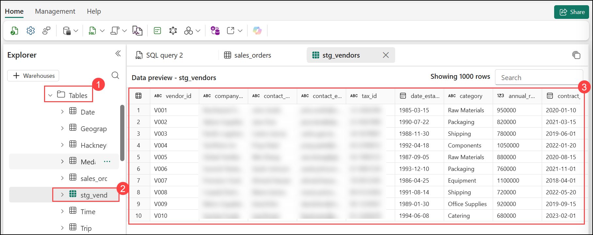

      **Expected Result**: **`Purview-Lab-WS**` workspace now contains 6 items:
      - `PurviewLakehouse`:  Wide World Importers retail data + vendors table (Lakehouse)
      - `PurviewLakehouse`:  SQL analytics endpoint (auto-created)
      - `PurviewLakehouse`:  Semantic model (includes vendors table)
      - `PurviewWarehouse`:  Sample warehouse data + stg_vendors (Warehouse)
      - `Vendor-ETL-Pipeline`:  Data pipeline (Lakehouse → Warehouse)
      - `vendors.csv`:  Uploaded file in Lakehouse Files

### Task 2: Configure and validate Fabric scan connection

**Step 1: Register Fabric in Purview**

1. Navigate back to the **Microsoft Purview** home page using the URL below.

   ```
   https://purview.microsoft.com/
   ```

1. From the left navigation pane, click **Solutions (1)**, then select **Data Map (2)**.

   

1. On the **Data sources** page click **Register (1)** In the source type list, search for and select **Fabric (2) (3)** then click **Continue (4)**.

   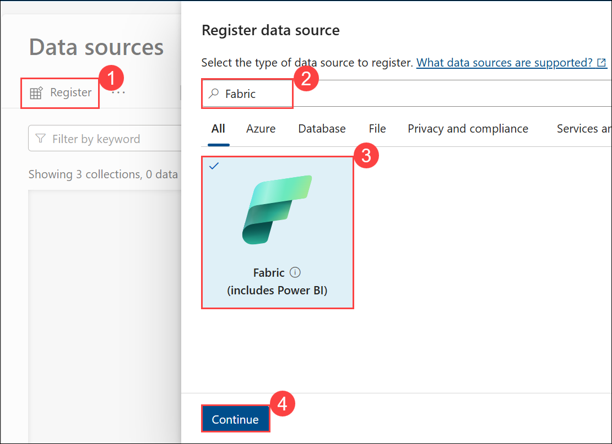
   
1. Configure the registration:
   - **Name**: **`Purview-Fabric` (1)**
   - **Domain**: **purview-<inject key="DeploymentID" enableCopy="false"/> (2)**
   - **Collection**: select **`Fabric Sources` (3)**
   - Click **Register (4)**

     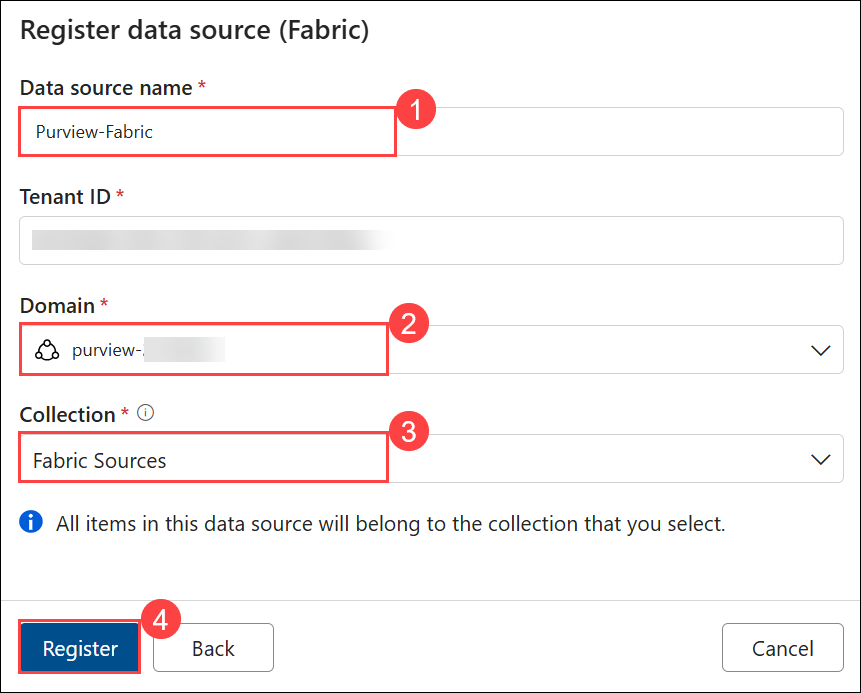
     
1. Verify **`Purview-Fabric`** appears under **`Fabric Sources`** in the data map.

   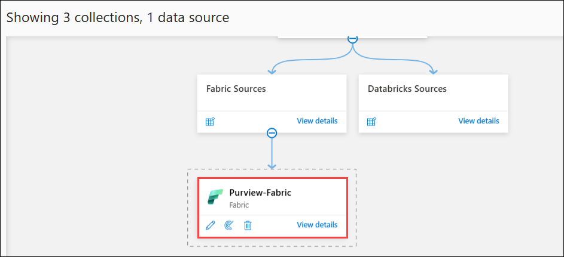

    - **Expected Result**: Fabric tenant registered as a source in Purview Data Map.

1. Under **Data sources**, locate **Purview-Fabric** and click the **Scan (1)** icon.

   - In the **Scan Purview-Fabric** pane, provide **Name (2)**: **`Fabric-DataMap-Scan`**.

   - Under **Personal workspaces (3)**, select **Exclude**.

   - For **Connect with integration runtime (4)**, ensure **Azure AutoResolveIntegrationRuntime** is selected.

   - Under **Credential (5)**, select **Microsoft Purview MSI (system)**.

   - For **Collection (6)**, select **Fabric Sources**.

   - Click **Test connection (7)**.

     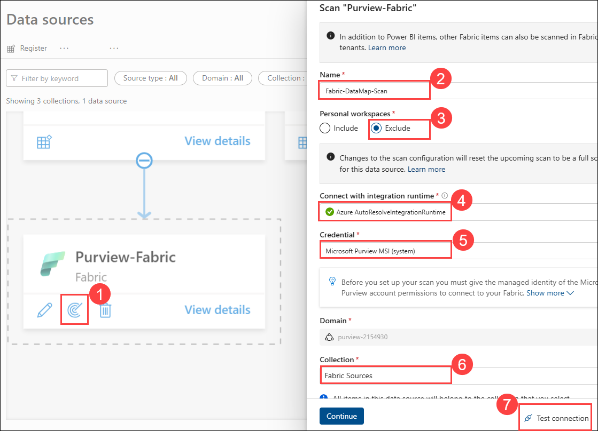

1. Once the **Test connection** is successful (**Success – View report (1)**), click **Continue (2)**.

   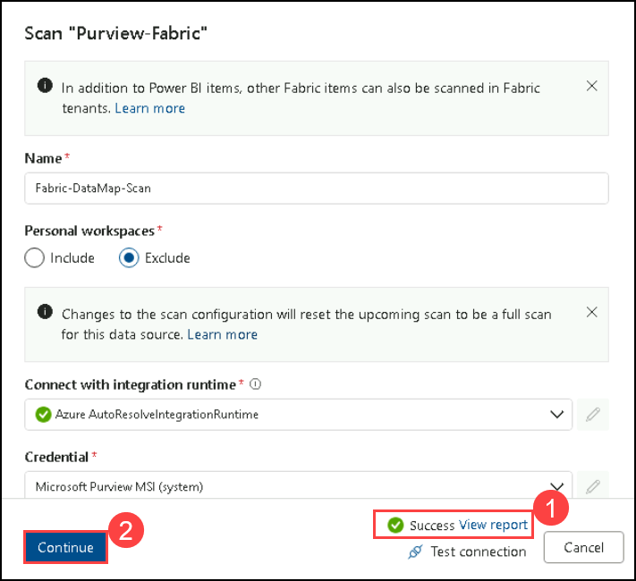

1. On the **Scope your scan** page, select **No (1)**, then click **Continue (2)**.

    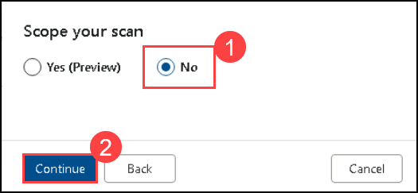

1. On the **Set a scan trigger** page, select **Once (1)**, then click **Continue (2)**.

    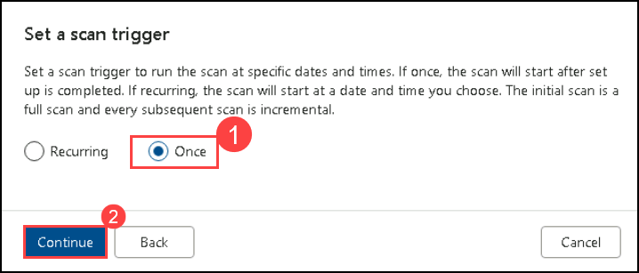

1. On the **Review your scan** page, click **Save and run**.

    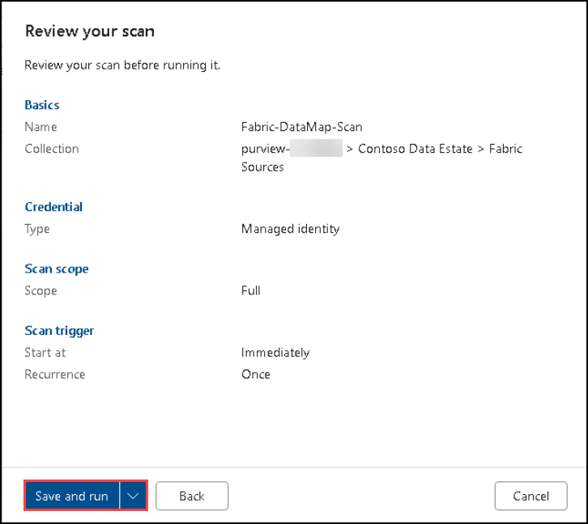

1. Back on the **Data sources** page, under **Fabric**, click on **View details**.

   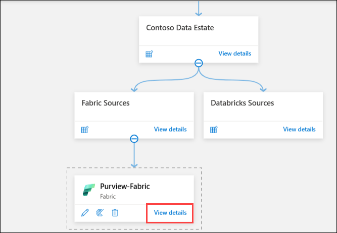

1. Monitor the scan. Once it completes, you will see the status as **Completed with exceptions**, as shown below.

   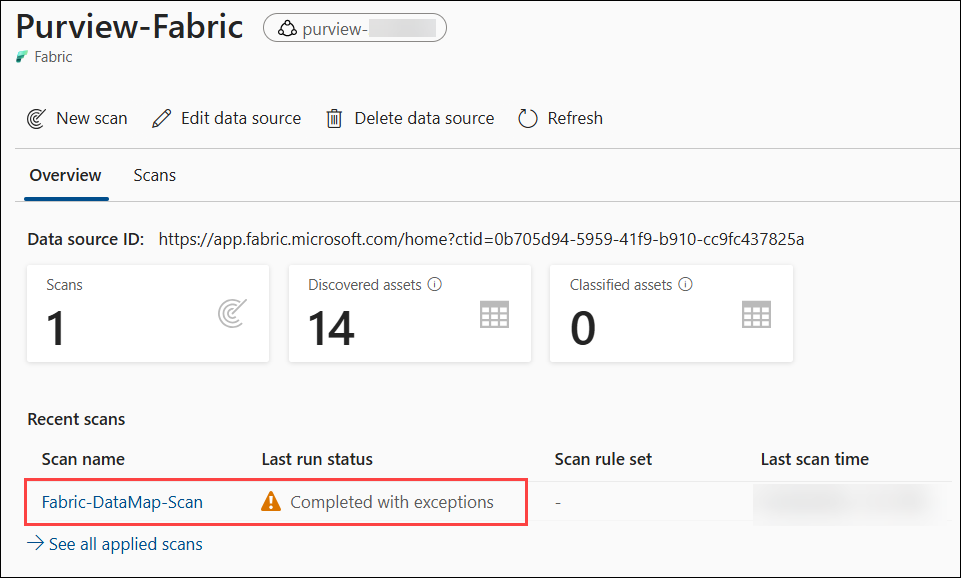

   > **Known limitation**: Per [Microsoft documentation](https://learn.microsoft.com/en-us/purview/register-scan-fabric-tenant), *"For all Fabric items besides Power BI, only item level metadata and lineage can be scanned. For Lakehouse tables and files, sub-item level metadata scanning is available but sub-item level lineage isn’t supported."* This means: Lakehouse tables appear individually, but Warehouse tables do not — only the Warehouse container is cataloged.

**Step 2: Verify Lakehouse Assets**

1. Go to **Unified Catalog**, expand **Discovery (1)**, and select **Data assets (2)**. In the search bar, search for **`dimension_customer` (3)**, then select it from the results list **(4)**.

    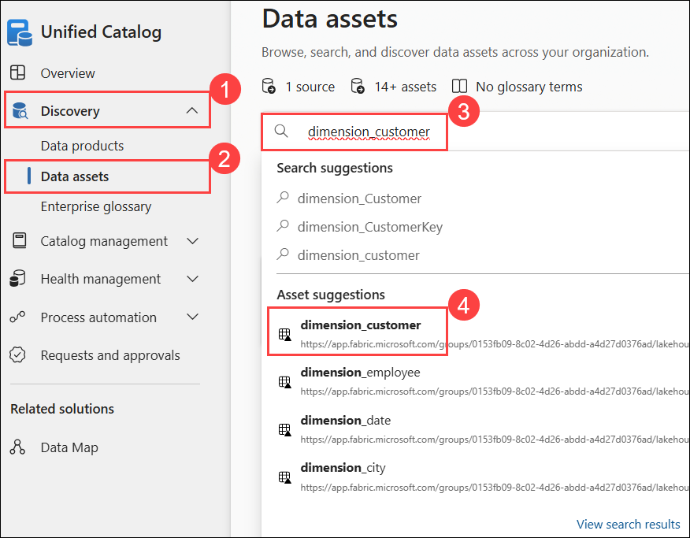

1. You are now on the **Overview** page for the Fabric asset. Review the details to understand how the asset is integrated with Fabric. You can also review it in the Purview portal.

    - Review:
        - **Hierarchy** (right side): Fabric Capacity → Purview-Lab-WS → Purview-Lakehouse → dimension_customer
        - **Schema**: column names and data types (Customer Key, Customer, Category, Buying Group, Postal Code, etc.)
        - **Properties**: OneLake path, format (Delta), workspace name

          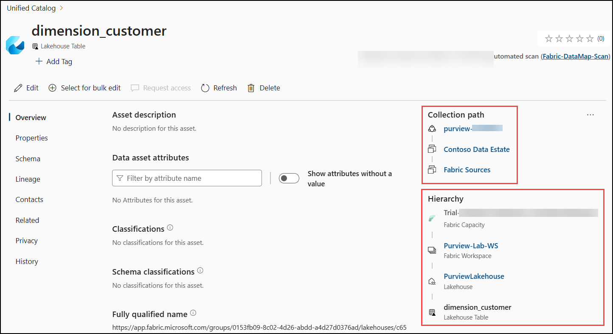

          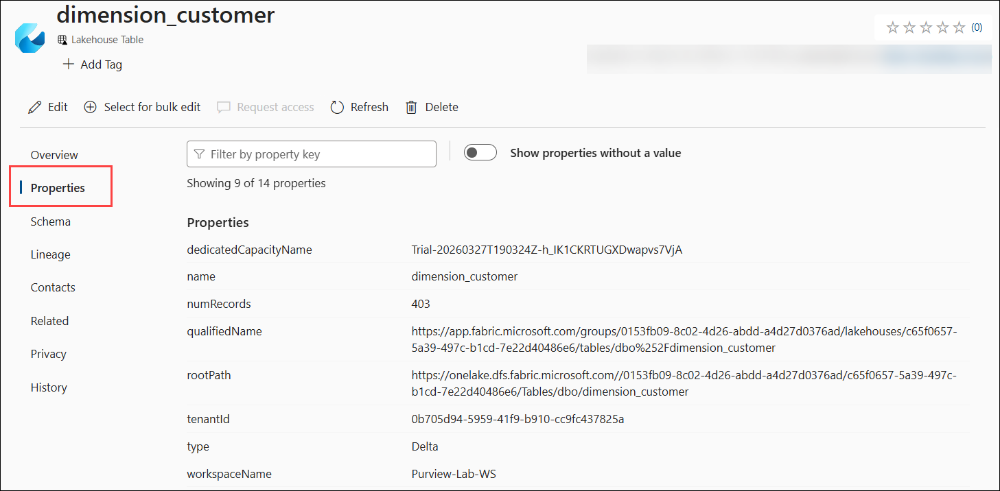

          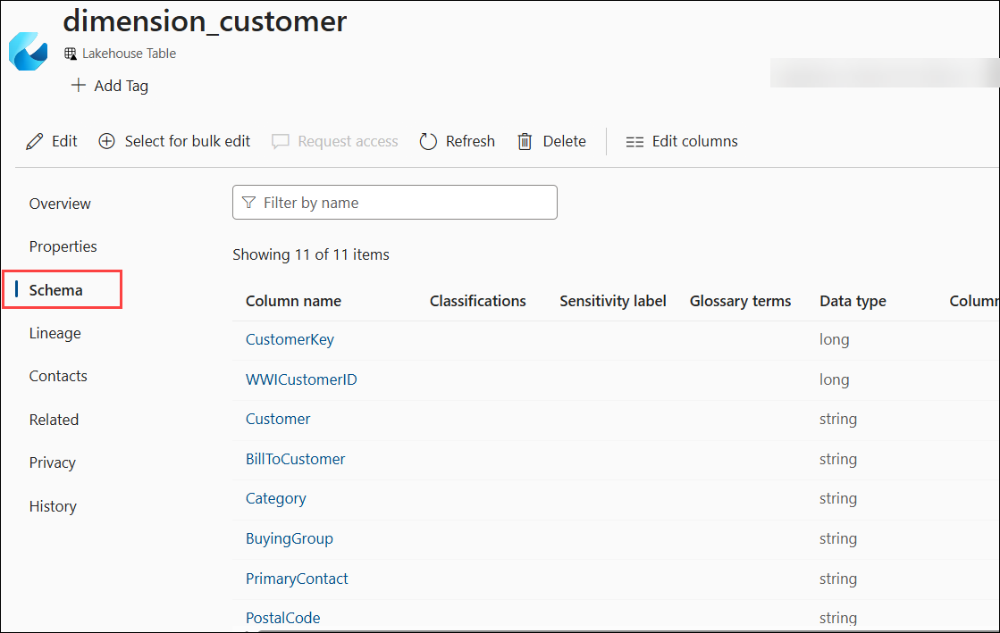
    
1. Now, review another asset from Fabric. Go back and, in the same way, search for `fact_sales`, then select it and review the sales fact table.

**Step 3: Verify Warehouse Assets**

1. In the asset list, type and select **Warehouse**. 
1. Review the Warehouse asset page:
    - **Overview**: fully qualified name (Fabric URL)
    - **Collection path** (right side): purview-{deploymentId} → Contoso Data Estate → Fabric Sources
    - **Hierarchy** (right side): Purview-Lab-WS (Fabric Workspace) → Purview-Warehouse (Warehouses)

        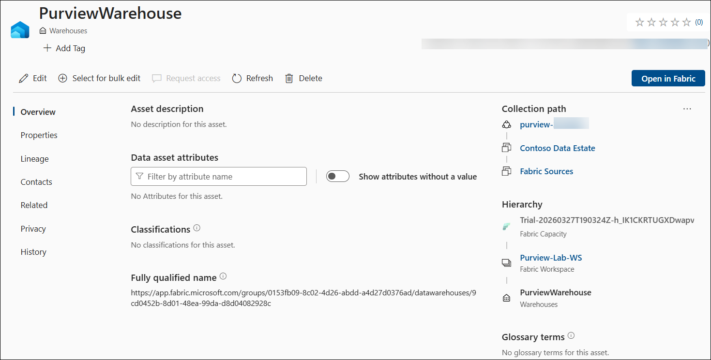
      
        >**Note**: Individual Warehouse tables (Date, Trip, Geography, etc.) are **not** listed as separate assets.
      > This is a [known Microsoft limitation](https://learn.microsoft.com/en-us/purview/register-scan-fabric-tenant)  Warehouse scanning is **item level only**. Sub-item scanning is only supported for Lakehouse.
      
1. Compare the two scan results:
    - **Lakehouse**:  Purview shows each table as a separate asset with full schema (columns, data types)
    - **Warehouse**: Purview shows only the Warehouse container as a single asset
   
       >**Note**This is an important governance insight: different Fabric item types have different levels of catalog granularity

        >**Expected Result**: Scan discovers assets. Lakehouse tables are individually cataloged with schemas. Warehouse is cataloged as a container asset. All visible in Unified Catalog.

## Task 4: Discover Fabric Semantic Models in Unified Catalog (15 min)

> **What is a Semantic Model?** A semantic model (shown as **Power BI Dataset** in Purview) is the BI/reporting layer on top of Lakehouse Delta tables. You created one in "Before You Begin". Purview discovers it automatically during the workspace scan.

**Step 1: Find the Semantic Model**

1. In **Unified Catalog** > **Discovery** > **Data assets**

1. Search for **`Purview-Lakehouse`**, you should see below mentioned asset types:
   - `Purview-Lakehouse` (Lakehouse)
   - `Purview-Lakehouse` (**Power BI Dataset**) this is the semantic model
   - Click on the **Power BI Dataset** asset

    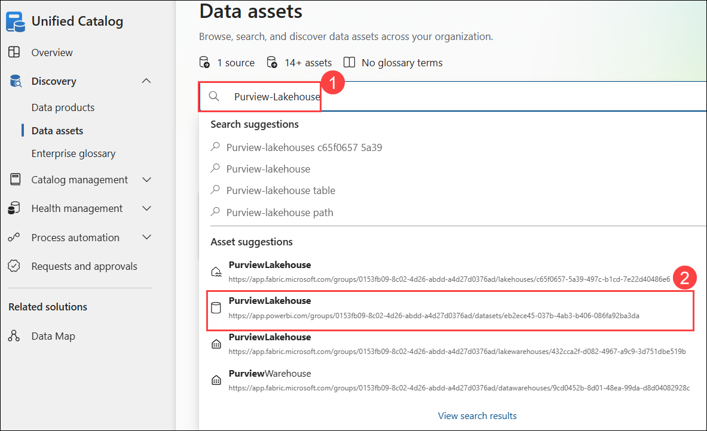
   
1. Review the asset detail page:
   
   - **Fully qualified name**: Power BI URL (e.g., `https://app.powerbi.com/groups/.../datasets/...`)
   - **Collection path**: purview-{deploymentId} → Contoso Data Estate → Fabric Sources
   - **Hierarchy**: Fabric Capacity → Purview-Lab-WS → Purview-Lakehouse (Power BI Dataset)

      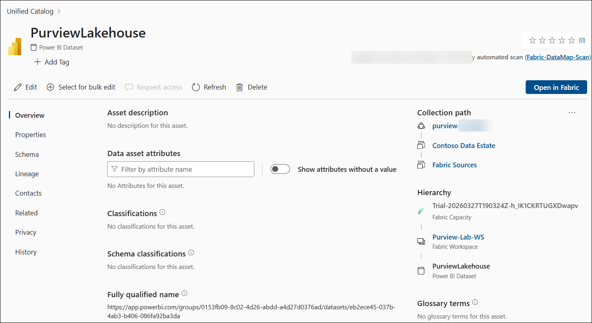

**Step 2: Explore Semantic Model Schema**

1. Click the **Schema** tab on the semantic model asset

1. Review the tables and columns these mirror the Lakehouse tables you selected:

   - `dimension_customer`, `dimension_city`, `dimension_employee`, `fact_sale`, etc.

   - Each table shows columns with Power BI data types (text, whole number, decimal, date)

    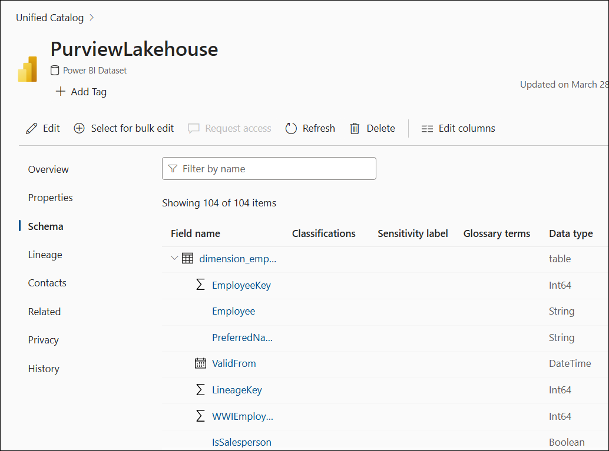
   
   >**Note:** The semantic model is the **business-friendly view** of the same data:
       - Lakehouse = raw Delta storage layer
       - SQL analytics endpoint = SQL query layer
       - Semantic model (Power BI Dataset) = BI/reporting layer

## Summary

In this lab, you created and configured a Microsoft Fabric workspace, built a Lakehouse with sample and custom data, created a Warehouse and Semantic Model, and implemented a data pipeline. You then registered Microsoft Fabric in Microsoft Purview, configured and executed a scan, and validated discovered assets including Lakehouse tables, Warehouse, and Semantic Models within the Unified Catalog.

## Click Next to continue to the next lab.

