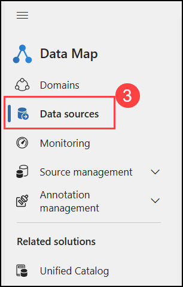
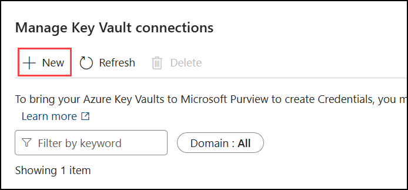
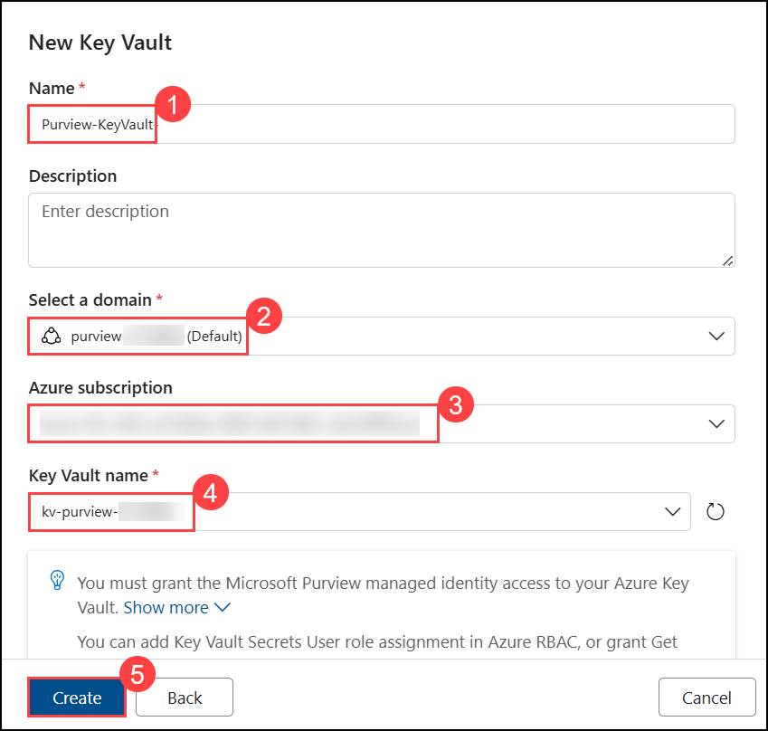
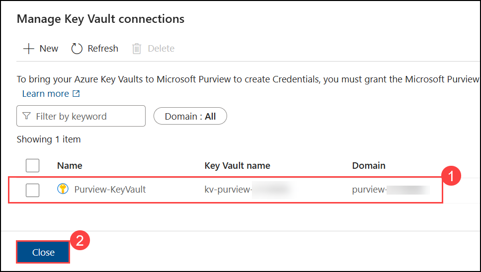
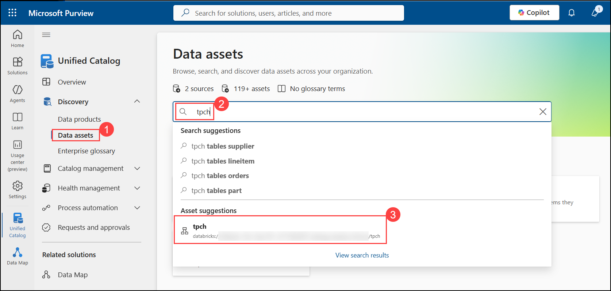
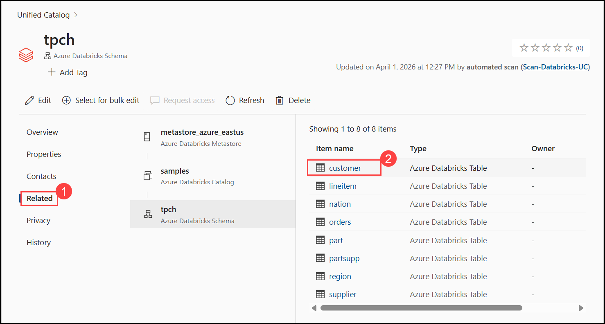
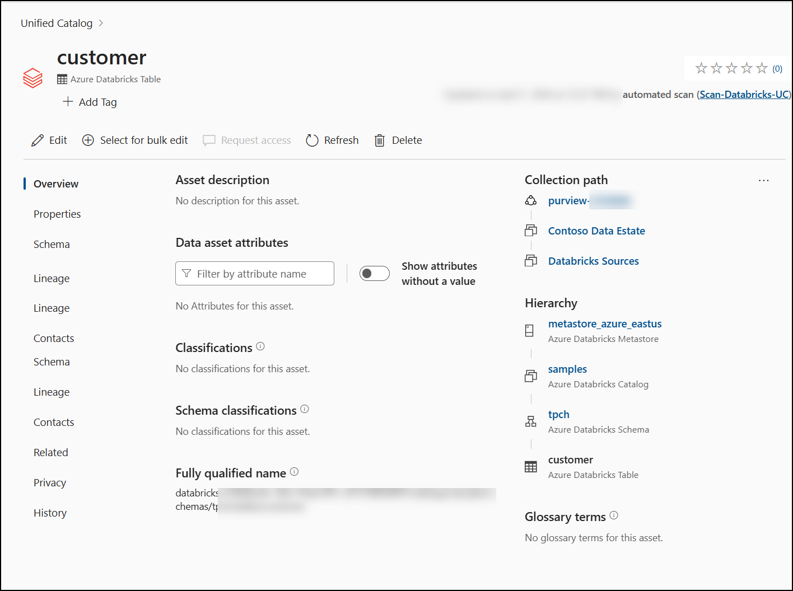

# Day 1 Lab 3: Connect Databricks Unity Catalog to Purview

## Lab Overview

In this lab, you will connect Azure Databricks Unity Catalog to Microsoft Purview to enable governance and discovery of Databricks data assets. You will begin by verifying the Databricks workspace and required connection details, then register Unity Catalog as a data source in Purview. You will configure secure authentication using a Personal Access Token (PAT) stored in Azure Key Vault, create a credential in Purview, and run a scan to discover Databricks assets.

Finally, you will validate the discovered assets in the Unified Catalog and explore how Databricks tables, schemas, and catalogs are represented within Microsoft Purview.

## Lab Objectives

In this lab, you will perform the following:

- **Task 1:** Register Azure Databricks Unity Catalog as a data source in Purview  
- **Task 2:** Configure Unity Catalog connector using PAT and Key Vault  
- **Task 3:** Create and run a scan for Databricks assets  
- **Task 4:** Validate discovered Databricks assets in Unified Catalog  
- **Task 5:** Explore Databricks catalog hierarchy and schema representation  

## Estimated Duration 60 minutes

### Verify your Databricks workspace:

1. In the Azure portal, from the search bar, search for and select **Azure Databricks**.

    

1. Review the pre-created Azure Databricks workspace named **dbw-purview-<inject key="DeploymentID" enableCopy="false"/>**. You will use this Databricks workspace for this lab and continue using the same resource throughout. Click on it.

    
   
1. From the Overview page, click on **Launch Workspace** to verify access.

   
   
1. On the **Databricks** page, from the left sidebar, click **SQL Warehouses (1)** and verify that a warehouse (e.g., Starter Warehouse) exists. Then click on it **(2)**.
   
   

1. Verify that the status is in a **Running state**.
   
   

1. Click on **Connection details (1)**, then copy and record the **Server hostname (2)** and **HTTP path (3)**.

   
   
1. In the Databricks workspace, click **Catalog (1)** in the left sidebar. In the Catalog Explorer, click on the **Settings icon (2)** and select the **Metastore (3)** name.

   

1. On the metastore details page, locate and copy the **Metastore ID**.

   

### Task 1: Register Databricks Workspace as a Data Source (10 min)

1. Navigate back to the **Microsoft Purview** home page using the URL below.

   ```
   https://purview.microsoft.com/
   ```

1. From the left navigation pane, click **Solutions (1)**, then select **Data Map (2)**.Under **Data Map** select **Data sources (3)**

   

   

1. On the **Data sources** page, click **Register (1)**. Search for and select **Azure Databricks Unity Catalog (2)**, then click **Continue (3)**.

   
   
1. On the **Register data source (Azure Databricks Unity Catalog)** window, specify the following values, then click **Register (4)**:
    - Name: **Purview-Databricks-UC** **(2)**
    - Metastore ID: Paste the **Metastore** ID which you recorded in notepad **(3)**
    - Collection: Select **Databricks Sources (4)** (the sub-collection created in Lab 1)

      
      
1. Verify **Purview-Databricks-UC** appears under **Databricks Sources** in the data map.

    

## Task 2: Configure Unity Catalog Connector (20 min)

> Purview authenticates to Databricks Unity Catalog using a **Personal Access Token (PAT)**. You'll generate a PAT in Databricks, store it in Azure Key Vault, then create a credential in Purview that references the Key Vault secret.

### Task 2.1: Generate a Personal Access Token in Databricks

1. Naviagte back to the **Databricks workspace**, click your **username (2)** (top-right corner) and select **Settings (1)**.

   
   
3. Click **Developer (1)** under User section, then next to **Access tokens**, click **Manage (2)**.

    

5. Click **Generate new token**.

   
   
7. Configure:
   - **Comment**: **`Purview scan token` (1)**
   - **Lifetime (days)**: **`6` (2)**
   - Click **Generate (3)**

     

9. **Copy the token immediately (1)** (you won't see it again) then click on **Done(2)**.

    

   > Record it **Notepad** later you will use it in next taks

### Task 2.2: Store the PAT in Azure Key Vault**

1. Naviagte back to Azure portal and from the search bar, search for and select **Key vaults**.

    

1. Select **Key vaults** name **kv-purview-<inject key="DeploymentID" enableCopy="false"/>**.

   

1. In the Key Vault, expand **Objects (1)**, select **Secrets (2)**, and then click **Generate/Import (3)**.

   

1. Configure:
   - **Name**: **`databricks-pat` (1)**
   - **Secret value**: paste the **PAT (2)** from Taks 2.1, step 5.
   - Click **Create (3)**.

     
     
1. Verify the secret **`databricks-pat`** appears in the secrets list

     
    
### Task 2.3: Connect Key Vault to Purview**

1. Navigate back to **Purview portal**.
1. Click **Data Map (1)** then expand **Source management (2)** then select **Credentials (3)** and click on **Manage Key Vault connections (4)**.

    

1. On the Manage Key Vault connections window, click **+ New** and specify the following:
    - **Name**: **Purview-KeyVault (1)**
    - **Domain**: **purview-<inject key="DeploymentID" enableCopy="false"/> (2)**
    - **Subscription**: **select your subscription (3)**
    - **Key Vault name**: **kv-purview-<inject key="DeploymentID" enableCopy="false"/> (4)**
    -  Click **Create (5)**.

       

        

1. Review the **Manage Key Vault connections (1)** recently created. When the pop-up appears, click **Close (2)**.

   
      
### Task 2.4: Create a Credential in Purview

1. Back on **Credentials** page, click on **+ New (1)** then specify the following details:

    - **Name**: **`Databricks-PAT-Credential` (2)**
    - **Authentication method**: **Access Token (3)**
    - **Key Vault connection**: **`Purview-KeyVault`(4)**
    - **Secret name**: **`databricks-pat` (5)**
    - Click **Create (6)**

      

### Task 2.5: Test the Connection

1. In **Data Map** click on **Data sources (1)** then under **Purview-Databricks-UC** select **+ New scan (2)**.

    

1. On Scan **Purview-Databricks-UC** window, specify the following details.
    - **Name**: **`Scan-Databricks-UC` (1)**
    - **Connect via integration runtime**: Azure AutoResolveIntegrationRuntime **(2)**
    - **Credential**: **`Databricks-PAT-Credential` (3)**
    - **Workspace URL**: paste the SQL Warehouse Server hostname which is copied into the notepad `adb-xxxxxxxxxx.xx.azuredatabricks.net` **(4)**
    - **HTTP path**: paste the SQL Warehouse HTTP path which is copied into the notepad **(5)**
    -  Click on **Test connection (6)**.
  
      

1. Wait for **Connection successful (1)** then click on **Continue (2)**.

    

1. On the **Set a Scan trigger** select **Once (1)** then click on **Continue (2)**.

   
   
1. Click on **Save and Run**.

   

### Task 2.6: Monitor Scan Progress

1. In **Data sources** page, under **Purview-Databricks-UC** click on **View details**.

   
   
1. Wait for the deployment status to show **Completed** (about 3–5 minutes).

    

1. Review scan summary 

    

## Task 4: Validate Databricks Assets in Unified Catalog (15 min)

> Now verify that Databricks Unity Catalog assets appear in Purview alongside the Fabric assets from Lab 2.

### Task 4.1: Search for Databricks Tables

1. From the left navigation pane, click **Solutions (1)**, then select **Unified Catalog (2)**.

   


1. In the **Unified Catalog** portal, expand **Discovery (1)**, select **Data assets (2)**, search for **trips (3)**, and then select the **trips asset (4)**.

    

1. Review:
   - **Schema**: column names and data types
   - **Hierarchy**: Metastore → samples → nyctaxi → trips
   - **Properties**: table type, storage location, catalog info

     
     
     

### Task 4.2: Explore the Catalog Hierarchy

1. In the **Unified Catalog** portal, select **Data assets (1)**, search for **tpch (2)**, and then select the **tpch asset (3)** to explore under **Related** section with the available TPC-H tables such as `customer`, `orders`, `lineitem`, `nation`, `part`, `region`, `supplier`, and `partsupp`.

   

   
   
1. In the **tpch** asset page, select **Related (1)**, click on the **customer table (2)**, and review the **Schema** tab to explore columns such as `c_custkey`, `c_name`, `c_address`, `c_nationkey`, and `c_phone`.

      

      
    
   > **Note:** The hierarchy: **Metastore** → **Schema** (`tpch`) → **Table** (`customer`)
    
    - This mirrors the Unity Catalog 3-level namespace: `catalog.schema.table`

## Summary

In this lab, you connected Azure Databricks Unity Catalog to Microsoft Purview by registering it as a data source, configuring secure authentication using a Personal Access Token stored in Azure Key Vault, creating a credential, and running a scan. You then validated the discovered Databricks assets in the Unified Catalog and explored the catalog hierarchy, schemas, and table-level metadata.

## Click Next to continue to the next lab.

