# Day 1 - Lab 4: Classification, Lineage & Cross-Platform Governance

### Estimated Duration: 40 Minutes

## Lab Overview
In this lab, you will explore how Microsoft Purview enables data governance across Microsoft Fabric and Databricks. You will verify scan results, apply built-in classifications to identify sensitive data, and understand how manual classification is used when automatic classification is not supported.

You will also review data lineage to understand how data flows across systems and enhance it by adding manual relationships. This lab provides an end-to-end view of data discovery, classification, and lineage tracking across modern data platforms.

## Lab Objectives

- Task 1: Review and Verify initial scans across Fabric and Databricks
- Task 2: Apply Built-in Classifications
- Task 3: Review technical lineage across platforms 

## Task 1: Review and Verify initial scans across Fabric and Databricks

In this task, you will learn how to review and verify initial scan results in **Microsoft Purview** to ensure both **Fabric** and **Databricks** scans have completed successfully.

1. Navigate back to the **Microsoft Purview** home page using the URL below.

   ```
   https://purview.microsoft.com/
   ```

1. From the left navigation pane, click **Solutions (1)**, then select **Data Map (2)**.Under **Data Map** select **Monitoring (3)**

   .

   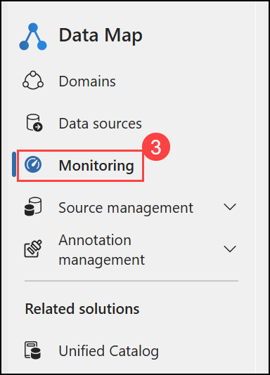.

2. Verify that you see two scans, one for **Fabric** and another for **Databricks**. Ensure both scans have executed successfully. The Fabric scan should show the status **Completed with exceptions**, and the Databricks scan should show the status **Completed**.

    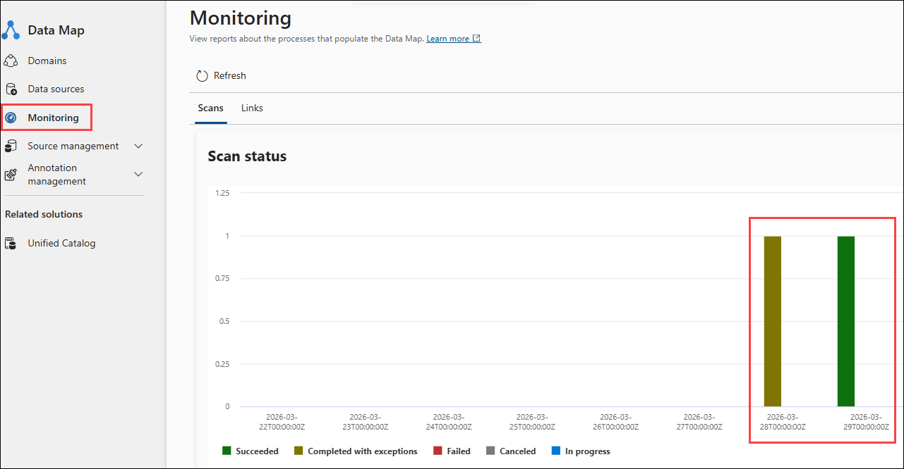

## Task 2: Apply Built-in Classifications 


In this task, you will learn how to apply built-in classifications in Microsoft Purview to identify sensitive data and enforce governance practices across Fabric and Databricks assets.

**Objective:** Apply built-in classifications to sensitive columns and understand how manual classification is used for governance in Fabric and Databricks.

   >**Note:** Microsoft Purview does not automatically classify data during scans for Fabric or Databricks sources.
    > Auto-classification (using ML or regex rules) is supported for sources like Azure SQL, ADLS, and Blob Storage.
    > For Fabric and Databricks, classifications are typically applied manually, which is a common practice in enterprise environments.

1. From the left navigation pane, click **Solutions (1)**, then select **Unified Catalog (2)**.

   

1. Under **Unified Catalog** page expand **Discovery (1)**, then select **Data assets (2)**. In the search bar, search for **`vendors` (3)** and select **vendors (4)** from the **Asset suggestions**.

   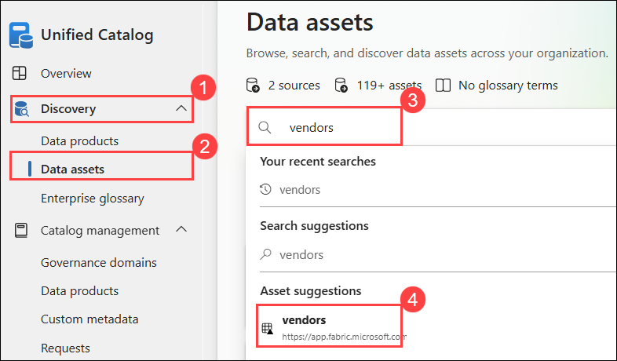
   
1. Navigate to the **Schema (1)** tab.

1. Observe that **no classifications (2)** are currently applied to the columns.

   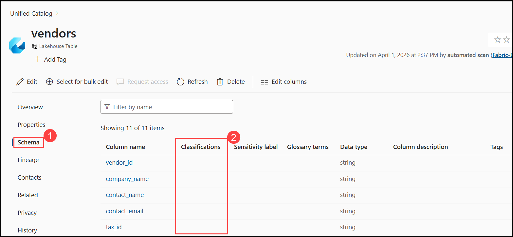

1. Now click the **Edit** button (pencil icon) at the top of the schema section.

   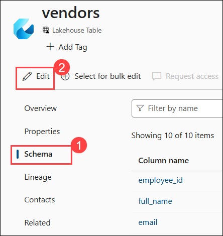
   
1. Apply classifications to the following columns then click **Save**.

    | Column | Classification to Apply |
    |--------|------------------------|
    | `full_name` | **All Full Names** |
    | `email` | **Email Address** |
    | `ssn` | **U.S. Social Security Number (SSN)** |
    | `date_of_birth` | **Date of Birth** |

    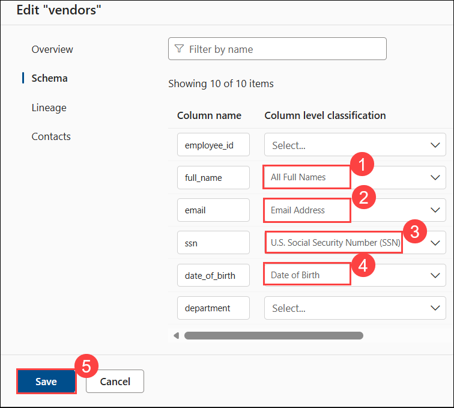

    >**Note**: Columns such as employee_id, department, and salary do not require classification, as they are not considered personally identifiable information (PII).
Focus on classifying sensitive data fields.
   
1. Verify the classification tags now appear on those columns.

    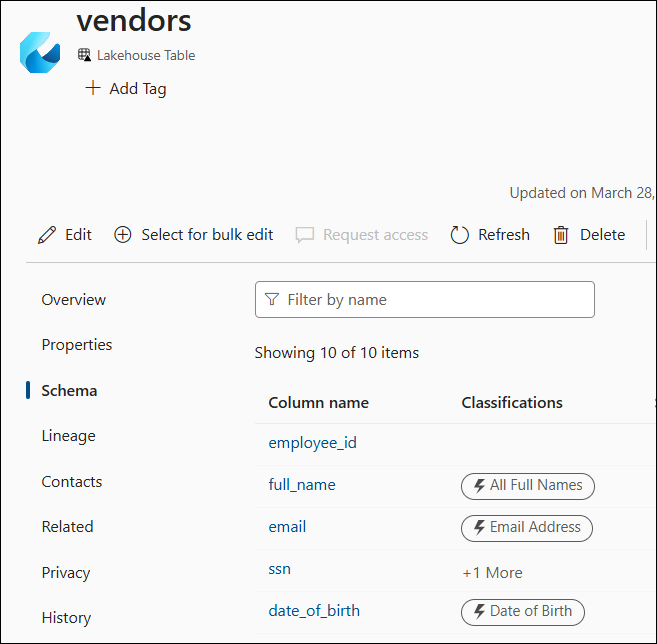

## Task 3: Review technical lineage across platforms 

In this task, you will explore technical lineage in Microsoft Purview to understand how data flows across platforms such as Microsoft Fabric. You will review lineage generated from data pipelines, examine asset relationships, and enhance lineage by adding manual connections where automatic lineage is not available.

1. In the **Unified Catalog** portal, expand **Discovery (1)**, select **Data assets (2)**, search for **Vendor-ETL-Pipeline (3)**, and then select the **Vendor-ETL-Pipeline asset (4)**.

    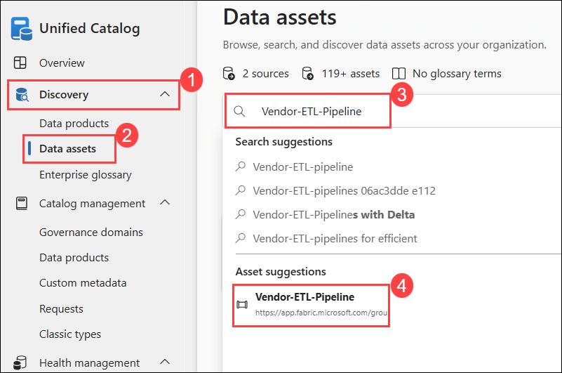

1. Click the **Lineage** tab.

   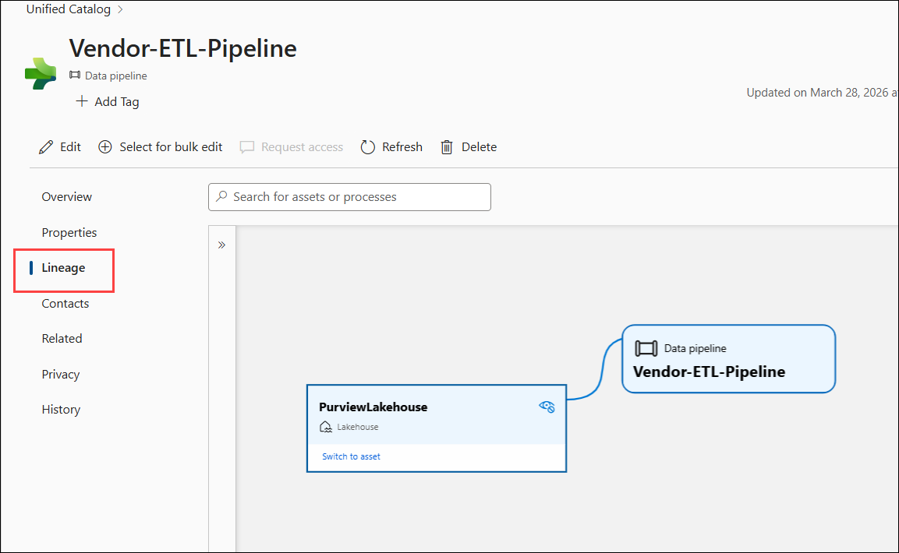
   
4. You should see:
   - **Source**: PurviewLakehouse - the Lakehouse parent item (not an individual table)
   - **Process**: Vendor-ETL-Pipeline - the pipeline you created in Lab 2
   - Click on each node to view its asset details

     > **Note**: The Warehouse destination does NOT appear in the lineage diagram. This is a known Microsoft limitation. Purview captures only the source-side connection for Fabric pipelines. Sub-item level lineage (individual table → pipeline → destination table) is not supported for Fabric.
        
     > If lineage shows "Not available", re-scan your Fabric source and wait 10-15 minutes.

1. In the lineage view, select the Lakehouse asset (e.g., Purview Lakehouse), then click **Switch to asset**.

     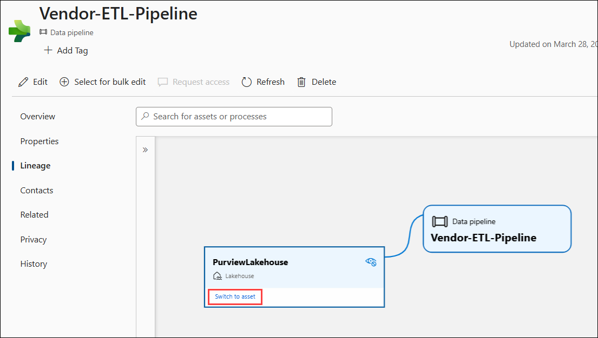

     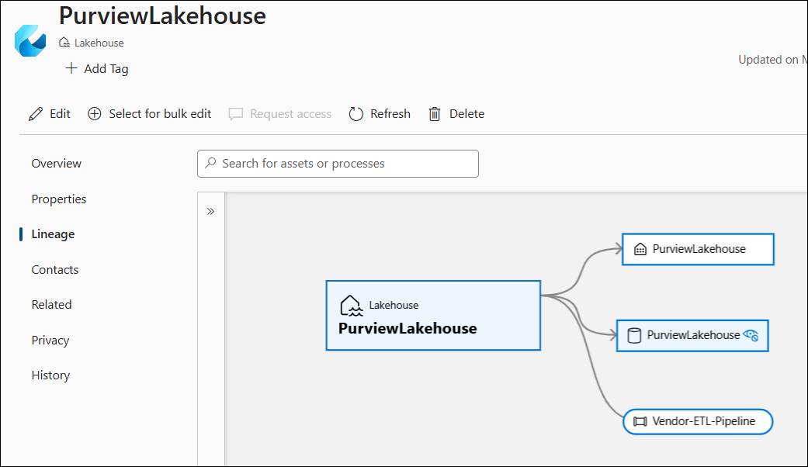

1. In the asset view, review how the Lakehouse connections are displayed.

   

   >**Note**: This shows how the Lakehouse is connected to other assets such as pipelines, SQL endpoints.

1. In the **PurviewLakehouse** asset page, click **Edit** and navigate to the **Lineage** tab.

   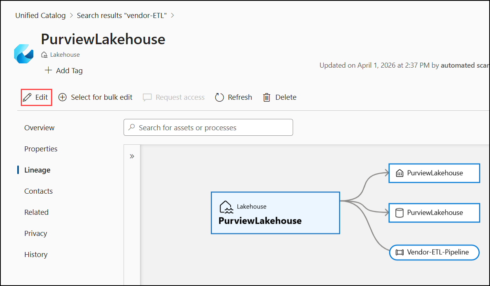

1. Under **Define lineage**, click **+ Add manual lineage (1)**, search and select **vendors (2)** as the related asset.

1. Click **Save (3)** to apply the changes.

   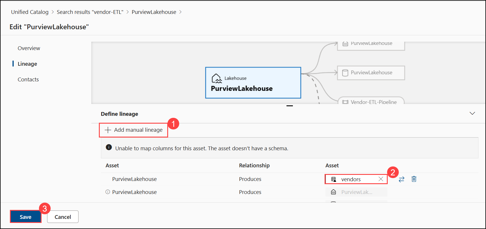

1. Observe how the new lineage connection is added and linked to the existing lineage graph.

   >**Note**: Manual lineage allows you to define relationships that are not automatically captured by Purview.

   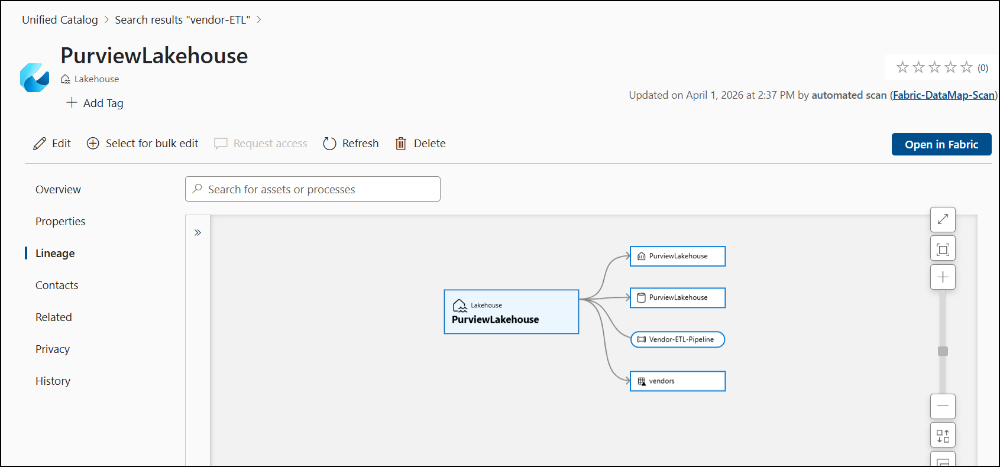

### Summary

In this lab, you:

- Verified scan results for Fabric and Databricks
- Applied built-in classifications to identify sensitive data
- Explored data lineage across platforms
- Identified limitations in lineage visibility
- Enhanced lineage by adding manual relationships

## You have successfully completed Day 1 labs, click next to continue to the next Day 2 labs.
