# Day 2 - Lab 5: Unified Search & Discovery Across Platforms

## Lab Overview 
In this lab, you will use Microsoft Purview to search and discover data assets across Microsoft Fabric and Databricks. You will compare metadata across platforms, identify gaps in data documentation, and improve asset quality by adding descriptions, classifications, ownership, and lineage.

This lab demonstrates how unified discovery combined with metadata enrichment enables effective data governance across modern data platforms.

## Lab Objective
You will be able to complete the following tasks:

- Task 1: Search Data Assets Across Fabric and Databricks
- Task 2: Compare Metadata Completeness
- Task 3: Identify Ownership and Documentation Gaps

### Task 1: Search Data Assets Across Fabric and Databricks

In this task, you will use the Microsoft Purview Unified Catalog to search and explore data assets across Microsoft Fabric and Databricks. You will review asset details and understand how unified search enables cross-platform data discovery.

1. From the left navigation pane, click **Solutions (1)**, then select **Unified Catalog (2)**.

   

1. From the **Unified Catalog** page, expand **Discovery (1)**, select **Data assets (2)**, search for **dimension_customer (3)**, and then select the **dimension_customer asset (4)**.

   

1. Open the Fabric Lakehouse table. Review the following:

    - Schema (columns and data types)
    - Asset properties

      >**Note:** This step demonstrates how to locate and inspect a specific asset.

      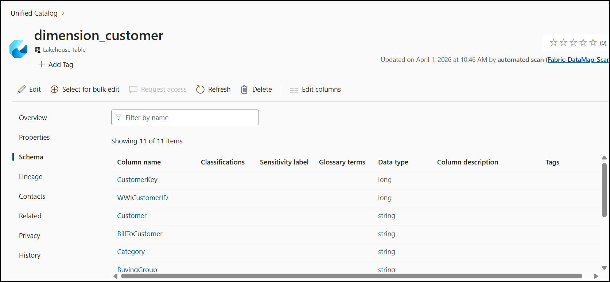

1. From the **Unified Catalog** page, select **Data assets (1)**, search for **customer (2)**, and then select the **customer asset (3)**.

   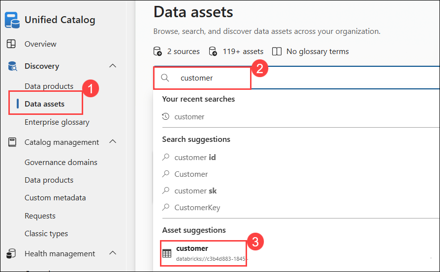

1. Review the list of returned assets.

   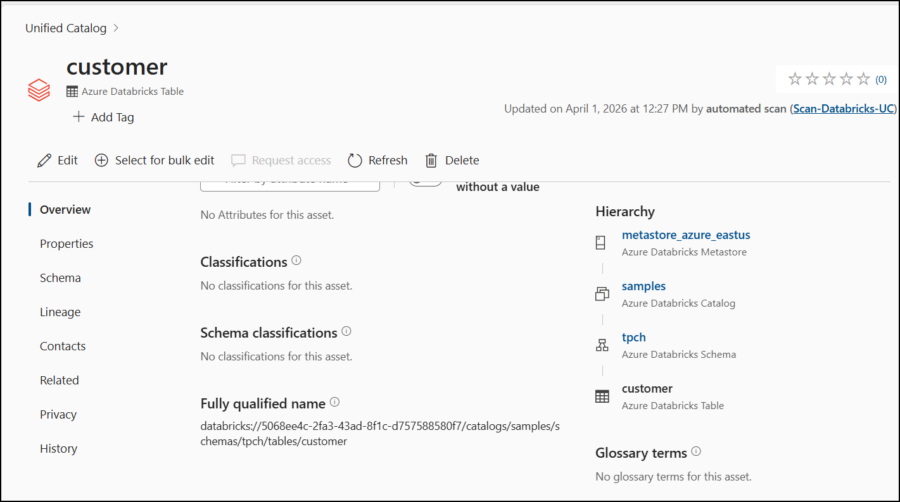

   >**Note:** Observe how similar data entities exist across different platforms.

1. Search for:

   - sale: observe results from both Fabric and Databricks

     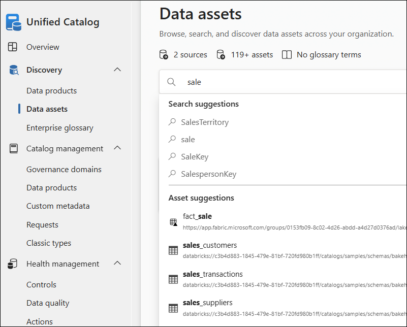

     >**Note**: This highlights unified data discovery across both Fabric and Databricks.

1. Search for **`customer`**, then press **Enter** to navigate to the results pane, where you can select and review multiple related assets in one place. 

1. Notice that assets from both **Fabric and Databricks** are visible in the search results. You can identify differences based on the source type.

   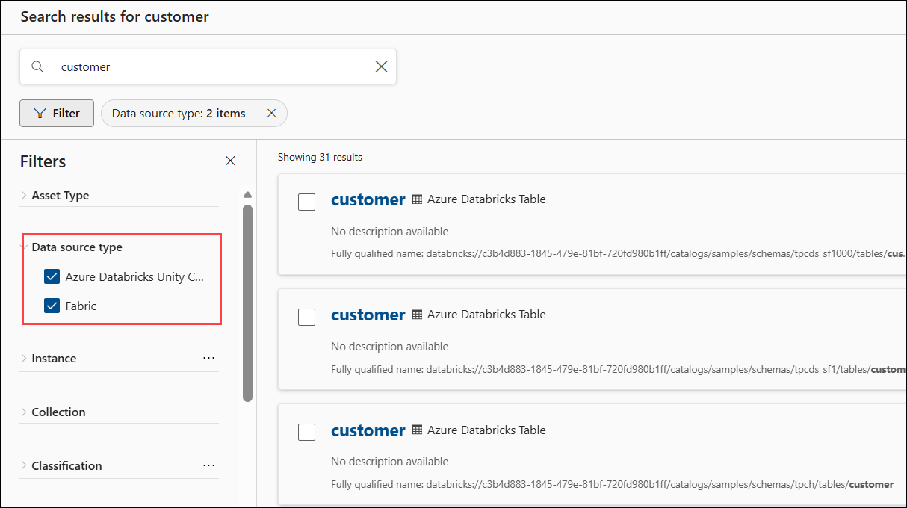

   >**Note:** Assets from both Fabric and Databricks are displayed together.
     - You can compare:
       1. Source type
       2. Asset names
       3. Metadata

    - This view helps in efficiently comparing and analyzing related assets.

## Task 2: Compare Metadata Completeness

In this task, you will compare metadata across Fabric and Databricks assets to identify gaps in documentation, ownership, and classification, and understand differences in metadata availability between platforms.

1. In the search results page, ensure **Fabric (1)** is selected under filters, and then click on **dimension_customer (2)**.

   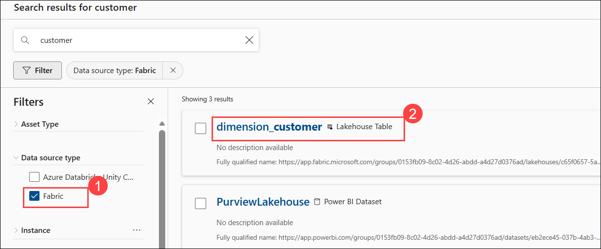
   
   - Review:

      - Schema: Present
      - Description: Missing
      - Owner: Missing
      - Classifications: Missing

        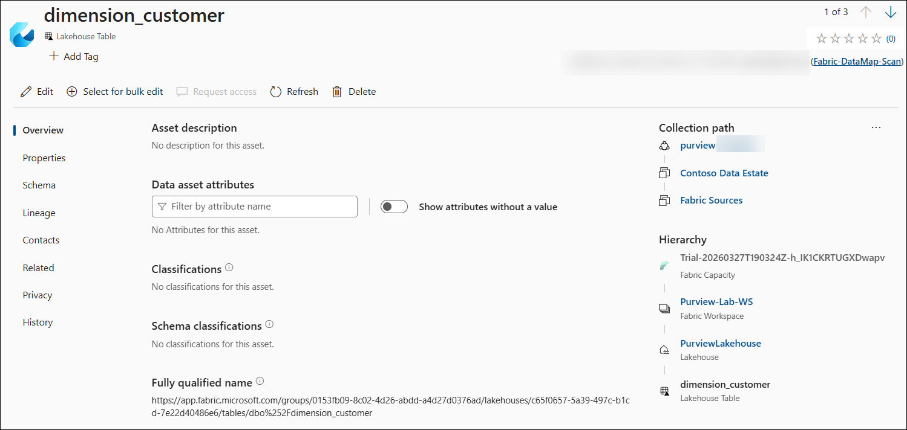

1. Now uncheck **Fabric** and select **Databricks (1)**. Search for `customer`**(2)**, then select it to open the Databricks asset.
 
   - Review:
     - Schema: Present
     - Description: Missing
     - Owner: Missing
     - Classifications: Present (if applied)

       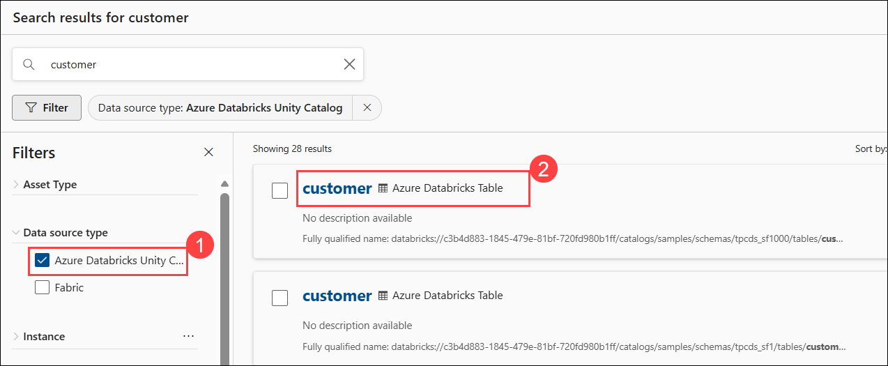

       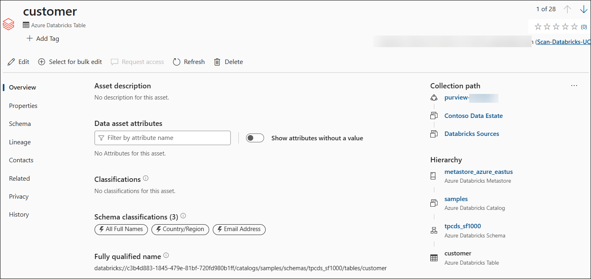

1. Compare both assets:
   
   - Fabric: requires manual metadata enrichment
   - Databricks: includes some default metadata

1. Expected Result: You understand differences in metadata availability between Fabric and Databricks

### Task 3: Identify Ownership and Documentation Gaps

In this task, you will enhance asset metadata by adding descriptions, classifications, ownership, and optional lineage. You will improve data quality and governance by filling gaps identified in previous steps.

1. In the search results page, ensure **Fabric (1)** is selected under filters, and then click on **dimension_customer (2)**.

   
   
1. In the **`dimension_customer`** asset page, click **Edit (1)**.

   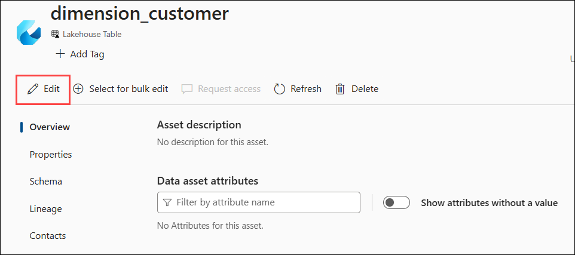
   
1. In the **Overview (1)** tab, update the **Asset description (2)** with relevant with below details.

   - **Asset description**: `Retail customer dimension table from Wide World Importers. Contains customer name, category, buying group, postal code, and delivery details. Source of truth for retail customer profiles in Fabric.`

   - Under **Classifications (3)**, select **All Full Names**.

     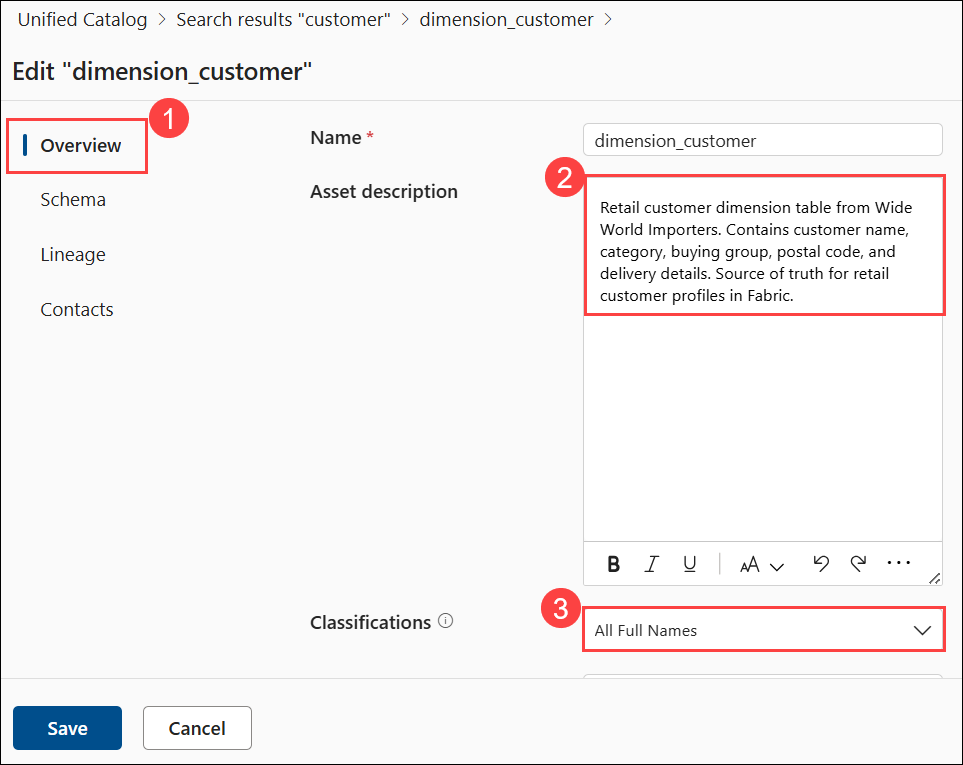
     
1. Navigate to the **Schema (1)** tab.

1. Apply classifications to the following columns:
   - `PrimaryContact`: **All Full Names**
   - `PostalCode`: **U.S. Zip Codes**

     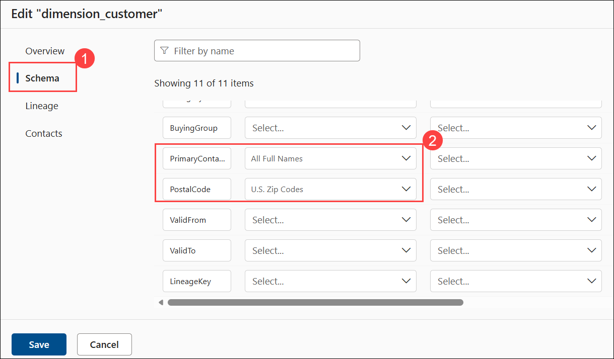

1. Navigate to the **Lineage (1)** tab. You can add linege manual as we perform task in prevate lab by  Clicking **+ Add manual lineage (2)** to define lineage (optional for this lab).

   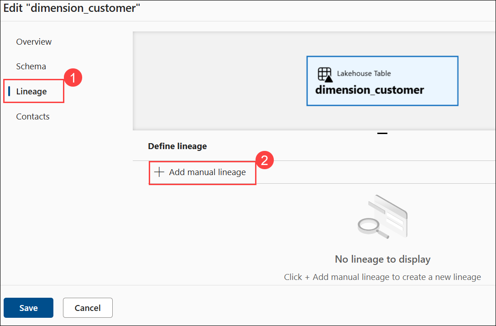

1. Navigate to the **Contacts (1)** tab. Under **Experts (2)** and **Owners (3)**, verify or add the appropriate user.
   
   - **Expert**: <inject key="AzureAdUserEmail" enableCopy="true"/>
   - **Owner**: <inject key="AzureAdUserEmail" enableCopy="true"/>
   - Click **Save (4)** to apply all changes.

    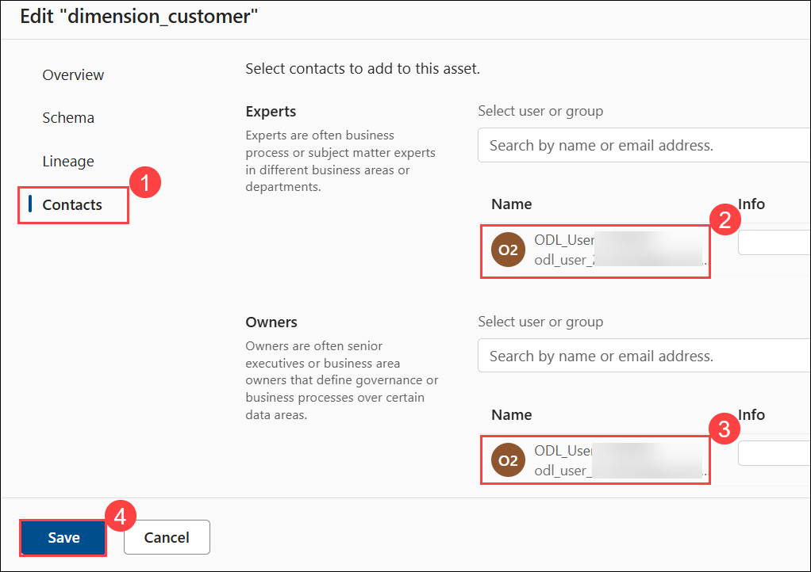

1. Now uncheck **Fabric** and select **Databricks**. Search for `customer`, click **Edit** and update.

   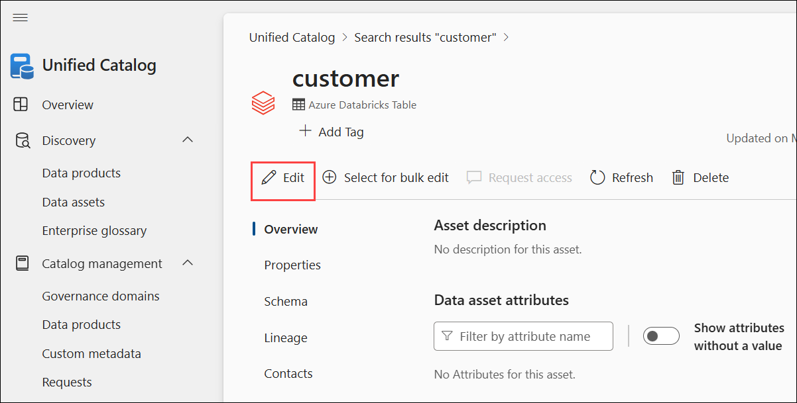
   
1. In the **Overview (1)** tab, update the **Asset description (2)** with relevant with below details.  

   - **Asset Description**: `TPC-H benchmark customer table from Databricks Unity Catalog samples. Contains customer key, name, address, phone, nation, account balance, and market segment. Read-only reference dataset.`
     
   - Under **Classifications (3)**, select **All Full Names**.
  
     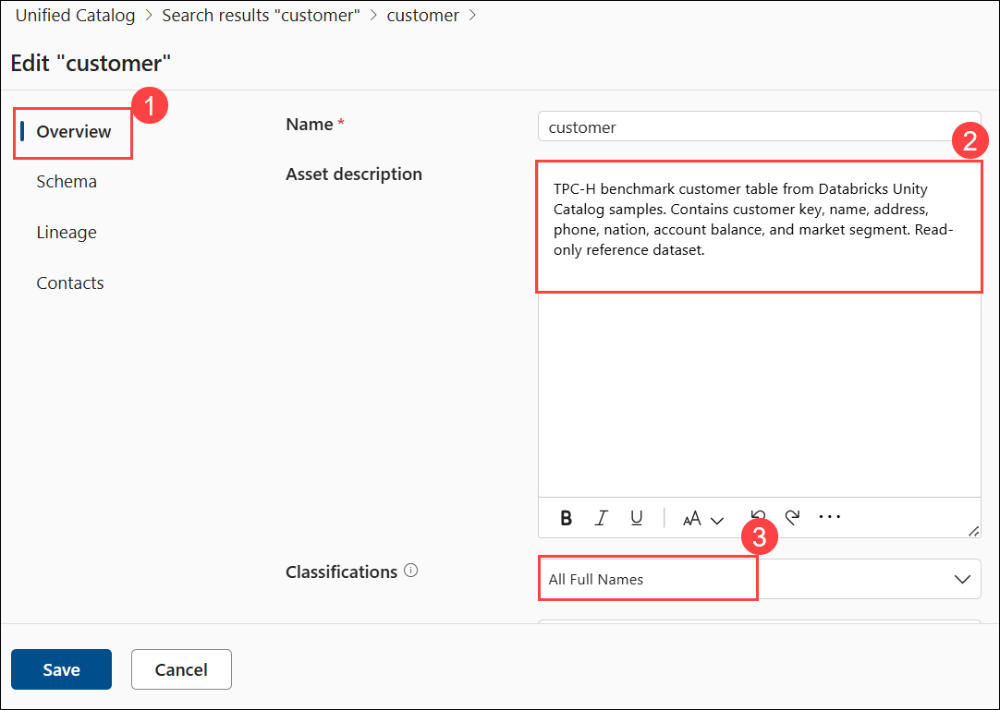
    
1. Under **Schema (1)** apply classifications to the following columns:
   - `c_firstname`: **All Full Names**
   - `c_lasttname`:  **All Full Names**

     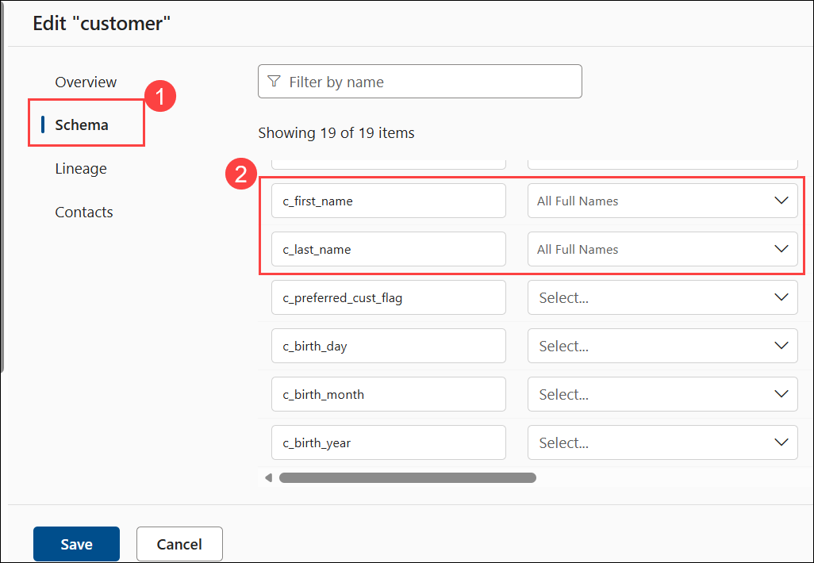

1. Navigate to the **Lineage (1)** tab. You can add linege manual as we perform task in prevate lab by  Clicking **+ Add manual lineage (2)** to define lineage (optional for this lab).

   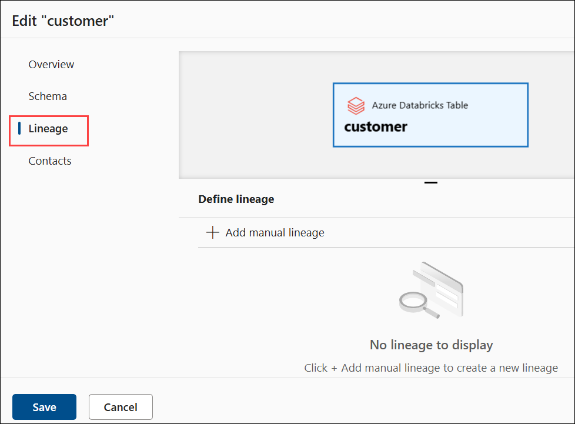

1. Navigate to the **Contacts (1)** tab. Under **Experts (2)** and **Owners (3)**, verify or add the appropriate user.
   
   - **Expert**: <inject key="AzureAdUserEmail" enableCopy="true"/>
   - **Owner**: <inject key="AzureAdUserEmail" enableCopy="true"/>
   - Click **Save (4)** to apply all changes.

      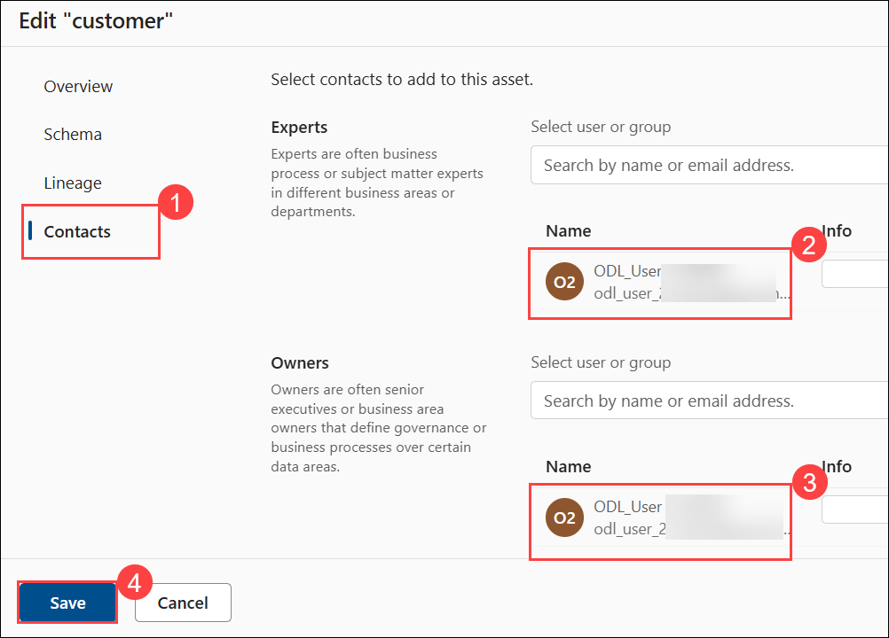
     
1. Compare the two assets now:

   | Metadata Field | Fabric `dimension_customer` | Databricks `tpch.customer` |
   |---|---|---|
   | Description |  Added | Added |
   | Owner |  Added |  Added |
   | Glossary terms | Not yet | Not yet |

### Summary

In this lab, you:

- Searched and discovered data assets across Fabric and Databricks
- Compared metadata completeness between platforms
- Identified gaps in descriptions, ownership, and classifications
- Enriched assets by adding metadata, classifications, and contacts
- Improved data governance through standardized documentation

## Click Next to continue to the next lab.

