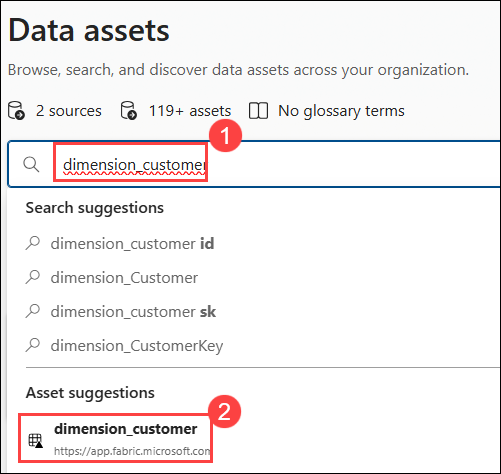

# Lab 5: Unified Search & Discovery Across Platforms

### Task 1: Search Data Assets Across Fabric and Databricks

In this task, you will search and explore data assets across Microsoft Fabric and Databricks using the Microsoft Purview Unified Catalog, and compare their schema and metadata.

1. In the **Purview portal** select **Unified Catalog (1)** expand **Discovery (2)**  choose **Data assets (3)**.

   

1. In the search bar, search for the item, then select it from the search results.

    ```
   dimension_customer
   ```

   

1. Open the Fabric Lakehouse table. Review the following:

    - Schema (columns and data types)
    - Asset properties

   **>Note:** This step demonstrates how to locate and inspect a specific asset.

1. Search for:

   ```
   customer
   ```

   

1. Review the list of returned assets.

1. Select the Databricks customer asset.

1. Review its schema and properties.

   **>Note:** Observe how similar data entities exist across different platforms.

1. Search for:

   - sale: observe results from both Fabric and Databricks

     [Picture 1](./Media/sandbox-purview-image176.png)

     **>Note**: This highlights unified data discovery across both Fabric and Databricks.

1. Search for **`customer`**, then press **Enter** to navigate to the results pane, where you can select and review multiple related assets in one place. 

1. Notice that assets from both **Fabric and Databricks** are visible in the search results. You can identify differences based on the source type.

   [Picture 1](./Media/sandbox-purview-image177.png)

   **>Note:** Assets from both Fabric and Databricks are displayed together.
     - You can compare:
       1. Source type
       2. Asset names
       3. Metadata

    - This view helps in efficiently comparing and analyzing related assets.

## Task 2: Compare Metadata Completeness

1. Search for dimension_customer → open the Fabric table
   - Review:

      - Schema → Present
      - Description → Missing
      - Owner → Missing
      - Classifications → Present (if applied)

1. Search for customer → open Databricks samples.tpch.customer
   - Review:
     - Schema → Present
     - Description → Present (default from Unity Catalog)
     - Owner → Missing
     - Classifications → Present (if applied)

1. Compare both assets:
   - Fabric → requires manual metadata enrichment
   - Databricks → includes some default metadata

1. Expected Result: You understand differences in metadata availability between Fabric and Databricks

### Task 3: Identify Ownership and Documentation Gaps

1. From previous task observations, identify missing metadata:
      - Description → Missing
      - Owner → Missing
      - Glossary terms → Missing

1. Open Fabric dimension_customer
   - Click Edit and update:
   - Add description
   - Assign Owner
   - Assign Expert

1. Save changes and verify updates on the asset page
1. Attempt to edit Databricks customer
