# Day 2 - Lab 6: Create and Manage Data Products

## Lab Overview

In this lab, you will create and manage data products in Microsoft Purview by combining data assets from multiple platforms such as Microsoft Fabric and Azure Databricks. You will define governance domains, create a data product with business context, and associate relevant data assets to build a unified, business-ready dataset.

You will then enrich the data product with governance metadata such as ownership, descriptions, use cases, and contacts. Finally, you will publish the data product to the Unified Catalog and validate how business users can discover and explore it through search and governance domain navigation. :contentReference[oaicite:0]{index=0}

## Lab Objectives

In this lab, you will perform the following:

- **Task 1:** Create a Data Product Spanning Fabric and Databricks  
- **Task 2:** Assign Domain, Owner, and Business Description  
- **Task 3:** Publish Data Product to Unified Catalog  

## Estimated Duration 60 minutes

## Task 1: Create a Data Product Spanning Fabric and Databricks

In this task, you will learn how to create a data product in **Microsoft Purview** by defining a governance domain and adding assets from **Fabric** and **Databricks**.

> **What is a Data Product?** A data product is a curated, business-ready collection of data assets packaged for consumption. It groups related assets from any source (Fabric, Databricks, ADLS, etc.) into a single discoverable unit with business context, ownership, and access policies.

**Step 1: Create a Governance Domain**

1. Navigate to the **Purview portal** 

   ```
   https://purview.microsoft.com
   ```
1. From the left navigation pane, click **Solutions (1)**, then select **Unified Catalog (2)**.

   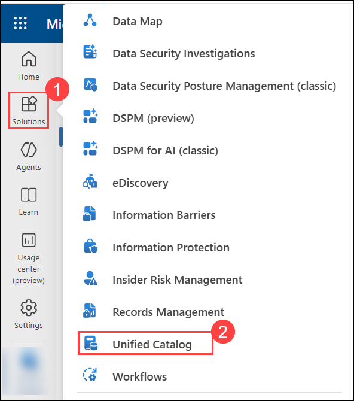

1. In the **Unified Catalog** page, expand **Catalog management (1)**, select **Governance domains (2)**, and click **Create governance domain (3)**.

   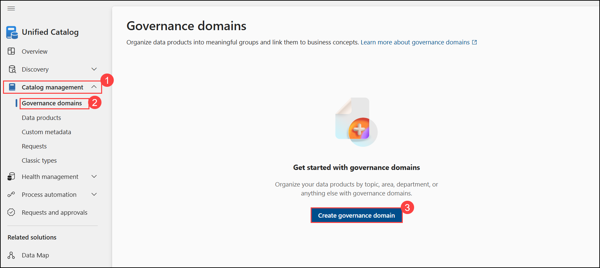

1. In the **New governance domain** page, enter the following details and click **Next (4)**:

      | Field        | Value                                                                |
      |--------------|----------------------------------------------------------------------|
      | Name         | Sales Analytics **(1)**                                              |
      | Description  | Governance domain for sales-related data assets across Fabric and Databricks platforms **(2)**|
      | Type     | Data domain **(3)**                                                      |

      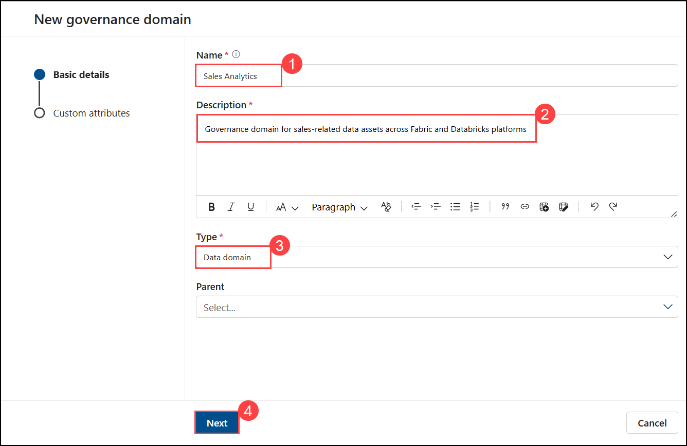

1. On the **Custom attributes** step, leave the default settings and click **Create (5)**.

   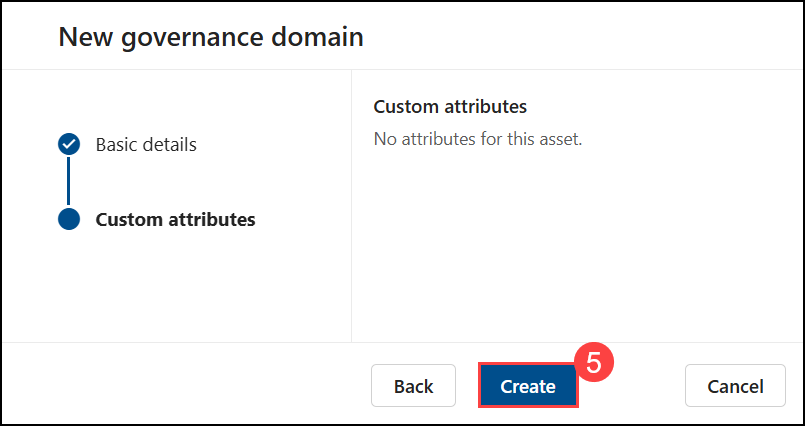

1. Verify that the **Sales Analytics** governance domain appears in the list.

   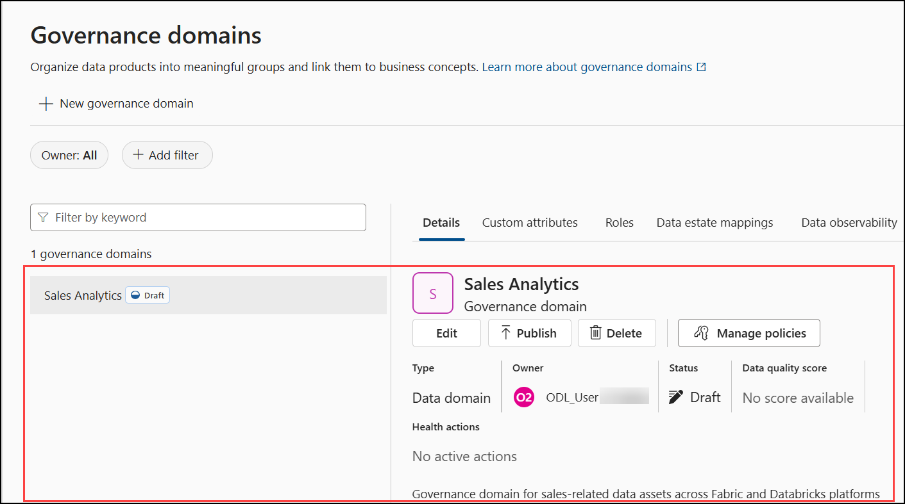

1. Once verified, select the domain and click **Publish**.

   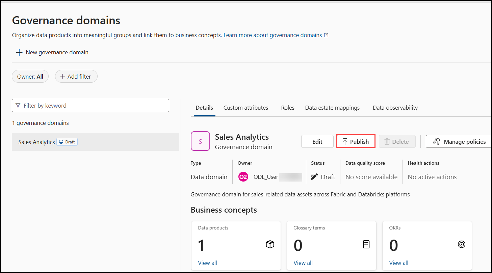

**Step 2: Create the Data Product**

1. In **Unified Catalog**, expand **Catalog management (1)** → select **Data products (2)** → click **+ New data product (3)**.

   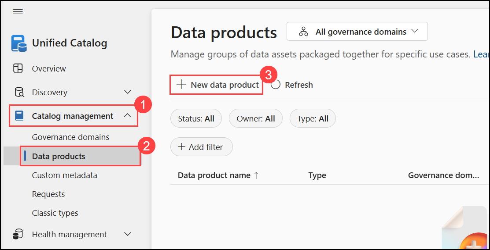

1. In the **Basic details** step, enter the following details and click **Next (5)**:

      | Field       | Value                                                                 |
      |-------------|----------------------------------------------------------------------|
      | Name        | Customer 360 **(1)**                                                 |
      | Description | Unified customer data product spanning Fabric Lakehouse and Databricks Unity Catalog for customer analytics and reporting **(2)** |
      | Type        | Dataset **(3)**                                                      |
      | Owner       | Ensure **ODL_User<inject key="DeploymentID" enableCopy="false"/> (4)** is selected |

      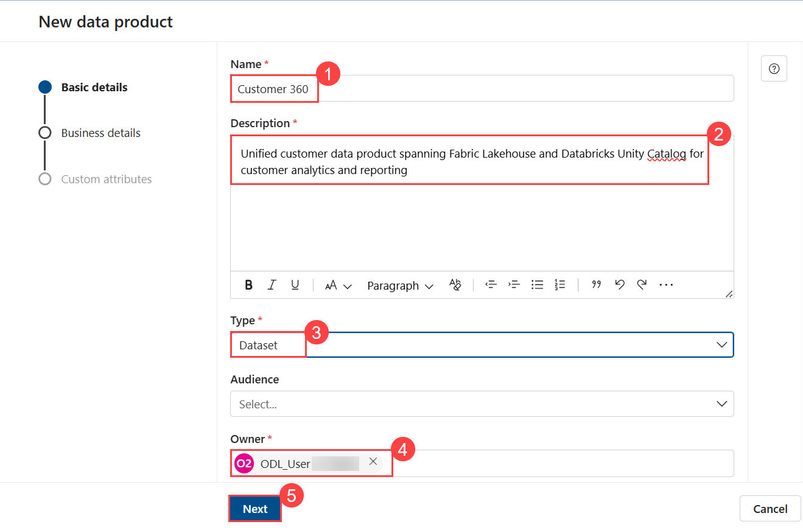

1. In the **Business details** step, enter the following and click **Next (3)**:

      | Field               | Value                                                                 |
      |---------------------|----------------------------------------------------------------------|
      | Governance domain   | Sales Analytics **(1)**                              |
      | Use cases           | Customer data product that consolidates customer profiles, geographic data, and sales transactions from Fabric and Databricks for unified analytics **(2)** |

      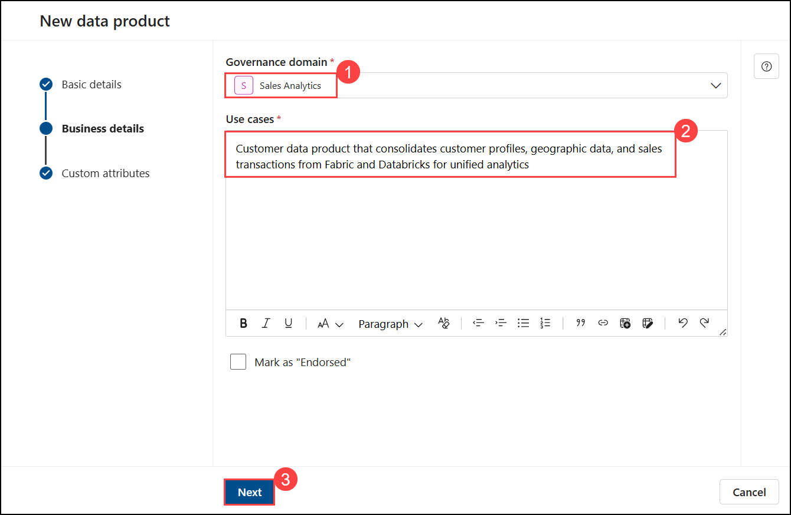

1. In the **Custom attributes** step, skip (no changes required) and click **Create**.

   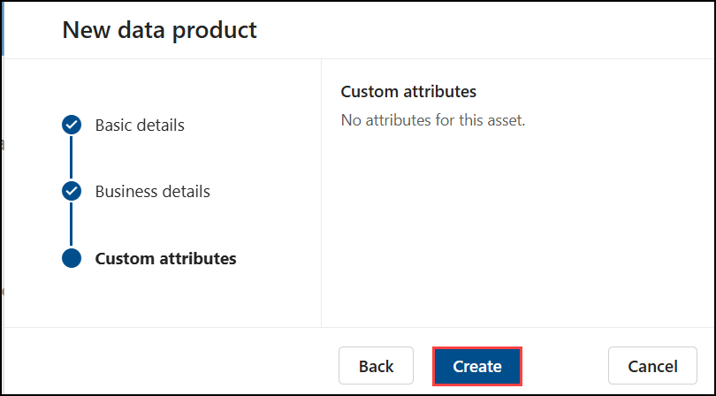

**Step 3: Add Assets to the Data Product**

1. After creating the data product, select **Add data assets (1)** and click **Done (2)**.

   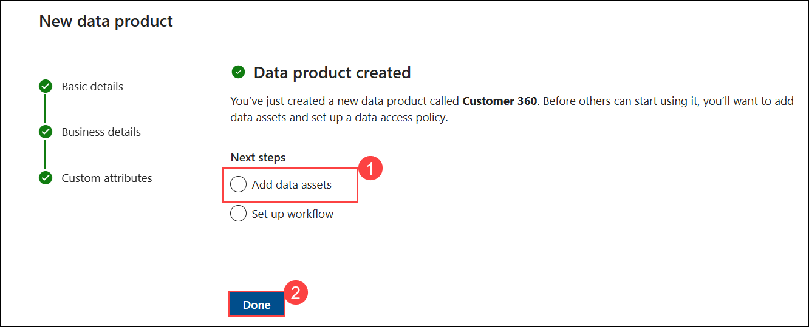

1. In the **Find and select** pane, select **Databricks Sources (1)**, choose at least four relevant tables such as `customer`, `sales_customers`, `sales_suppliers`, and `sales_franchises` (2), verify them in the **Selected (3)** pane, and click **Add (4)**.

   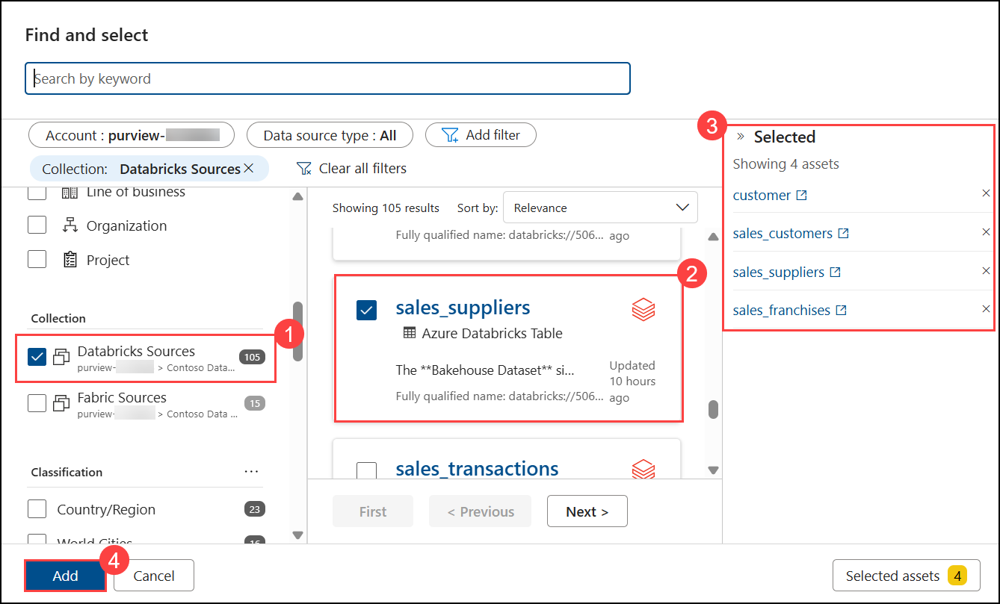

1. Repeat the same process for **Fabric Sources (1)**, select at least four relevant tables such as `dimension_customer`, `vendors`, `dimension_city`, and `dimension_stock_item` (2), verify them in the **Selected (3)** pane, and click **Add (4)**.

   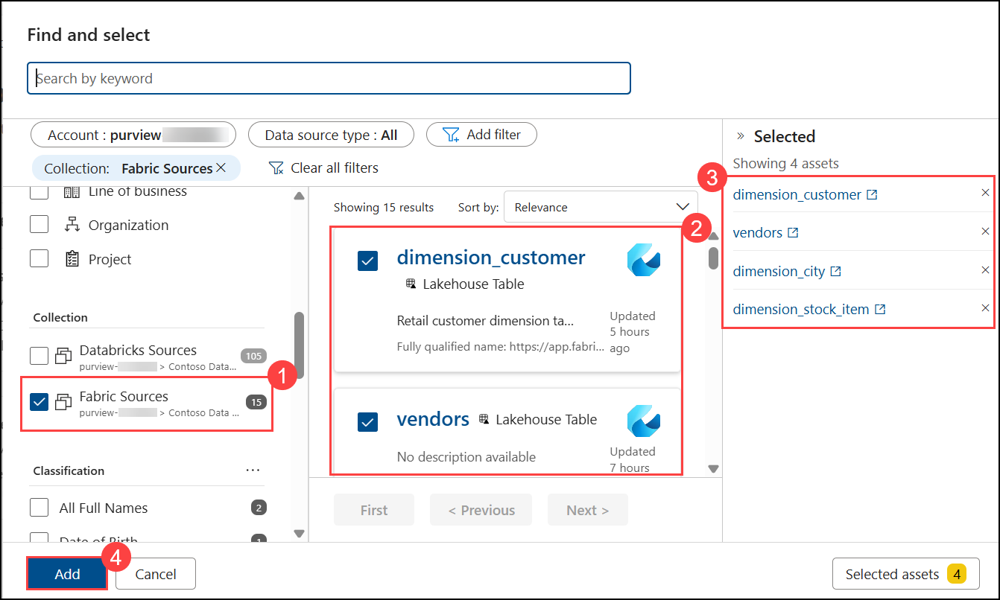

   > **Tip**: Use the **Collection** filter to narrow results to just Fabric Sources or Databricks Sources when multiple results appear.

1. Optionally, add more assets to enrich the data product:
    - **Fabric**: `dimension_city`,`dimension_customer`, `fact_sale` (if available in your Lakehouse)
    - **Databricks**: any additional tables from your custom catalog
1. Verify the assets appear in the data product's asset list (minimum 3 assets)

   > **Note**: This data product spans two platforms (Fabric + Databricks) — demonstrating Purview's ability to package cross-platform assets into a single business unit.

   **Expected Result**: `Sales Analytics` governance domain created. `Customer 360` data product created with assets from both Fabric and Databricks (minimum 4: `dimension_customer`, `customer`, `sales_suppliers`,`dimension_city`).

## Task 2: Assign Domain, Owner, and Business Description

In this task, you will learn how to assign governance domain, ownership, and business context to a data product in **Microsoft Purview**.

**Step 1: Review Data Product Metadata**

1. Open the **Customer 360** data product and review the metadata:

      | Field              | Value                                                                 |
      |--------------------|----------------------------------------------------------------------|
      | Name               | Customer 360 **(1)**                                                 |
      | Description        | Unified customer data product spanning Fabric Lakehouse and Databricks Unity Catalog for customer analytics and reporting **(2)** |
      | Governance domain  | Sales Analytics **(3)**                                              |
      | Owner              | **ODL_User<inject key="DeploymentID" enableCopy="false"/> (4)**      |

      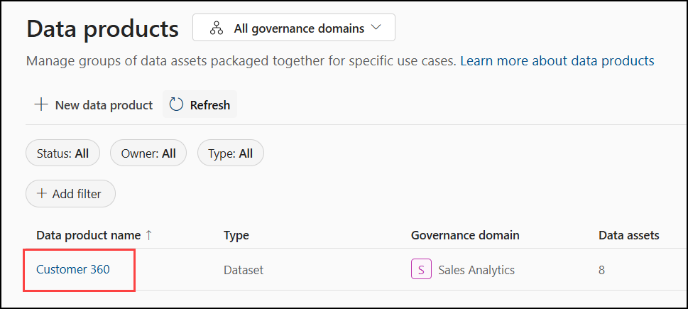

      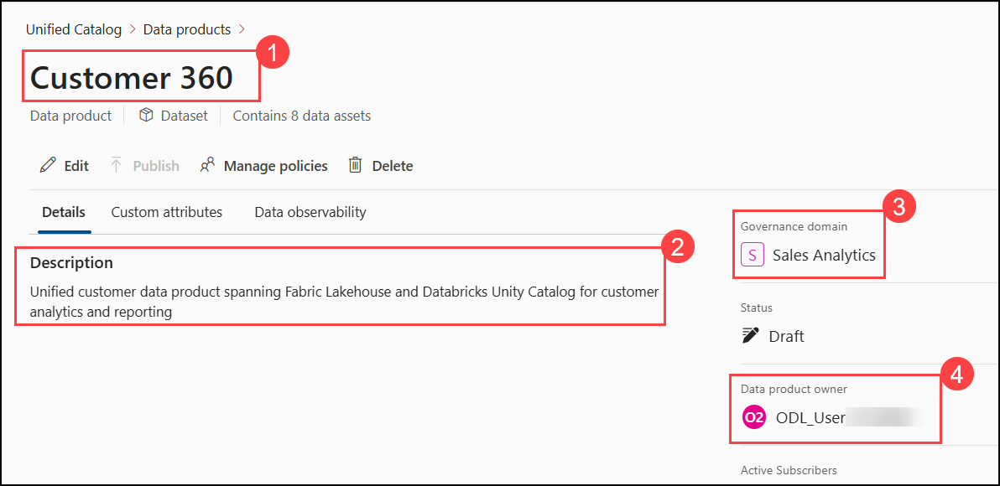

**Step 2: Add Additional Business Context**

1. Click **Edit** on the data product.

   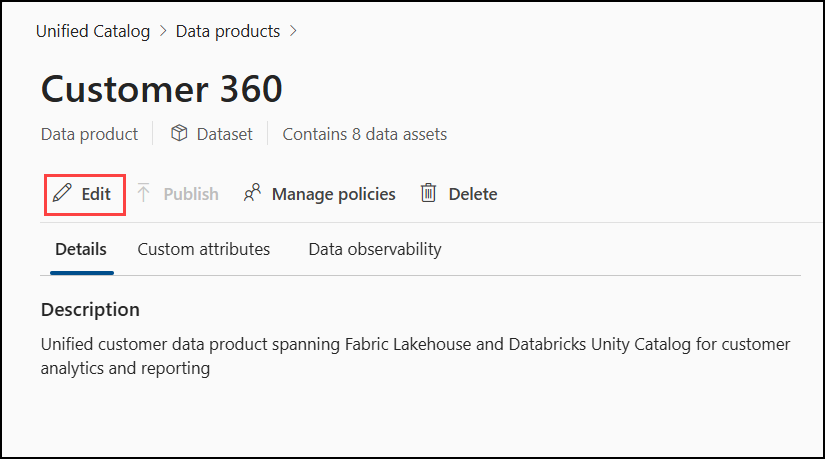

2. Navigate to **Business details (1)**, update the **Use cases (2)** field with  
   `Customer analytics, segmentation, sales reporting, cross-platform customer matching`, and click **Save (3)**.

   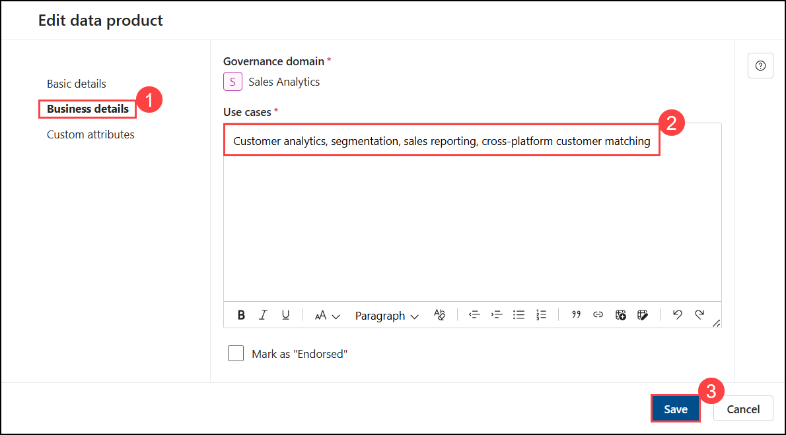

## Task 3: Publish Data Product to Unified Catalog

In this task, you will learn how to publish a data product in **Microsoft Purview** and verify its discovery in the **Unified Catalog**.

**Step 1: Review Before Publishing**

1. Open the **Customer 360** data product and verify that the name, description, governance domain (**Sales Analytics**), owner (**ODL_User<inject key="DeploymentID" enableCopy="false"/>**), and required data assets (minimum of 4) are correctly populated.

1. Confirm that the data product status is **Draft**.

   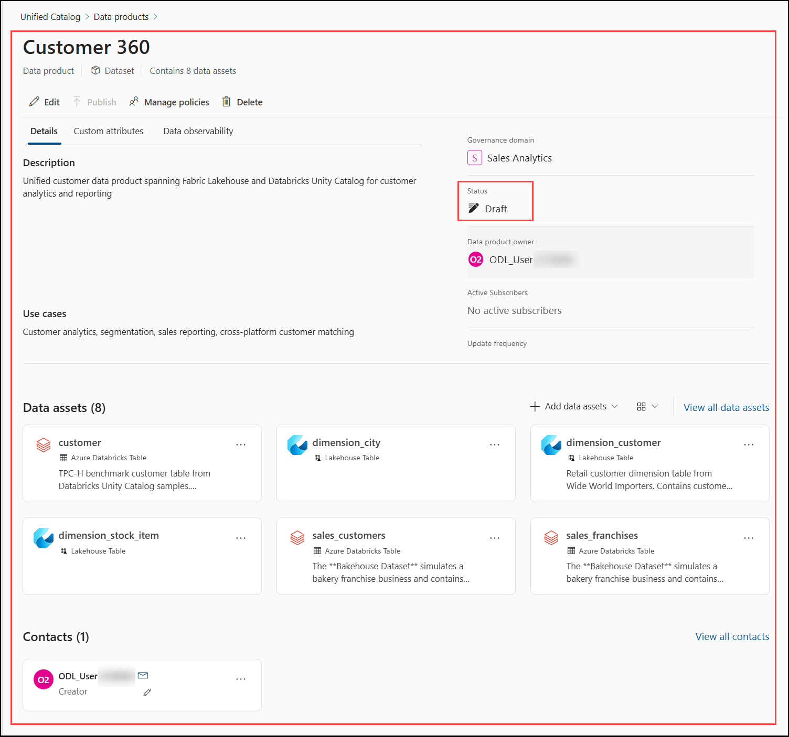

**Step 2: Publish the Data Product**

1. Click **Publish** (or change status to **Published**)

   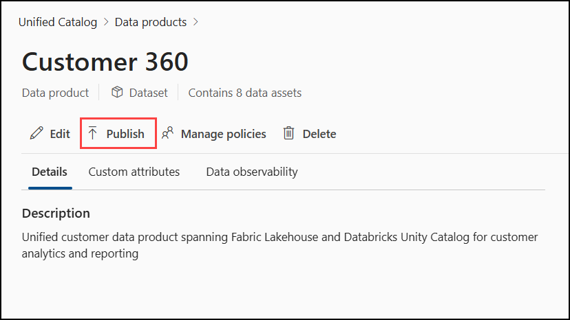

1. Confirm the publish action

   > **What happens when you publish?** Published data products become visible to all users with catalog reader permissions. Business users can discover them through search, browse, and governance domain navigation. Draft products are only visible to owners and admins.

1. When prompted, select **Set up workflow (1)** and click **OK (2)**.

   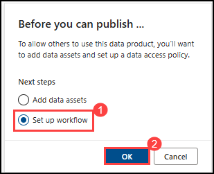

2. In the **Manage access policies** pane, set the **Access time limit (1)** to **5 Days**, ensure **ODL_User<inject key="DeploymentID" enableCopy="false"/> (2)** is added as the approver, and click **Save changes (3)**.

   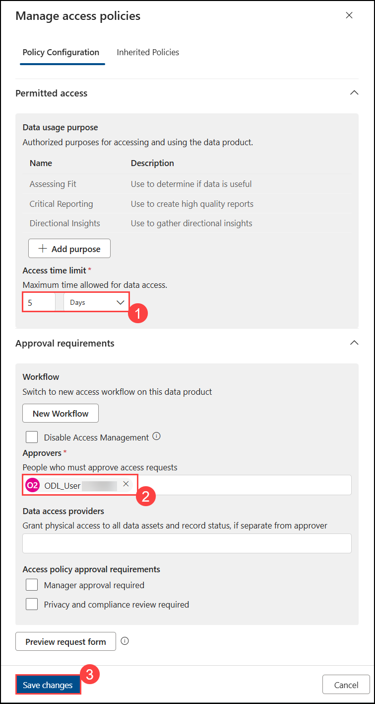

1. The data product status changes to **Published**

   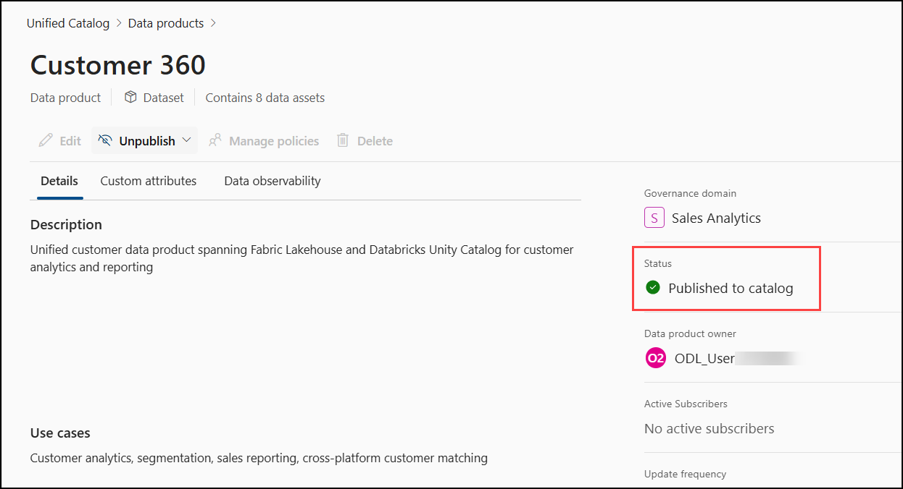

**Step 3: Verify Discovery as a Business User**

1. In **Unified Catalog**, expand **Discovery (1)** and select **Data products (2)** and verify that **Customer 360 (3)** appears in the list.

   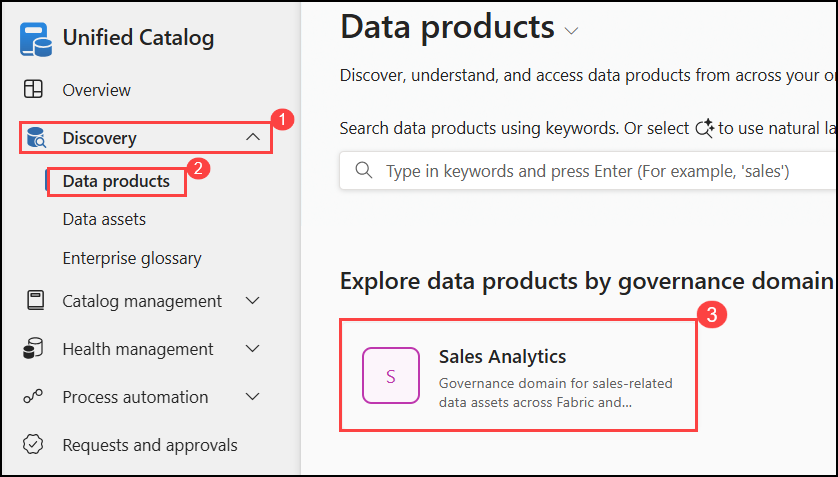

2. Select **Customer 360** and confirm that the description, use cases, governance domain (**Sales Analytics**), owner (**ODL_User<inject key="DeploymentID" enableCopy="false"/>**), and included data assets are correctly displayed.

   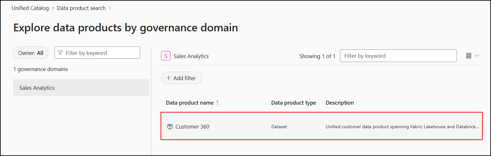

   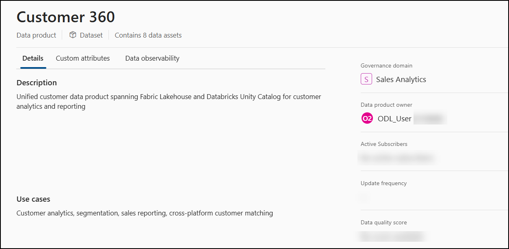


1. Go to **Unified Catalog** → **Discovery** → **Data assets** → search for `Customer 360`
    - The data product should appear as a searchable entity

1. Expand **Catalog management (1)**, select **Governance domains (2)**, choose **Sales Analytics (3)**, and click **View all (4)** under **Business concepts**.

    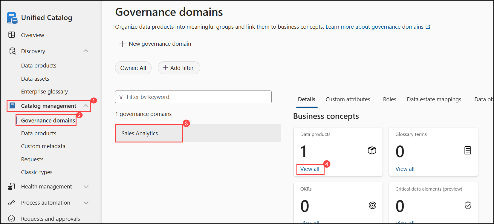

**Step 4: Browse by Governance Domain**

1. Go to **Unified Catalog** → **Discovery** → **Browse**
1. Select **By governance domain** → click `Sales Analytics`
1. Verify `Customer 360` data product is listed
1. Click into it → navigate to individual assets → confirm the full drill-down path:
    - Domain → Data Product → Asset → Schema → Columns

**Step 5: Create a Second Data Product (Optional)**

1. If time permits, create a second data product:
    - **Name**: `Sales Transactions`
    - **Description**: `Sales and order transaction data across Fabric and Databricks for revenue analysis`
    - **Domain**: `Sales Analytics`
    - **Assets**: `fact_sale` (Fabric) + any available Databricks order/sales tables
    - **Publish** it
1. Verify both data products appear under the `Sales Analytics` domain

   >**Expected Result**: `Customer 360` data product published and discoverable in Unified Catalog. Business users can find it via search, data products listing, and governance domain browsing. Full drill-down from domain → product → asset → schema works.

## Summary

In this lab, you created and managed a data product in Microsoft Purview by defining a governance domain, combining data assets from Microsoft Fabric and Azure Databricks, and assigning business metadata such as owner, description, and use case. You then published the data product to the Unified Catalog and validated its discoverability and usability from a business user perspective.

## Click Next to continue to the next lab.

