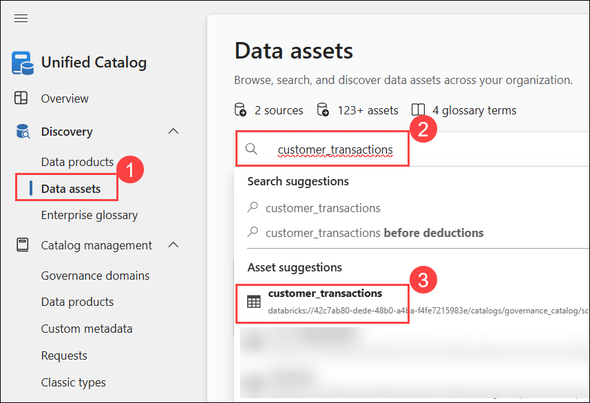
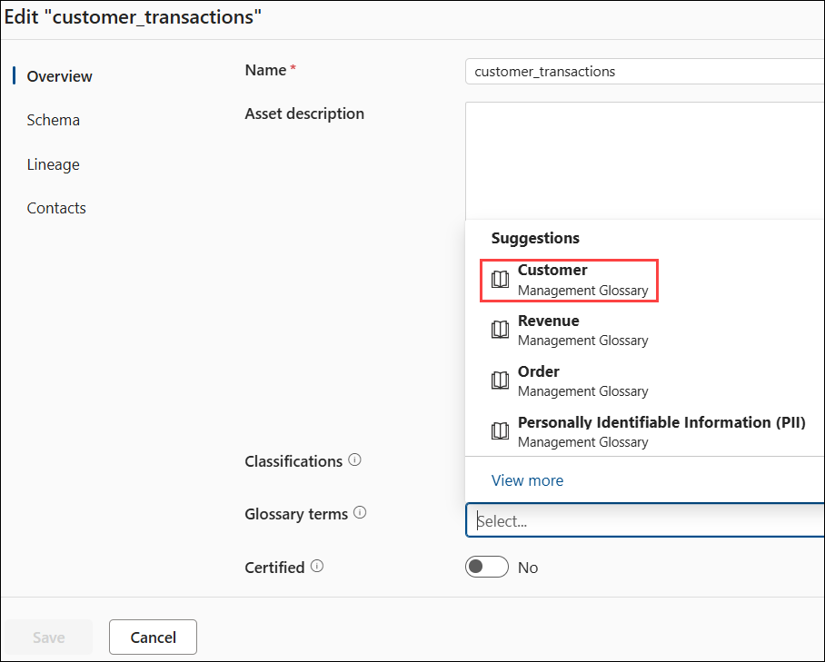
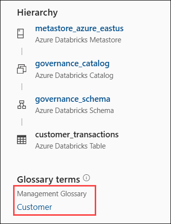
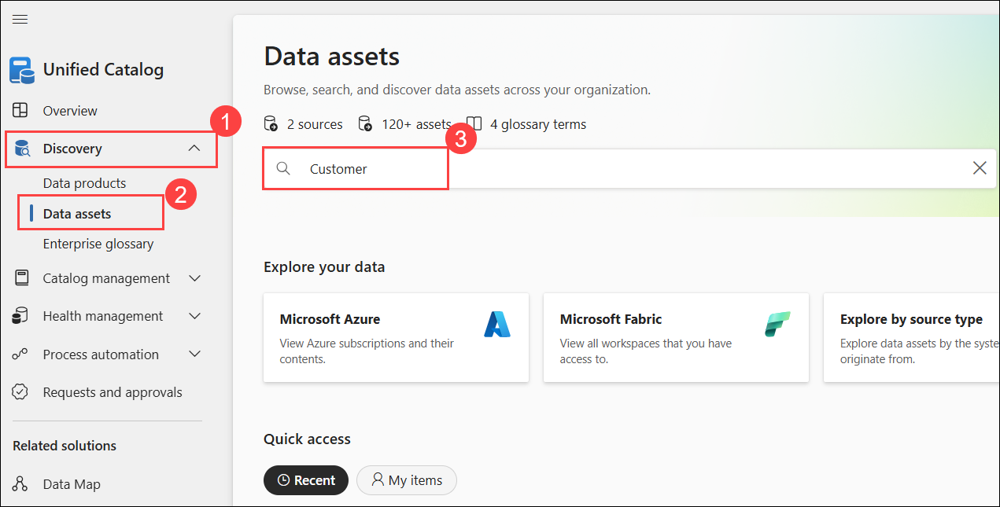
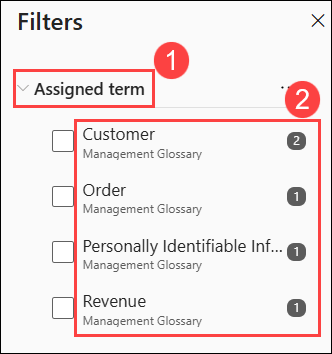
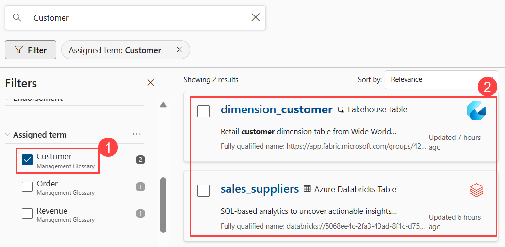
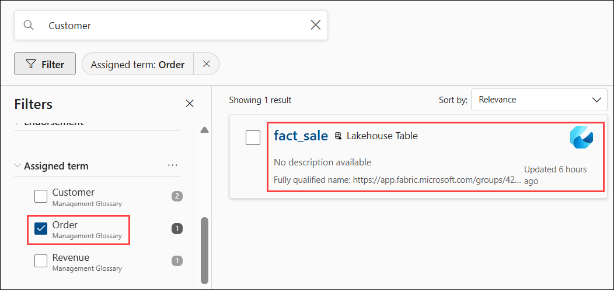

# Day 2 - Lab 7: Business Metadata & Glossary Management

## Estimated Duration: 50 minutes

## Lab Overview

In this lab, you will create and manage business glossary terms in Microsoft Purview to establish a standardized business vocabulary. You will define glossary terms, map them to data assets across Microsoft Fabric and Azure Databricks, and validate how business terminology aligns with technical data assets in the Unified Catalog.

This lab demonstrates how business glossary terms act as a bridge between business concepts and technical metadata, enabling improved data discovery and governance across platforms.

## Lab Objectives

In this lab, you will perform the following:

- Task 1: Create Business Glossary Terms  
- Task 2: Map Glossary Terms to Fabric and Databricks Assets  
- Task 3: Validate Business-to-Technical Alignment  

## Task 1: Create Business Glossary Terms  
   
In this task, you will create a classic glossary in Microsoft Purview and define four business terms that represent key business concepts. These terms will later be mapped to technical data assets.

1. Navigate back to the **Microsoft Purview** home page using the URL below.

   ```
   https://purview.microsoft.com/
   ```

1. From the left navigation pane, click **Solutions (1)**, then select **Unified Catalog (2)**.

   

1. Under **Unified Catalog** expand **Catalog management (1)** then click **Classic types (2)** and select **+ New glossary (3)**

   

1. On the **New glossary** page, enter the following and click **Create (5)**

      | Field | Value |
      |------|------|
      | Name | Management Glossary **(1)** |
      | Domain | purview-<inject key="DeploymentID" enableCopy="false"/> (Default) **(2)** |
      | Steward | ODL_User<inject key="DeploymentID" enableCopy="false"/> **(3)** |
      | Expert | ODL_User<inject key="DeploymentID" enableCopy="false"/> **(4)** |

      

1. Open the created glossary and click **View terms**

   

1. Click **+ New term (1)**, then click **Continue (2)**

   

1. On the **Overview** page, enter the following and click **Create (3)**

      | Field | Value |
      |------|------|
      | Name | Customer **(1)** |
      | Definition | A person or organization that purchases goods or services. In the retail context (Fabric), this includes buying group and category. In the benchmark context (Databricks), this includes market segment and account balance. **(2)** |

      

1. Click **Terms** at the top left to go back and add a new term

   

1. Click **+ New term (1)** and select **System default** then click **Continue (2)**

   

1. On the **Overview** page, enter the following and click **Create (3)**

      | Field | Value |
      |------|------|
      | Name | Revenue **(1)** |
      | Definition | The total income generated from sales transactions before deductions. Calculated from unit price multiplied by quantity, excluding tax and returns. **(2)** |

      

1. Click **Terms** at the top left to go back and add a new term

   

1. Click **+ New term (1)** and select **System default** then click **Continue (2)**

   

1. On the **Overview** page, enter the following and click **Create (3)**

      | Field | Value |
      |------|------|
      | Name | Order **(1)** |
      | Definition | A confirmed request from a customer to purchase one or more items. Includes order date, status, total price, and priority. Tracked across both retail (Fabric) and benchmark (Databricks) systems. **(2)** |

      

1. Click **Terms** at the top left to go back and add a new term

   

1. Click **+ New term (1)** and select **System default** then click **Continue (2)**

   

1. On the **Overview** page, enter the following and click **Create (3)**

      | Field | Value |
      |------|------|
      | Name | Personally Identifiable Information (PII) **(1)** |
      | Definition | Any data that can identify a specific individual, including names, addresses, phone numbers, email addresses, and government-issued identifiers. Subject to data protection regulations. **(2)** |

      

## Task 2: Map Glossary Terms to Fabric and Databricks Assets

In this task, you will learn how to map business glossary terms to **Fabric** and **Databricks** assets in **Microsoft Purview** to connect business context with technical data.

**Step 1: Map "Customer" Term to Assets**

1. From the **Unified Catalog** page, expand **Discovery (1)**, select **Data assets (2)**, search for **dimension_customer (3)**, and then select the **dimension_customer asset (4)**.

   

1. Click **Edit**

   

1. Click the dropdown under **Glossary terms (1)** and select **Customer (2)**

   

1. Verify that **Customer** appears under selected terms, then click **Save (2)**

   

1. Review that **Customer** is displayed under **Glossary terms** in the asset overview

   

1. Click **Data assets (1)**, search for **sales_suppliers (2)**, and select the asset **sales_suppliers (3)**

   

1. Click **Edit**

   

1. Click the dropdown under **Glossary terms (1)** and select **Customer (2)**
   

1. Verify **Customer** is added under selected terms, then click **Save (2)**

   

1. Review that **Customer** appears under **Glossary terms** in the asset overview

   

1. Click **Data assets (1)**, search for **customer_transactions (2)**, and select the asset **customer_transactions (3)**

   

1. Click **Edit**

1. Click the dropdown under **Glossary terms (1)** and select **Customer (2)**

   

1. Verify **Customer** is added under selected terms, then click **Save (2)**

1. Review that **Customer** appears under **Glossary terms** in the asset overview

   

**Step 2: Map "Revenue" Term to Sales Assets**

1. Click **Data assets (1)**, search for **fact_sale (2)**, and select the asset **fact_sale (3)**

   

1. Click **Edit**

   

1. Click the dropdown under **Glossary terms (1)** and select **Revenue (2)**
   

1. Verify **Revenue** is added under selected terms, then click **Save (2)**

   

1. Review that **Revenue** appears under **Glossary terms** in the asset overview

   

**Step 3: Map "Order" Term to Sales Assets**

1. Click **Data assets (1)**, search for **fact_sale (2)**, and select the asset **fact_sale (3)**

   

1. Click **Edit**

   

1. Click the dropdown under **Glossary terms (1)** and select **Order (2)**
  
   

1. Verify **Order** is added under selected terms, then click **Save (2)**

   

1. Review that **Revenue and Order** appears under **Glossary terms** in the asset overview

   

**Step 4: Map "PII" Term to Assets with Sensitive Data**

1. Click **Data assets (1)**, search for **vendors (2)**, and select the asset **vendors (3)**

   

1. Click **Edit**

   

1. Click the dropdown under **Glossary terms (1)** and select **Personally Identifiable Information (PII) (2)**
  
   

1. Verify **Personally Identifiable Information (PII)** is added under selected terms, then click **Save (2)**

   

1. Review that **Personally Identifiable Information (PII)** appears under **Glossary terms** in the asset overview

   

## Task 3: Validate Business-to-Technical Alignment

In this task, you will learn how to validate business-to-technical alignment in **Microsoft Purview** by exploring glossary-linked assets and cross-platform relationships.

1. Go to **Unified Catalog** > **Discovery (1)** > **Data assets (2)**. In the search bar, type **`Customer` (3)**, then press **Enter**.

   

1. On the results page, expand **Assigned terms**. You should see all four created **glossary terms**.

   

1. Select one term to filter the results. Notice that only the assets associated with the selected glossary term are displayed.

   
   
1. Repeat the same for other terms to observe how filtering works. This demonstrates how glossary terms help refine and organize search results effectively.

   
   
### Summary

In this lab, you:

- Created business glossary terms to define key business concepts
- Mapped glossary terms to Fabric and Databricks assets
- Linked business context with technical metadata
- Explored glossary-based search and navigation
- Validated business-to-technical alignment across platforms

## You have successfully completed Day 2 labs, click next to continue to the next Day 3 labs.
