# Lab 8: Data Quality Rules and Monitoring

## Objective

Define data quality rules on Fabric and Databricks assets, execute quality checks, and review quality metrics in the Unified Catalog.

## Task 1: Configure Data Quality Source Connections for Fabric and Databricks

Data quality in Microsoft Purview connects directly to the data source to execute rule queries. For Fabric Lakehouse tables, Purview uses the SQL analytics endpoint.

**For Microsoft Fabric (customer_master):**

1. In the **Fabric portal**, navigate to the workspace and open the **Lakehouse**. 

    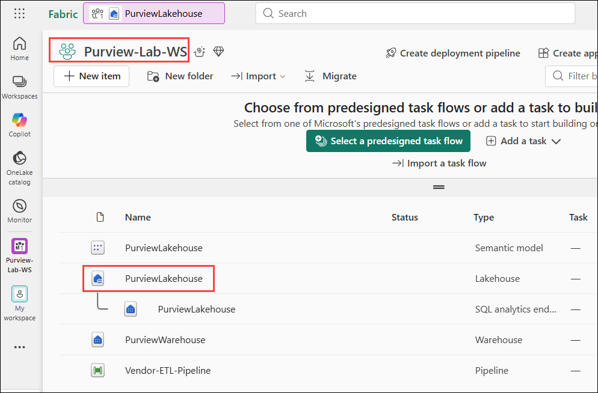

1. Copy the **workspace ID** from the URL (1), as shown below, as it will be required in later steps. Then, from the same URL, copy the **Lakehouse ID (2)** that appears after `lakehouse/`.

    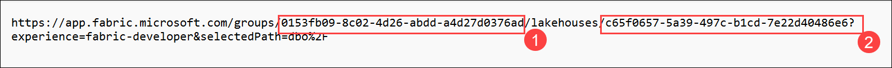

1. In the purview portal, open **Unified Catalog**, expand **Health management (1)**, select **Data quality (1)** > **Sales Analytics**. And from the top menu click on **Manage**
   
      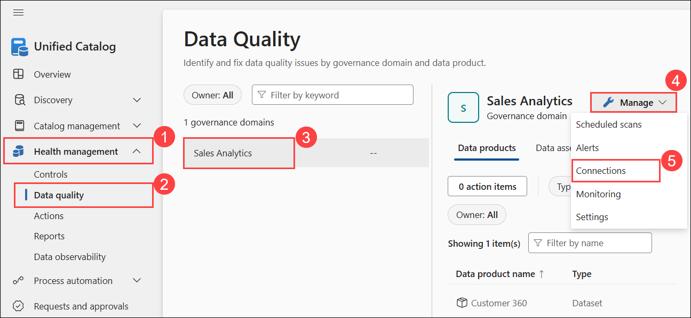

1. Select **+ New** then provide the following connection details:
   - **Connection name**: **fabric-dq-connection (1)**
   - **Source Type**:Choose **Fabric (2)**
   - **Worksapce id**: paste the id you copied in the previous step(3)
   - **Lakehouse id**: paste the id you copied in the previous step(4)
   - Click **Submit (5)** after the connection is tested

     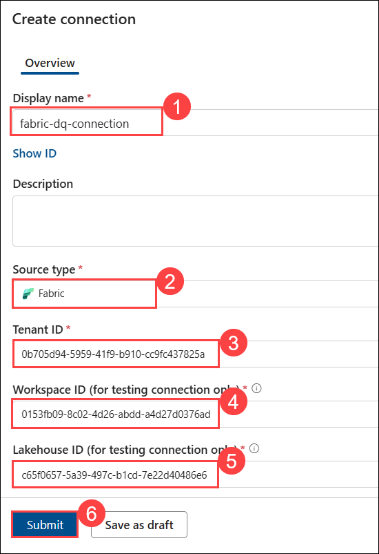

## Task 2: Define Data Quality Validation Rules for Dataset

1. For each rule below, navigate to **Unified Catalog** > **Health management** > **Sales Analytics (1)** > **Customer 360 (2)**.

   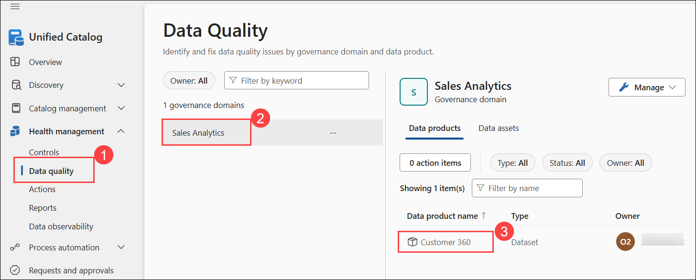

1. Click on **Customer 360** and select **dimension_customer**

   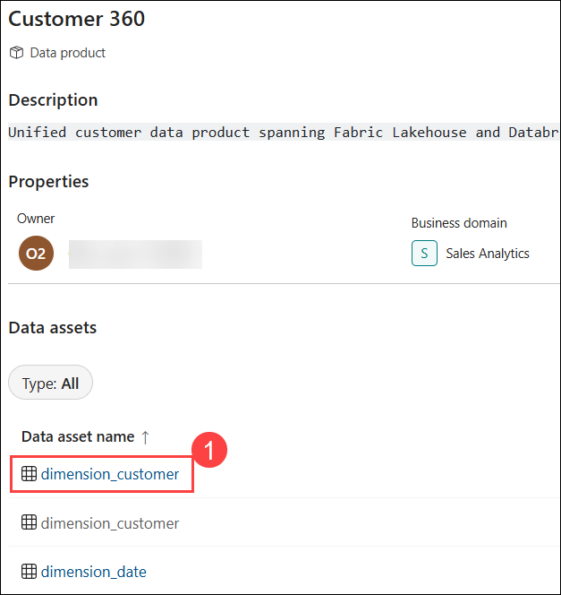

1. Select **Rules** and click on **New Rule**

   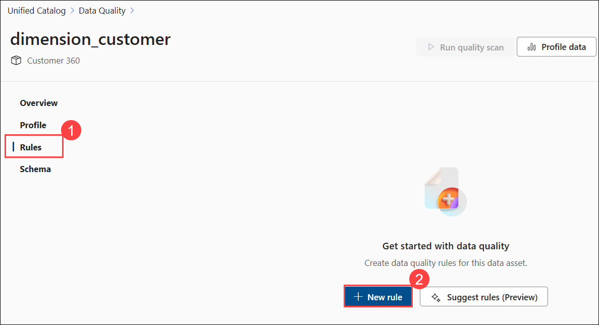

### Task 2.1: Create Rule 1 — Empty/Blank Fields

4. Select **Empty/blank fields** scroll down clcik on NExt.

     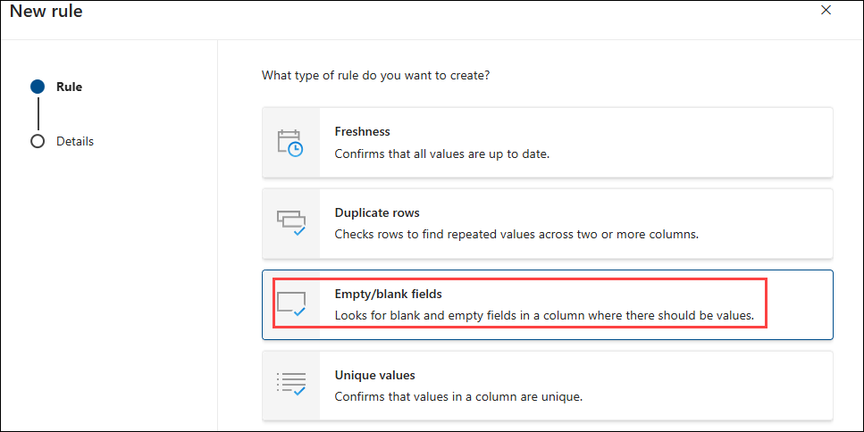

6. Configure:
   - **Column**: **Customer (1)**
   - **Description**: **Looks for blank and empty customer name fields (2)**
   - Click on **Score threshold (3)** just review the details.
   - Click on **Create (4)**
  
     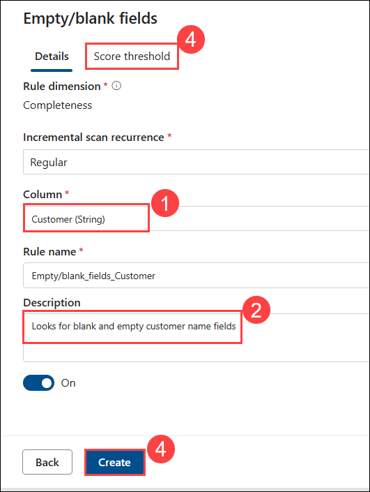

     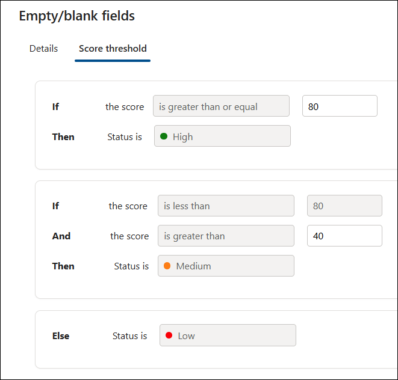
   
1. Back on **`dimension_customer`**, review the newly created rule **(1)**, then click **Run quality scan (2)**.

    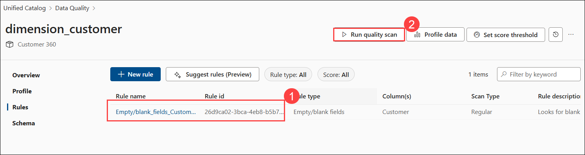
 
1. On the **Scan run configuration** page, configure the settings as required. For now, keep the default settings selected, then click **Run quality scan**.

    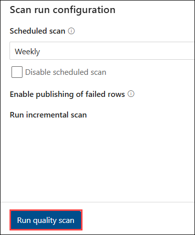

### Task 2.2: Create Rule 2 - String Format Match

1. Back on **Customer 360** page, search and select **vendors**.

    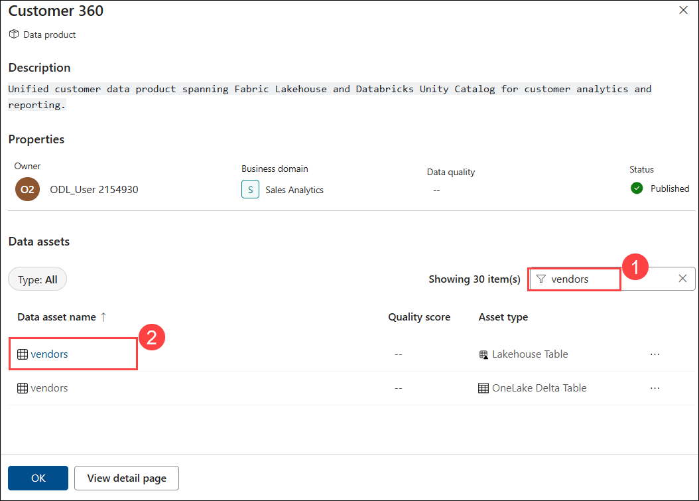

1. In the rule configuration pane, provide the following details:

   - **Column (1)**: `email (String)`  
   - **Description (2)**: Validates that vendor email addresses follow the expected format  
   - **Validation type (3)**: Regular expression  
   - **Validation criteria (4)**: `@.*\.com`
   - click **Create (5)**.

     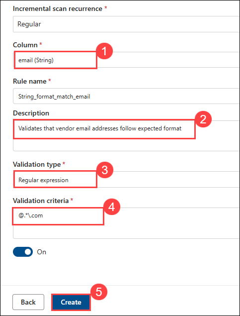

1. Back on **`vendors`**, review the newly created rule **(1)**, then click **Run quality scan (2)**.

    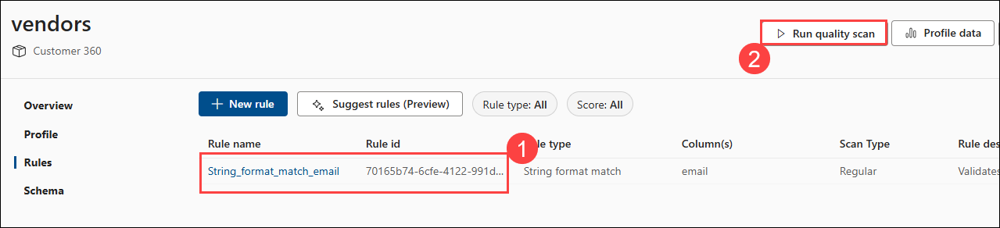
 
1. On the **Scan run configuration** page, configure the settings as required. For now, keep the default settings selected, then click **Run quality scan**.

    | Rule | Type | Target Asset | Target Column |
    |------|------|-------------|---------------|
    | Customer Name Completeness | Completeness | Fabric `dimension_customer` | Customer |
    | Sales Data Freshness | Freshness | Fabric `vendors` | Date column |

**Expected Result**: 2 data quality rules created covering completeness, freshness, in Fabric assets.

**Step 3: Review Quality Run History**

10. For each rule, click **Run history** (or **Evaluation history**)
11. Review:
    - Timestamp of each run
    - Pass/fail counts per run
    - Trend over time (currently just 1 run — in production you'd see trends)

**Step 4: Document Results**

12. Note the quality results summary:

    | Rule | Asset | Pass Rate | Notes |
    |------|-------|-----------|-------|
    | Customer Name Completeness | Fabric `dimension_customer` | Expected ~100% | Sample data is complete |
    | Sales Data Freshness | Fabric `fact_sale` | Varies | Static sample data — freshness may show as stale |

   

**Expected Result**: All 4 quality rules executed successfully. Pass rates visible for each rule. Quality evaluation history recorded.

## Task 3: Review Quality Metrics in Unified Catalog (15 min)

**Step 1: View Quality Scores on Assets**

1. Go to **Unified Catalog** → **Discovery** → **Data assets**
2. Search for `dimension_customer` → click on the Fabric Lakehouse version
3. Look for a **Data quality** tab or section on the asset detail page
4. Review:
   - Quality score for the asset (aggregated from all rules applied to it)
   - Individual rule results (Customer Name Completeness pass rate)
   - Quality status indicator (green/yellow/red based on thresholds)
5. Search for `samples.tpch.customer` → review quality scores:
   - Customer Key Uniqueness: 100%
   - Phone Number Format: varies

**Step 2: Quality and Data Products**

6. Go to **Unified Catalog** → **Catalog management** → **Data products** → click `Customer 360`
7. Check if quality information is visible at the data product level:
    - Assets within the data product should show their individual quality scores
    - The data product quality is an aggregate of its constituent assets
8. Note: Quality visibility on data products will be explored further in **Lab 9**

**Step 3: Set Up Quality Alerts (If Available)**

9. In **Data quality** settings, check for alert/notification options:
    - Configure alerts when quality drops below a threshold (e.g., pass rate < 95%)
    - Set notification recipients (your lab user account)
10. If alert configuration is not available in the current Purview version, note this as a feature to review in future updates

**Expected Result**: Quality scores visible on individual assets in Unified Catalog. Quality monitoring established for cross-platform assets.

---

## Lab 8 Summary

| Task | What You Did | Key Takeaway |
|------|-------------|--------------|
| 1 | Created 4 quality rules (completeness, freshness, uniqueness, format) | Quality rules validate data correctness across platforms |
| 2 | Executed quality checks on Fabric + Databricks assets | Quality evaluation produces pass rates and identifies issues |
| 3 | Reviewed quality metrics in Unified Catalog and Insights | Quality scores visible on assets and in governance dashboards |

