# Day 2 - Lab 8: Data Quality Rules and Monitoring

## Estimated Duration: 50 minutes

## Lab Overview

In this lab, you will configure data quality in Microsoft Purview by creating source connections to both Fabric and Databricks, defining validation rules on data assets, executing quality scans, and reviewing quality metrics. This lab demonstrates how Purview's data quality capabilities help organizations monitor and validate data reliability across platforms.

Data quality in Microsoft Purview connects directly to the data source to execute rule queries. You will set up connections for both Fabric Lakehouse and Azure Databricks, then apply rules to validate data accuracy and completeness.

## Lab Objectives

In this lab, you will perform the following:

- **Task 1:** Configure Data Quality Source Connections for Fabric and Databricks
- **Task 2:** Define Data Quality Validation Rules for Dataset
- **Task 3:** Review Quality Metrics in Unified Catalog


## Task 1: Configure Data Quality Source Connections for Fabric and Databricks

In this task, you will add data assets to the Sales Analytics governance domain for quality evaluation, then create source connections for both Fabric and Databricks so Purview can execute quality queries against the data.

1. Now, let’s create **Data Quality** for Fabric in the **Purview portal**.

1. In **Unified Catalog**, expand **Health management (1)**, then select **Data quality (2)**. Select the **Sales Analytics (3)** domain.
   
     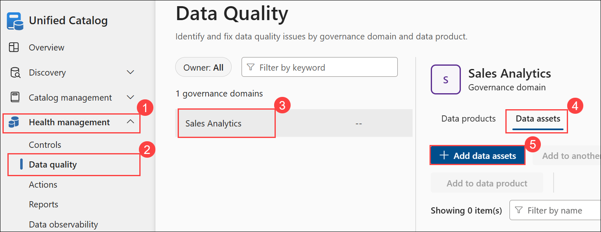

1. Click on **Customer 360**.

   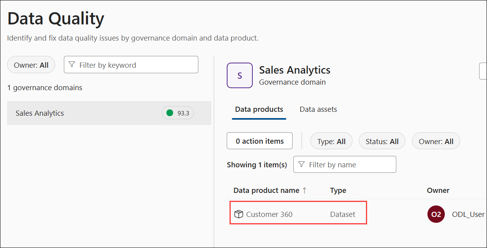
      
1. Here, you can see all the assets added from the previous lab. We have now applied data quality rules and generated quality scores for both the Fabric asset (`dimension_customer`) and the Databricks asset (`customer_transactions`).

1. Notice the warning icon (1) indicating **No connection can be used**. This means a connection must be configured for the asset before running data quality rules.

    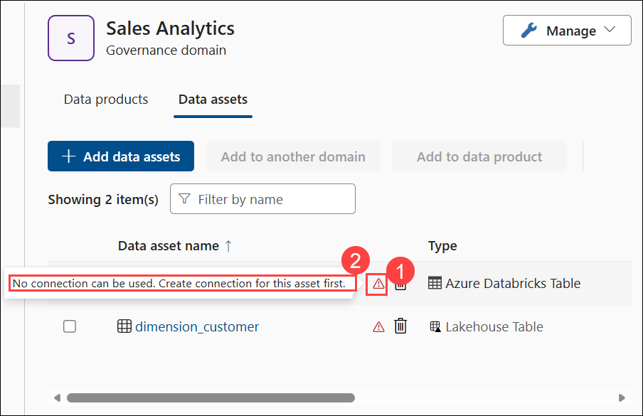

1. Click on **OK** to exit the pane.
   
1. Before creating the connection, we need to gather required values from both **Fabric** and **Databricks**. First, collect these details, then proceed to create the connection.

1. Navigate back to **Fabric portal**, navigate to the workspace and open the **Lakehouse**. 

    

1. Copy the **workspace ID** from the URL (1), as shown below, as it will be required in later steps. Then, from the same URL, copy the **Lakehouse ID (2)** that appears after `lakehouse/`.

    

1. Back on **purview portal** then click on **Manage (1)** then seelct **Connections (2)**.
   
      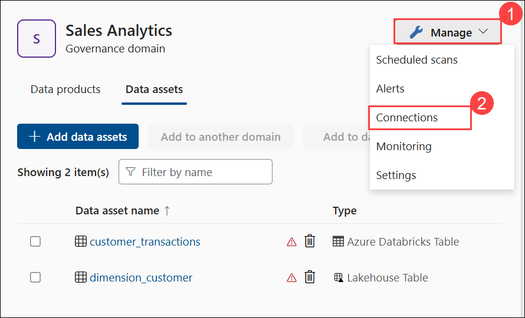

1. Select **+ New** then provide the following connection details:
   - **Connection name**: **fabric-dq-connection (1)**
   - **Source Type**:Choose **Fabric (2)**
   - **Worksapce id**: paste the id you copied in the previous step
   - **Lakehouse id**: paste the id you copied in the previous step
   - Click **Submit (5)** after the connection is tested

     

1. Now lest creat for databrick.

1. Select **New connection** again.

   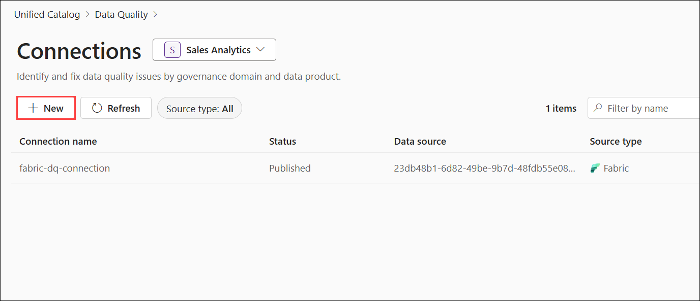
   
1. Provide the following details:
   - **Connection name**: **databricks-dq-connection (1)**
   - **Source type**: **Azure Databricks (2)**
   - **Workspace Name**: select the workspace from the dropdown (3)
   - **Metastore ID**: Paste the id copied in Ex 00 (4)
   - **HTTP Path**: Paste the path copied in Ex 00 (5)
   - **Catalog Name**: governance_catalog (6)
   - **Schema Name**: governance_schema (7)
   - **Table Name**: customer_transactions (8)
   - **Key Vault**: **purviewkv<inject key="Deployment ID" enableCopy="false"></inject>** (9)
   - **Secret Name**: **databricks-pat** (10)
   - Click **Submit** (11)

     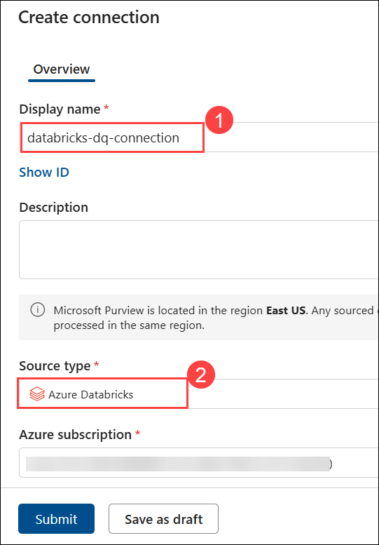
     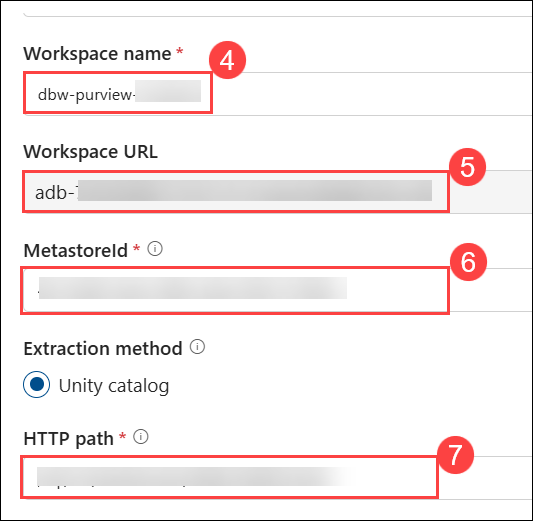
     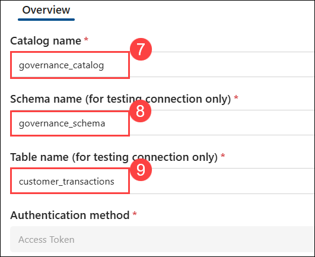
     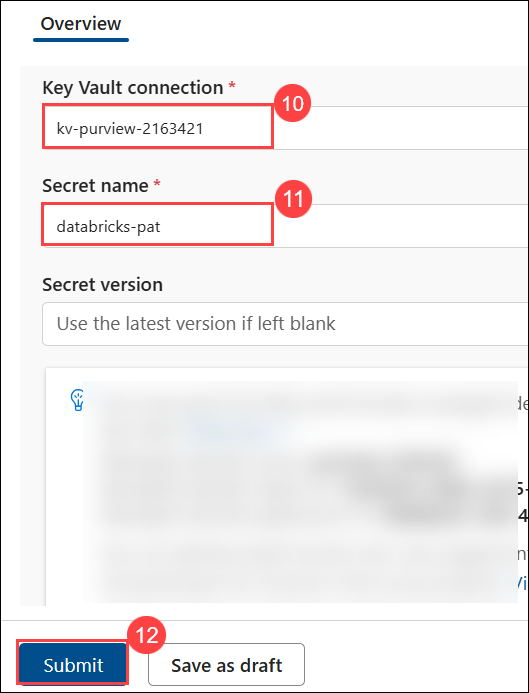

## Task 2: Define Data Quality Validation Rules for Dataset

In this task, you will create data quality rules on both Databricks and Fabric assets, then execute quality scans to evaluate data against those rules.

1. On the **Connections** page and verify that both connections are created and show the status as **Published (1)**. Click **Data Quality (2)**, navigate to the back to **Data Quality** page.

     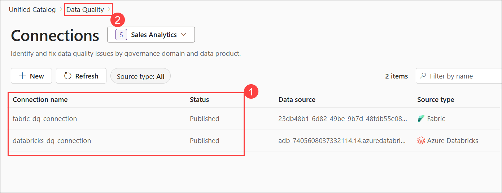

1. Select **`customer_transactions`**.

   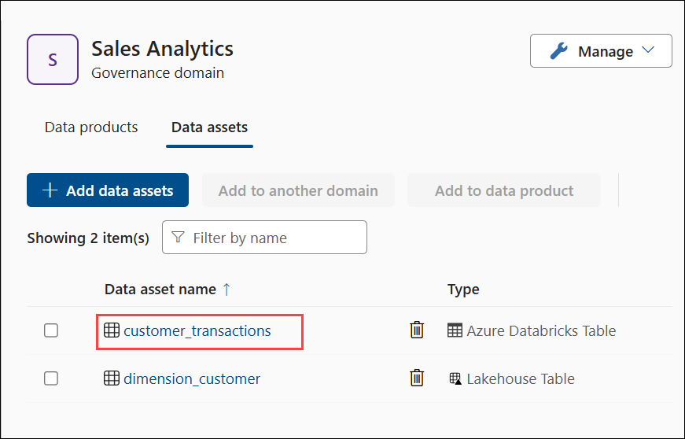

3. In the asset page, navigate to the **Rules (1)** tab, then click **+ New rule (2)**.

    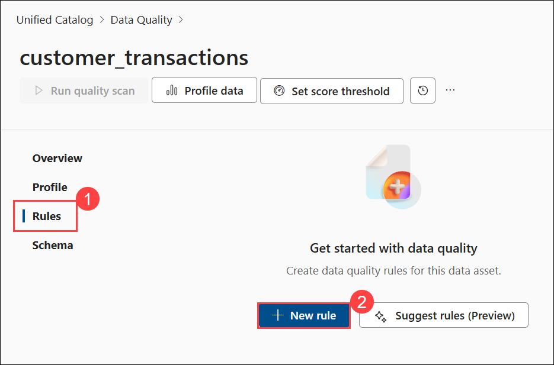

1. Select **Custom (1)** and click **Next (2)**.

    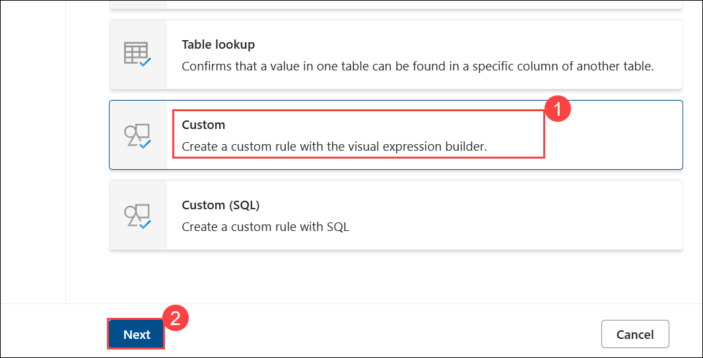

1. In the **Custom** rule setup:
    - Set **Incremental scan recurrence (1)** to **Both**. Then click **Create (2)**.

      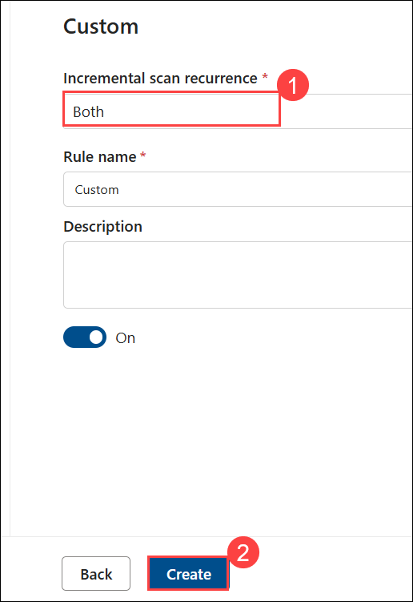

1. In the rule configuration:
    
    - Set **Rule dimension (1)** to **Accuracy**
    - In **Row expression (2)**, enter:
      ```
      transaction_amount > 0
      ```
    - Click **Save (3)** to finalize the rule.

       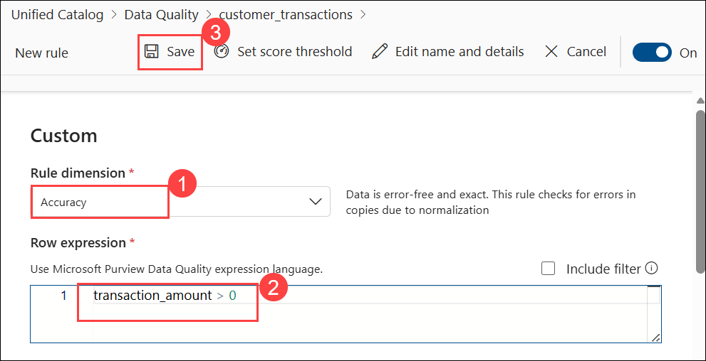

1. On the **`customer_transactions`** asset, verify that the **Custom (1)** rule is created, then click **Run quality scan (2)**.

    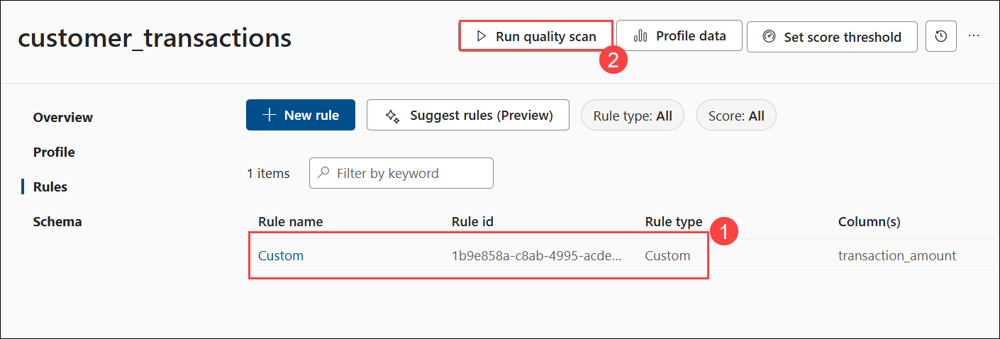

1. In the **Scan run configuration**:
    - Enable **Run incremental scan (1)**
    - Set **Scan data updated in the last (2)** to **One day**
    - Select **transaction_date (DATE) (3)** as the datetime column
    - Click **Run quality scan (4)**

      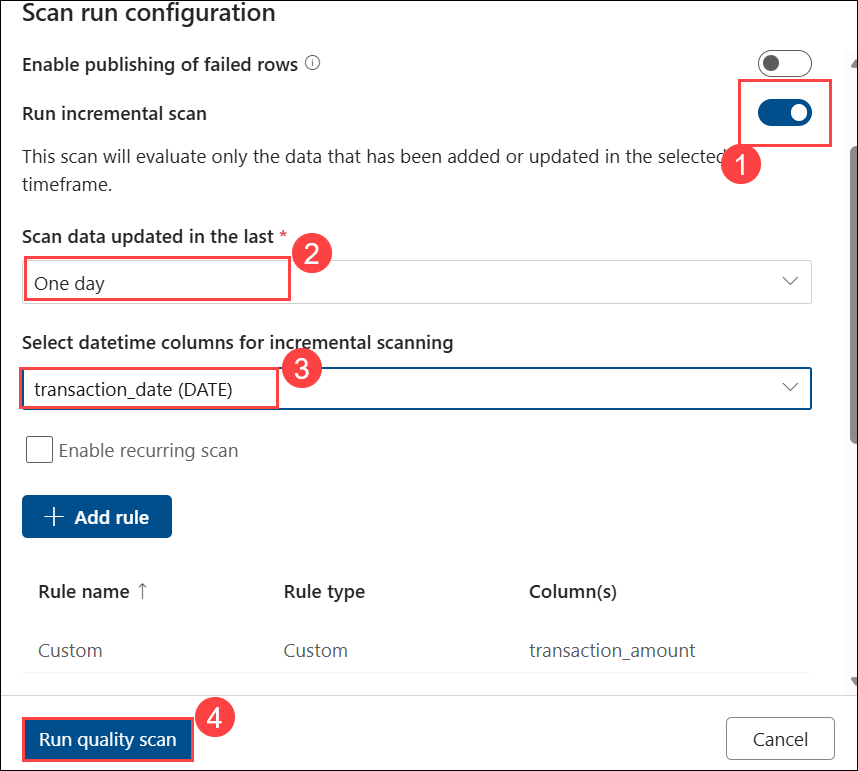

1. Once the scan completes, navigate back to the **Sales Analytics** domain → **Data assets**.

1. Select `dimension_customer` to proceed with applying data quality rules on the Fabric asset.

   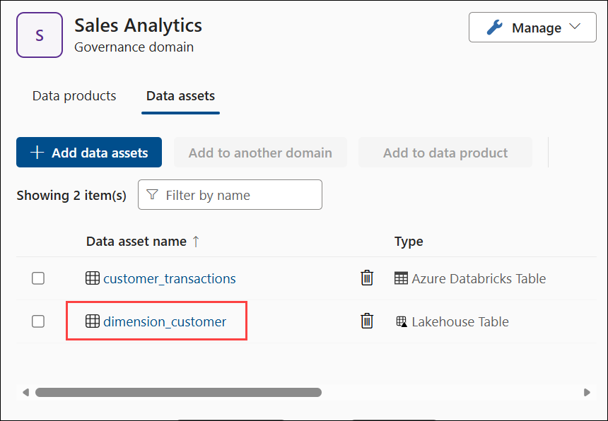
   
1. On the `dimension_customer` asset page, navigate to the **Rules (1)** tab, then click **+ New rule (2)**.

     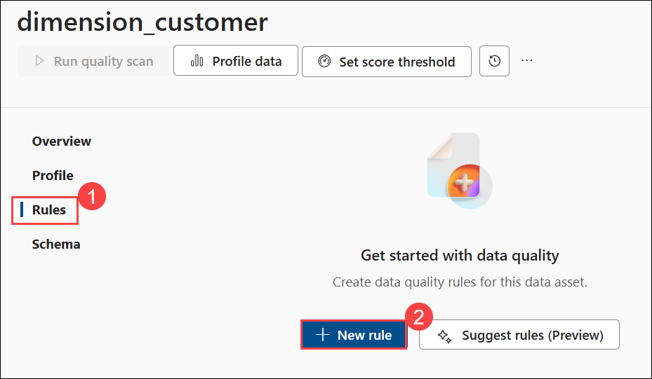
    
1. From the rule templates, select **Empty/blank fields**, then click on **Next** to proceed.

     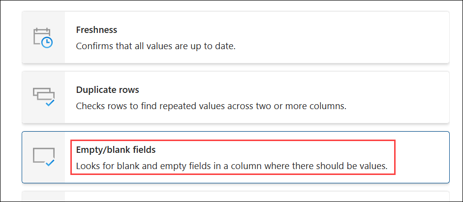
    
1. In the rule configuration:
    - Set **Incremental scan recurrence (1)** to **Regular**
    - Select **Column (2)**: `Customer (String)`
    - Click **Create (3)**

      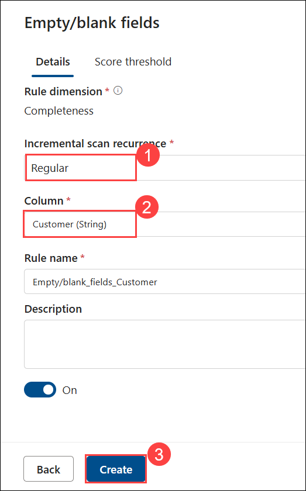

1. Verify that the rule **Empty/blank_fields_Customer (1)** is created, then click **Run quality scan (2)**.

    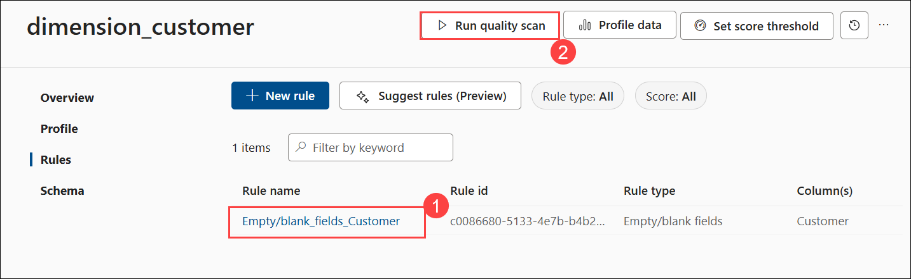

1. In the **Scan run configuration**:
    - Enable **Run incremental scan (1)**
    - Set **Scan data updated in the last (2)** to **One week**
    - Select **ValidTo (timestamp) (3)** as the datetime column
    - click **+ Add Rule (4)** and select the rule then confirm the rule is listed **(5)**
    - Click **Run quality scan (6)**

      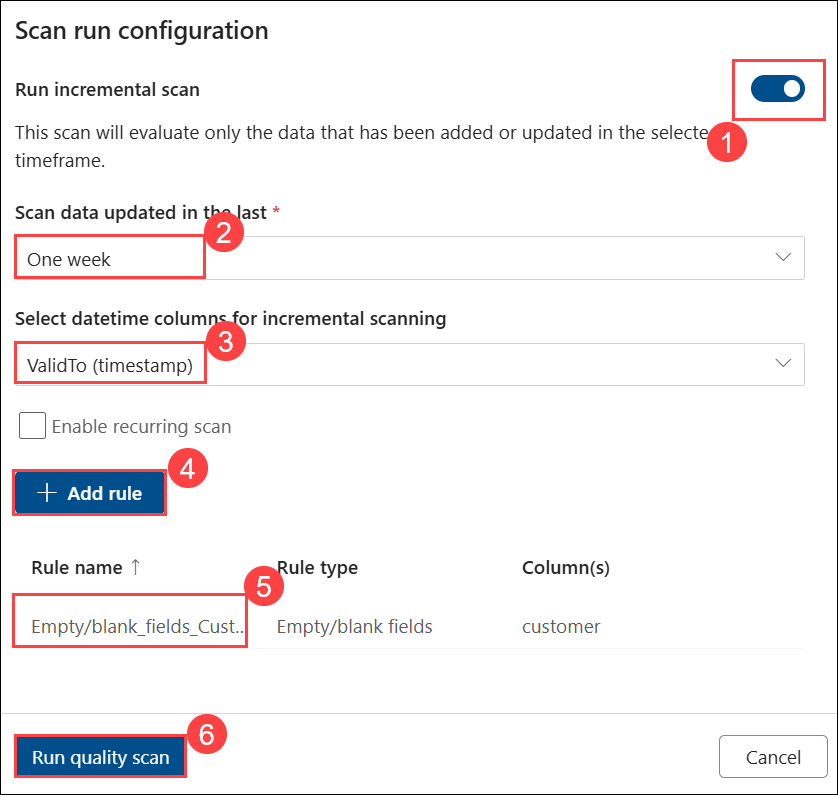

1. Wait for both scans to complete.
   
## Task 3: Review Quality Metrics in Unified Catalog (15 min)

In this task, you will review the data quality scores and metrics generated by the quality scans to understand how Purview monitors data reliability across assets.

1. To review the scan results and metrics, navigate to **Sales Analytics** domain → **Data quality** → **Customer 360** page.

   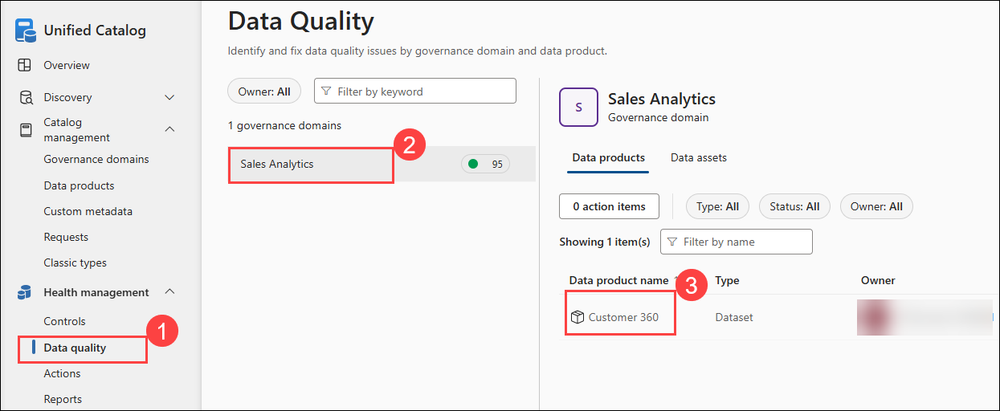

1. First, select **`customer_transactions`** and review the **Overview** page:

    - Verify the **Quality score**
    - Review **Active rules**, **Quality score trend**, and **Last quality scan** details

       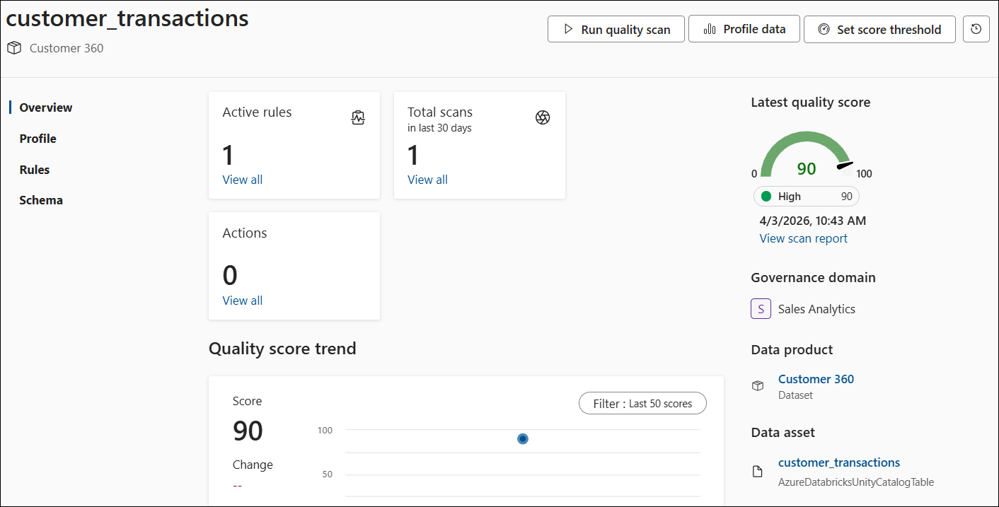

1. Next, go back and select `dimension_customer`, then review the same details:
    
    - Confirm the **Quality score**
    - Review the applied rule and scan results
   
        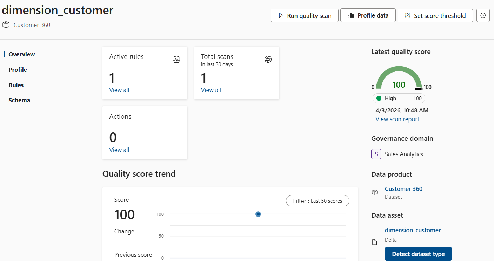

1. Observe how data quality scores and metrics help monitor and validate data reliability across assets.

### Summary

In this lab, you:

- Configured data quality source connections for Fabric and Databricks
- Created custom and template-based data quality rules on assets
- Executed quality scans on both Databricks and Fabric datasets
- Reviewed quality scores and metrics in the Unified Catalog
- Validated data reliability across platforms using quality monitoring


## Click Next to continue to the next lab.


