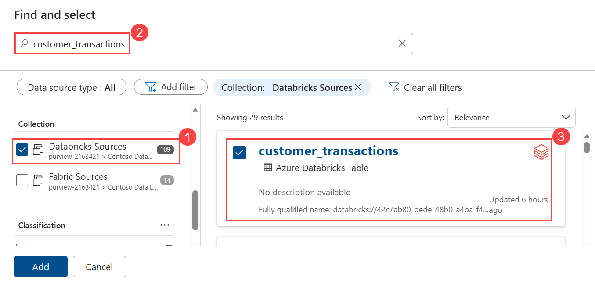
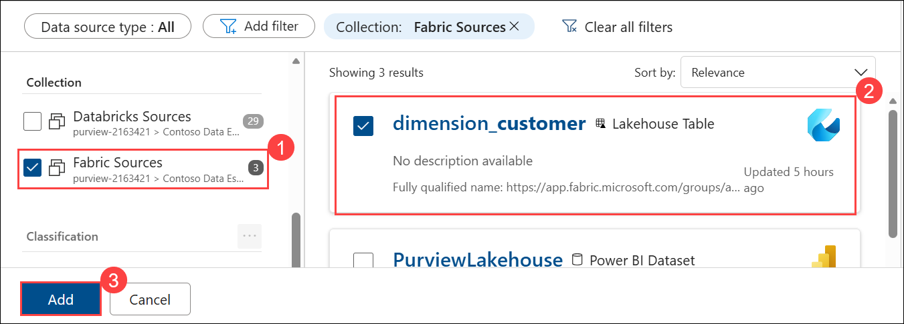
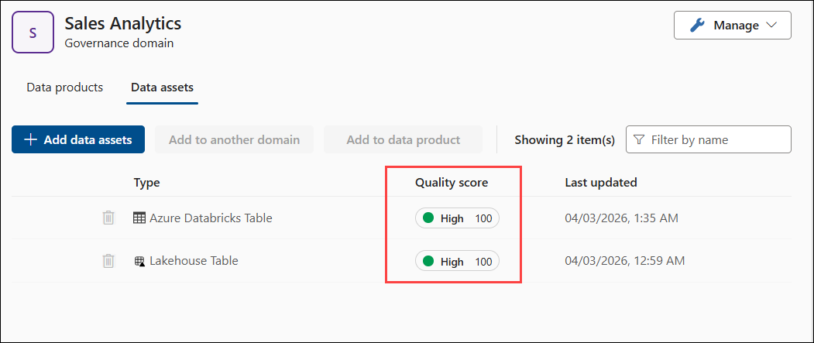

# Day 2 - Lab 8: Data Quality Rules and Monitoring

## Objective

Define data quality rules on Fabric and Databricks assets, execute quality checks, and review quality metrics in the Unified Catalog.


## Task 1: Configure Data Quality Source Connections for Fabric and Databricks

Data quality in Microsoft Purview connects directly to the data source to execute rule queries. For Fabric Lakehouse tables, Purview uses the SQL analytics endpoint.

1. Now, let’s create **Data Quality** for Fabric in the **Purview portal**. Before defining rules, you need to select the data assets on which data quality will be applied.

1. In **Unified Catalog**, expand **Health management (1)**, then select **Data quality (2)**. Select the **Sales Analytics (3)** domain. Navigate to the **Data assets (4)** tab. Click **+ Add data assets (5)** to add assets for data quality evaluation.

     

6. In the **Find and select** pane, ensure **Databricks Sources (1)** is selected. In the search bar, search for **`customer_transactions (2)`**, then select the asset **(3)**.

   

8. Next, switch the collection to **Fabric Sources (1)**. Select **`dimension_customer (2)`**, then click **Add (3)**.

   

10. Back in the **Sales Analytics** domain under **Data assets**, verify that both assets are added.

12. Notice the warning icon (1) indicating **No connection can be used**. This means a connection must be configured for the asset before running data quality rules.

    

1. Before creating the connection, we need to gather required values from both **Fabric** and **Databricks**. First, collect these details, then proceed to create the connection.

1. Navigate back to **Fabric portal**, navigate to the workspace and open the **Lakehouse**. 

    

1. Copy the **workspace ID** from the URL (1), as shown below, as it will be required in later steps. Then, from the same URL, copy the **Lakehouse ID (2)** that appears after `lakehouse/`.

    

1. Back on **purview portal** then click on **Manage (1)** then seelct **Connections (2)**.
   
      

1. Select **+ New** then provide the following connection details:
   - **Connection name**: **fabric-dq-connection (1)**
   - **Source Type**:Choose **Fabric (2)**
   - **Worksapce id**: paste the id you copied in the previous step
   - **Lakehouse id**: paste the id you copied in the previous step
   - Click **Submit (5)** after the connection is tested

     

1. Now lest creat for databrick.

1. Select **New connection** again.

   
   
1. Provide the following details:
   - **Connection name**: **databricks-dq-connection (1)**
   - **Source type**: **Azure Databricks (2)**
   - **Workspace Name**: select the workspace from the dropdown (3)
   - **Metastore ID**: Paste the id copied in Ex 00 (4)
   - **HTTP Path**: Paste the path copied in Ex 00 (5)
   - **Catalog Name**: governance_catalog (6)
   - **Schema Name**: governance_schema (7)
   - **Table Name**: customer_transactions (8)
   - **Key Vault**: **purviewkv<inject key="Deployment ID" enableCopy="false"></inject>** (9)
   - **Secret Name**: **databricks-pat** (10)
   - Click **Submit** (11)

     
     
     
     


## Task 2: Define Data Quality Validation Rules for Dataset


1. On the **Connections** page and verify that both connections are created and show the status as **Published (1)**. Click **Data Quality (2)**, navigate to the back to **Data Quality** page.

     

1. Select **`customer_transactions`**.

   

13. In the asset page, navigate to the **Rules (1)** tab, then click **+ New rule (2)**.

    

15. Select **Custom (1)** and click **Next (2)**.

    

16. In the **Custom** rule setup:
    - Set **Incremental scan recurrence (1)** to **Both**. Then click **Create (2)**.

      

17. In the rule configuration:
    
    - Set **Rule dimension (1)** to **Accuracy**
    - In **Row expression (2)**, enter:
      ```
      transaction_amount > 0
      ```
    - Click **Save (3)** to finalize the rule.

       

17. On the **`customer_transactions`** asset, verify that the **Custom (1)** rule is created, then click **Run quality scan (2)**.

    

19. In the **Scan run configuration**:
    - Enable **Run incremental scan (1)**
    - Set **Scan data updated in the last (2)** to **One day**
    - Select **transaction_date (DATE) (3)** as the datetime column
    - Click **Run quality scan (4)**

      

20. Once the scan completes, navigate back to the **Sales Analytics** domain → **Data assets**.

22. Select `dimension_customer` to proceed with applying data quality rules on the Fabric asset.

   
   
21. On the `dimension_customer` asset page, navigate to the **Rules (1)** tab, then click **+ New rule (2)**.

     
    
23. From the rule templates, select **Empty/blank fields**, then click on **Next** to proceed.

     
    
25. In the rule configuration:
    - Set **Incremental scan recurrence (1)** to **Regular**
    - Select **Column (2)**: `Customer (String)`
    - Click **Create (3)**

      

26. Verify that the rule **Empty/blank_fields_Customer (1)** is created, then click **Run quality scan (2)**.

    

28. In the **Scan run configuration**:
    - Enable **Run incremental scan (1)**
    - Set **Scan data updated in the last (2)** to **One week**
    - Select **ValidTo (timestamp) (3)** as the datetime column
    - click **+ Add Rule (4)** and select the rule then confirm the rule is listed **(5)**
    - Click **Run quality scan (6)**

      

1. Wait for both scans to complete.

1. Once the scans are complete, navigate back to the **Sales Analytics** domain > **Data assets**.

2. Verify that both assets display a **Quality score** of **High (100)**, as shown below.

   
   
## Task 3: Review Quality Metrics in Unified Catalog (15 min)

**Step 1: View Quality Scores on Assets**

1. Go to **Unified Catalog** → **Discovery** → **Data assets**
2. Search for `dimension_customer` → click on the Fabric Lakehouse version
3. Look for a **Data quality** tab or section on the asset detail page
4. Review:
   - Quality score for the asset (aggregated from all rules applied to it)
   - Individual rule results (Customer Name Completeness pass rate)
   - Quality status indicator (green/yellow/red based on thresholds)
5. Search for `samples.tpch.customer` → review quality scores:
   - Customer Key Uniqueness: 100%
   - Phone Number Format: varies

**Step 2: Quality and Data Products**

6. Go to **Unified Catalog** → **Catalog management** → **Data products** → click `Customer 360`
7. Check if quality information is visible at the data product level:
    - Assets within the data product should show their individual quality scores
    - The data product quality is an aggregate of its constituent assets
8. Note: Quality visibility on data products will be explored further in **Lab 9**

**Step 3: Set Up Quality Alerts (If Available)**

9. In **Data quality** settings, check for alert/notification options:
    - Configure alerts when quality drops below a threshold (e.g., pass rate < 95%)
    - Set notification recipients (your lab user account)
10. If alert configuration is not available in the current Purview version, note this as a feature to review in future updates

**Expected Result**: Quality scores visible on individual assets in Unified Catalog. Quality monitoring established for cross-platform assets.

---

## Lab 8 Summary

| Task | What You Did | Key Takeaway |
|------|-------------|--------------|
| 1 | Created 4 quality rules (completeness, freshness, uniqueness, format) | Quality rules validate data correctness across platforms |
| 2 | Executed quality checks on Fabric + Databricks assets | Quality evaluation produces pass rates and identifies issues |
| 3 | Reviewed quality metrics in Unified Catalog and Insights | Quality scores visible on assets and in governance dashboards |

## Click Next to continue to the next lab.


