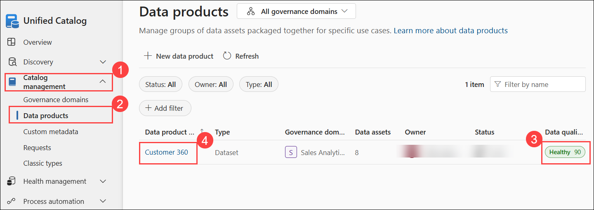
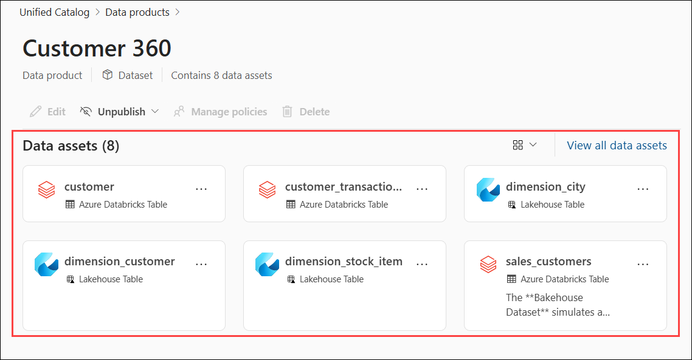
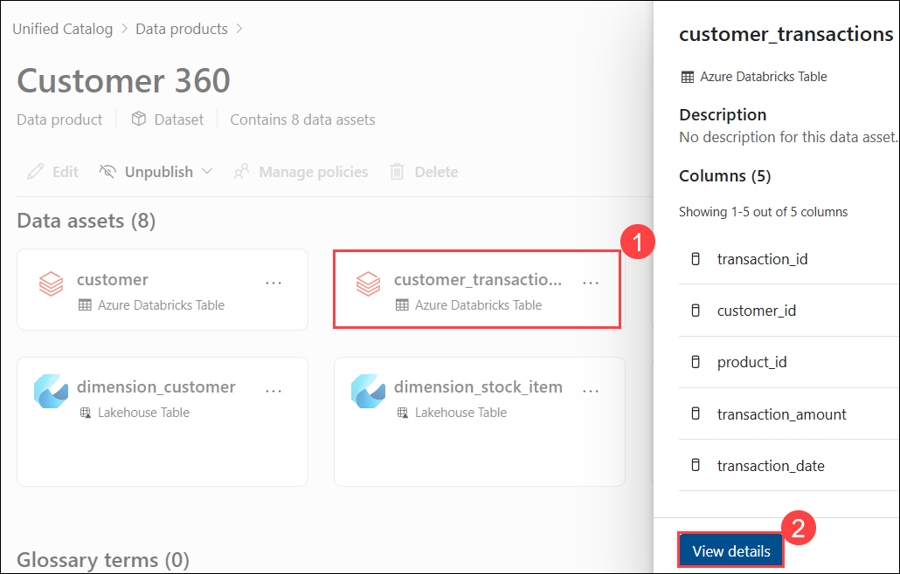
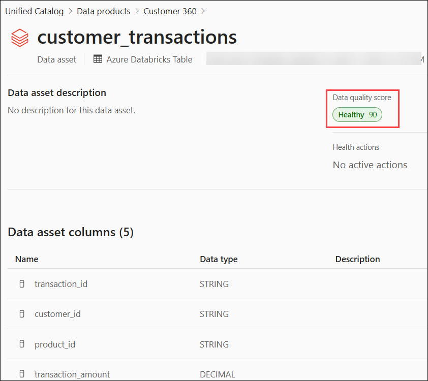
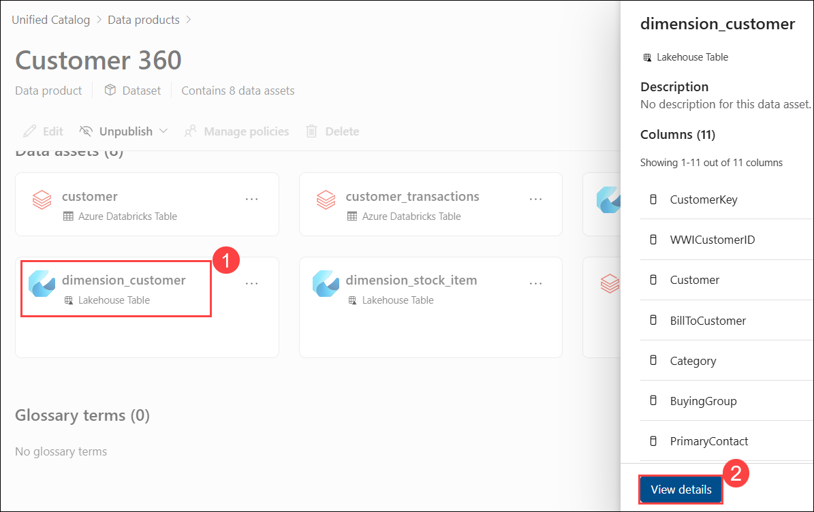
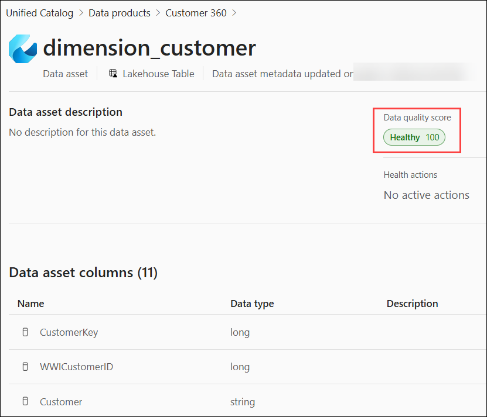
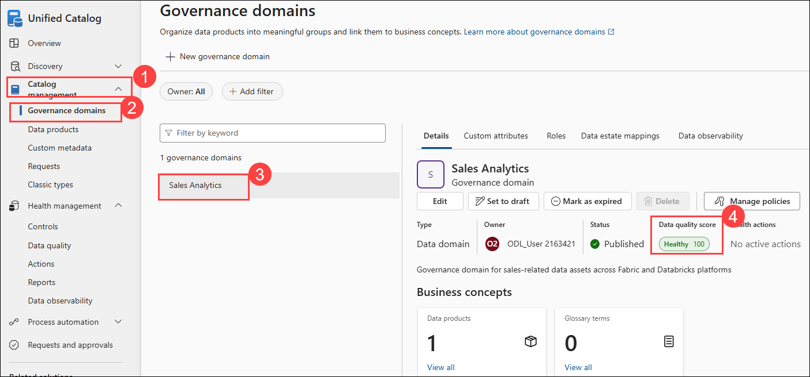
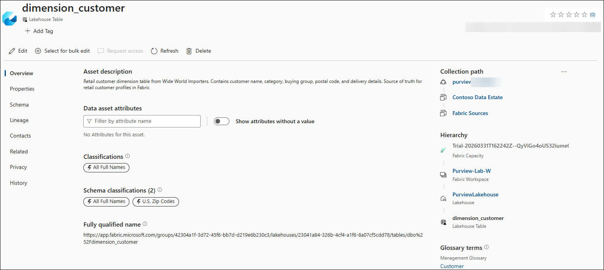
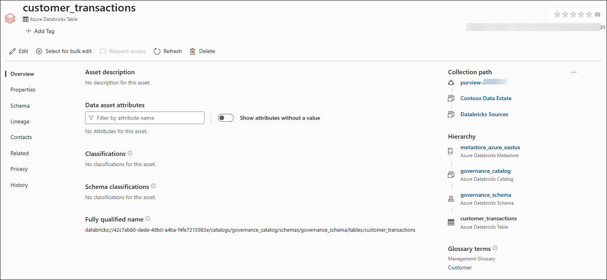
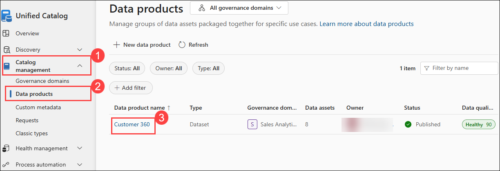

# Day 3 - Lab 9: Data Quality Impact on Data Products

## Lab Overview

In this lab, you will explore how data quality results impact data products in Microsoft Purview. You will link quality scores to data products, evaluate trust levels across datasets, and understand how quality status is communicated to data consumers through the Unified Catalog.

This lab demonstrates how data quality monitoring enables organizations to differentiate between trusted and non-trusted datasets, and how data products serve as the primary channel for communicating data reliability to consumers.

## Lab Objectives

In this lab, you will perform the following:

- **Task 1:** Link Quality Results to Data Products
- **Task 2:** Identify Trusted vs Non-Trusted Datasets
- **Task 3:** Communicate Quality Status to Consumers

## Task 1: Link Quality Results to Data Products

In this task, you will review how data quality scores from Lab 8 are reflected on data product assets, and ensure all assets within the data product have quality monitoring enabled.

**Step 1: Review Current Data Product Quality**

1. In **Unified Catalog**, expand **Catalog management (1)** and select **Data products (2)**. Locate the **Customer 360 (4)** data product and review the **Data quality score (3)**, **Healthy (XXX)**.

   

1. On the **Customer 360** page, under **Data assets**, review the list of all assets.

   

1. Select **`customer_transactions (1)`** and review the asset details pane. Click **View details (2)** to open the full asset page.

   

1. On the asset page, review:
    - **Data quality score** (should show **Healthy**)
    - Column details and schema information

      

1. Navigate back to the **Customer 360** page.

1. Select **`dimension_customer (1)`** and review the asset details pane. Click **View details (2)**.

   

1. On the asset page, review:
   
    - **Data quality score** (should show **Healthy**)
    - Column details and schema information

      
      
1. Observe how data quality metrics are reflected at both the individual asset level and the overall data product level.

  **Expected Result**: Assets in the `Customer 360` data product show quality scores from Lab 8. Data product quality is visible as an aggregate of individual asset quality.

1. In **Unified Catalog**, expand **Catalog management (1)** and select **Governance domains (2)**. Select the **Sales Analytics (3)** domain. In the **Details** pane, review the **Data quality score (4)**, which should display **Healthy (XYZ)**.

   

## Task 2: Identify Trusted vs Non-Trusted Datasets

In this task, you will evaluate trust levels across your data estate by assessing assets against multiple governance criteria including quality scores, ownership, descriptions, and glossary terms.

### Task 2.1: Evaluate Trust Criteria**

1. Go to **Unified Catalog** > **Discovery** > **Data assets**.

2. Search for `dimension_customer` (Fabric) and evaluate trust:

   | Trust Criterion | Status |
   |----------------|--------|
   | Quality score | From Lab 8 |
   | Owner assigned | From Lab 5 |
   | Description | From Lab 5 |
   | Glossary terms | From Lab 7 |
   | In a data product | `Customer 360` from Lab 6 |
   | **Trust level** | **HIGH — Trusted** |

   

4. Back on **Unified Catalog** > **Discovery** > **Data assets** the search for **`customer_transactions`** (Databricks) and evaluate:

   | Trust Criterion | Status |
   |----------------|--------|
   | Quality score | From Lab 8 |
   | Owner assigned | From Lab 5 |
   | Description | From Lab 5 |
   | Glossary terms | From Lab 7 |
   | In a data product | `Customer 360` from Lab 6 |
   | **Trust level** | **Evaluate based on criteria** |

   

6. Search for an unmanaged asset **`dimension_date`** and  evaluate:

   | Trust Criterion | Status |
   |----------------|--------|
   | Quality score | No rules applied |
   | Owner assigned | Not set |
   | Description | Empty |
   | Glossary terms | None linked |
   | In a data product | Not in any product |
   | **Trust level** | **LOW — Non-trusted** |

   

### Task 2.2: Document Trust Assessment**

1. Summary of trust levels across your estate:

   | Trust Level | Criteria Met | Example Assets | Action Needed |
   |-------------|-------------|----------------|---------------|
   | **High** | All criteria | `dimension_customer` | None - ready for consumption |
   | **Medium** | Some criteria | `customer_transactions` | Complete remaining metadata |
   | **Low** | None/minimal | `dimension_stock_item` | Full curation needed |

## Task 3: Communicate Quality Status to Consumers

In this task, you will review how quality status is communicated to data consumers through data products and governance dashboards in Microsoft Purview.

**Step 1: Data Product as Quality Communication Channel**

1. Go to **Unified Catalog** → **Discovery** → **Data products**
2. Click `Customer 360`
3. Review what a business consumer sees:
   - **Description**: explains the data product purpose
   - **Owner/Expert**: who to contact with questions
   - **Assets**: list of included tables with quality scores
   - **Governance domain**: `Sales Analytics`
   
4. This is the primary way consumers discover and evaluate data quality through the data product page

### Summary

In this lab, you:

- Linked data quality results to data products in the Unified Catalog
- Evaluated trust levels across datasets using governance criteria
- Identified trusted vs non-trusted datasets based on quality and metadata
- Reviewed quality communication through data products and governance dashboards
- Explored Health Management actions for governance improvement

## Click Next to continue to the next lab.

