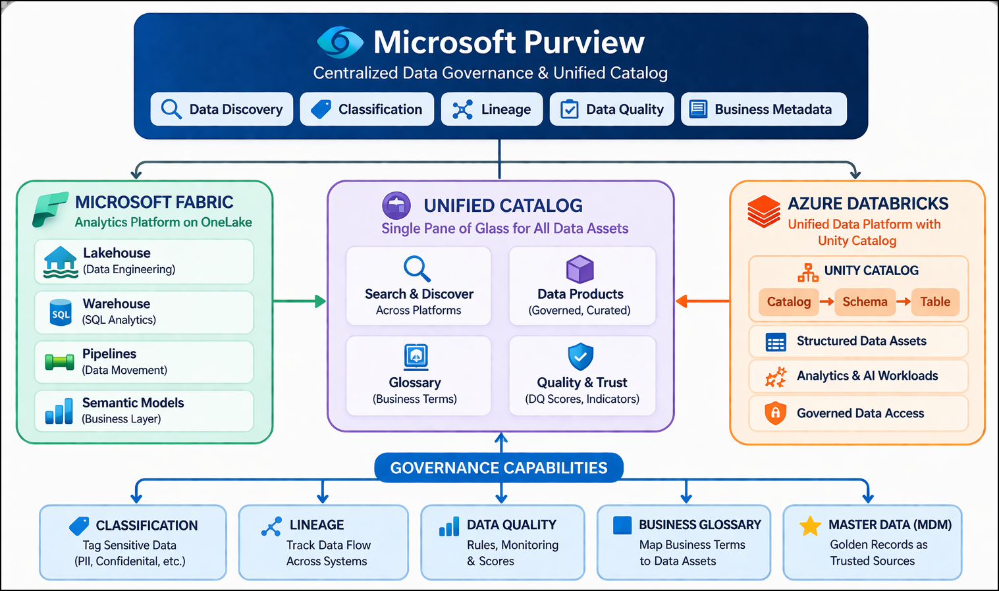
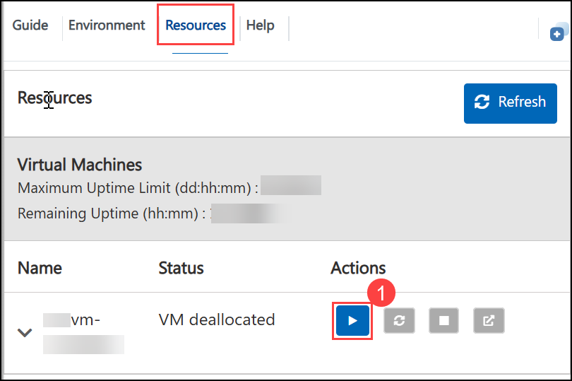
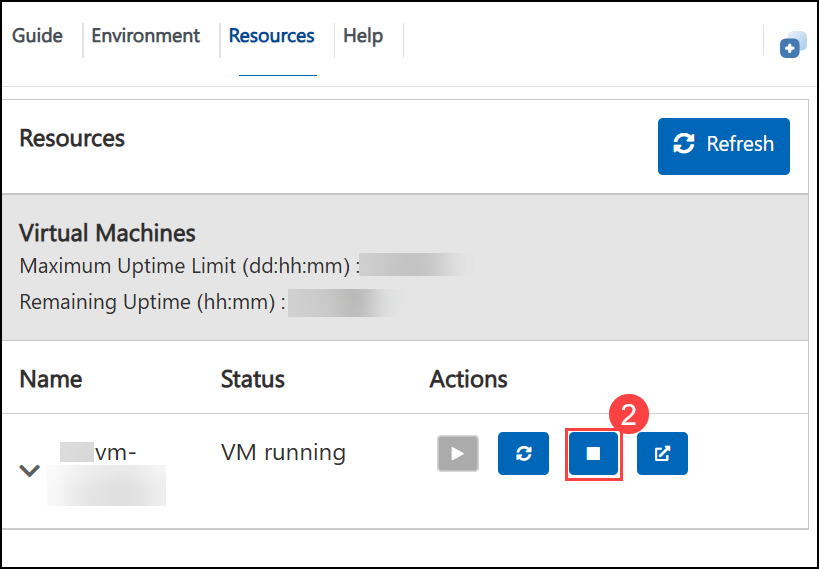
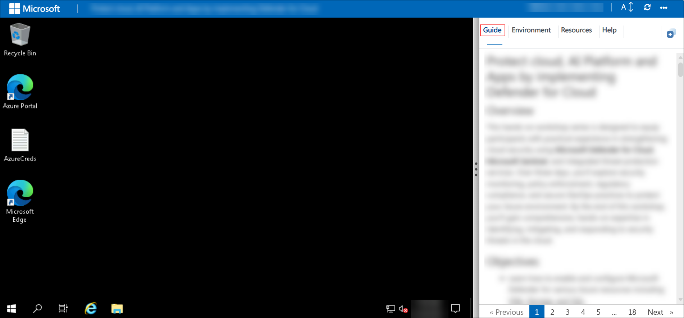
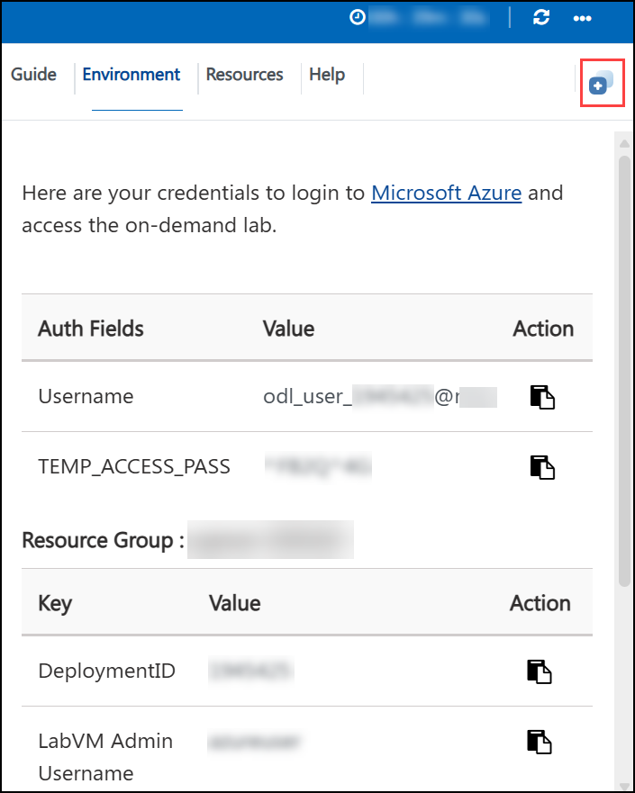
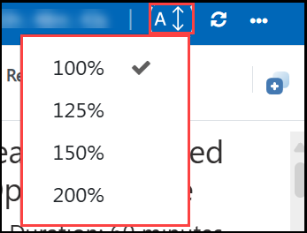
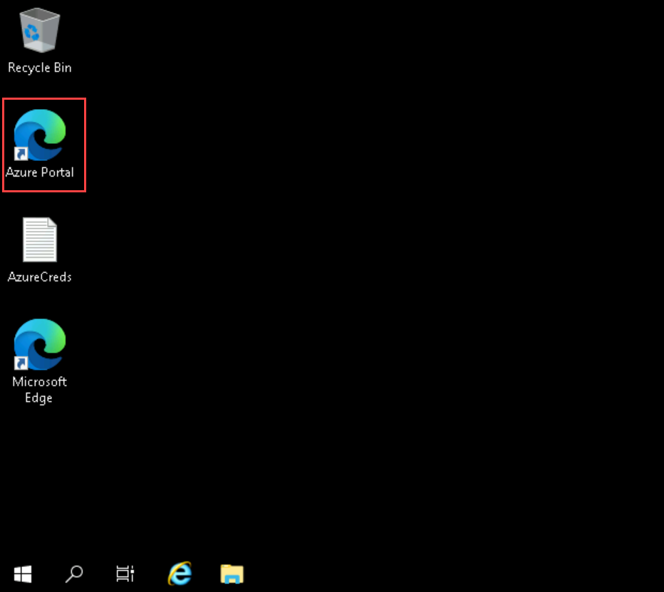
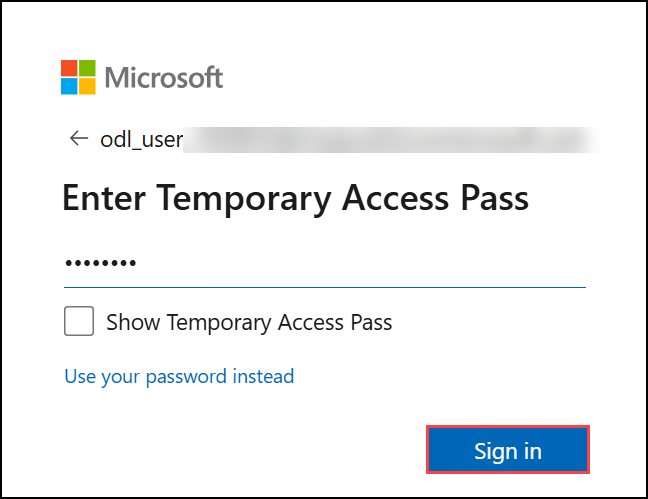
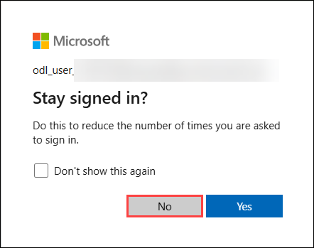

# Getting Started – Data Governance with Microsoft Purview Across Fabric & Databricks

## Overview

This hands-on workshop provides a comprehensive, end-to-end experience in implementing enterprise data governance using **Microsoft Purview** across a multi-platform data estate that includes **Microsoft Fabric** and **Azure Databricks**.

In this workshop, you will begin by setting up a governance foundation, integrating data sources, and discovering assets. You will then progress to applying governance controls such as classification, lineage tracking, and metadata enrichment. As the workshop advances, you will implement business-friendly governance layers including data products and glossary terms, followed by data quality monitoring, trust evaluation, and master data (MDM) governance.

By the end of this workshop, you will understand how to transform raw, disconnected datasets into trusted, governed, and business-ready data assets using Microsoft Purview.

## Workshop Objectives

In this workshop, you will:

- **Establish a Data Governance Foundation**
  - Configure Microsoft Purview
  - Set up collections, domains, and access roles

- **Integrate Multi-Platform Data Sources**
  - Connect Microsoft Fabric and Azure Databricks
  - Scan and discover data assets across platforms

- **Implement Core Governance Capabilities**
  - Apply classifications to sensitive data
  - Visualize data lineage across pipelines and platforms

- **Enable Data Discovery and Business Context**
  - Search and explore assets using Unified Catalog
  - Create and publish data products
  - Define and map business glossary terms

- **Monitor Data Quality and Build Trust**
  - Define and execute data quality rules
  - Evaluate data trust levels across the estate

- **Implement Master Data Governance (MDM)**
  - Identify authoritative (golden) data sources
  - Publish master data as governed data products

## Labs Covered

### Day 1 – Foundation & Data Integration
- **Lab 1:** Purview Environment Setup & Core Configuration  
- **Lab 2:** Connect Microsoft Fabric to Purview  
- **Lab 3:** Connect Databricks Unity Catalog to Purview  
- **Lab 4:** Classification, Lineage & Cross-Platform Governance  

### Day 2 – Discovery & Business Layer
- **Lab 5:** Unified Search & Discovery Across Platforms  
- **Lab 6:** Create and Manage Data Products  
- **Lab 7:** Business Metadata & Glossary Management  

### Day 3 – Data Quality, Trust & MDM
- **Lab 8:** Data Quality Rules and Monitoring  
- **Lab 9:** Data Quality Impact on Data Products  
- **Lab 10:** MDM Integration Scenarios  

## Prerequisites

Participants should have:

- Basic understanding of:
  - Azure Portal navigation  
  - Data analytics concepts  
  - Data governance fundamentals  

- Familiarity with:
  - Microsoft Fabric (Lakehouse, Warehouse concepts)  
  - Azure Databricks (Unity Catalog basics)  
  - Microsoft Purview (basic concepts)  

## Architecture

In this workshop, **Microsoft Purview** acts as the central governance layer that connects and manages data across multiple platforms.

- **Microsoft Fabric** provides:
  - Lakehouse (data engineering)
  - Warehouse (SQL analytics)
  - Pipelines and semantic models

- **Azure Databricks (Unity Catalog)** provides:
  - Structured data assets
  - Multi-level catalog hierarchy (catalog → schema → table)

- **Microsoft Purview** integrates with both platforms to enable:
  - Data discovery  
  - Classification  
  - Lineage tracking  
  - Data quality monitoring  
  - Business metadata management  

All assets are unified within the **Unified Catalog**, enabling both technical and business users to discover, understand, and trust data.

## Architecture Diagram

## Explanation of Components

### Microsoft Purview
A unified data governance platform that enables data discovery, classification, lineage tracking, data quality monitoring, and business metadata management across hybrid and multi-cloud environments.

### Microsoft Fabric
An all-in-one analytics platform that includes Lakehouse, Warehouse, Data Pipelines, and Semantic Models, all built on OneLake.

### Azure Databricks (Unity Catalog)
A data platform for analytics and AI workloads, where Unity Catalog provides centralized governance for data assets using a structured hierarchy.

### Unified Catalog
A business-friendly interface in Purview that allows users to:
- Search and discover data assets  
- Explore data products  
- Use glossary terms  
- Evaluate data quality and trust  

### Data Products
Curated, business-ready collections of data assets that include:
- Ownership  
- Business descriptions  
- Governance domain alignment  
- Cross-platform data  

### Business Glossary
Defines standard business terminology and links business concepts (e.g., Customer, Revenue) to technical data assets.

### Data Quality
Enables rule-based validation of data using:
- Completeness  
- Freshness  
- Uniqueness  
- Format validation  

### Master Data (Golden Records)
Authoritative data sources identified and governed using:
- Glossary terms (Golden Record, Master Data)  
- Data products  
- Metadata tagging  

## Getting Started with the Lab Environment

## Managing Your Virtual Machine

1. Please note that the lab is available for **4 days (96 hours)** from the time it is launched. Within these 4 days, the VM can be used for a total of **24 hours**.

1. Once the lab starts, the 96-hour access period begins. However, the VM will only run for up to 24 hours in total, and these hours are counted only when the VM is actively running.

1. We recommend **stopping or pausing the VM** whenever it is not in use. This will help save the remaining VM hours so they can be used later within the 3-day period. Also, we have implemented Idleness Tracking, if the VM is **Idle** for **30 minutes automatically VM goes to Stopped State**.

1. If the VM is in Stopped/Deallocated state, Users can Stop/Start the VM from the "Resources" tab that is available from the Guide section as shown below: **Start (1)** and **Stop/Deallocate (2)**.

    

    

## Accessing Your Lab Environment

Once you're ready to begin, your virtual machine and lab guide will be available directly within your web browser.

## Virtual Machine & Lab Guide

The virtual machine provides access to the Azure Portal and Microsoft security portals.The lab guide remains visible throughout the lab exercises.

## Exploring Your Lab Resources

Navigate to the **Environment** tab to review lab resources and credentials.

## Utilizing the Split Window Feature

Use the **Split Window** button in the top-right corner to open the lab guide in a separate window for easier navigation.

## Managing Your Virtual Machine

Start, stop, or restart your virtual machine as needed from the **Resources** tab.

## Lab Guide Zoom In / Zoom Out

Adjust the zoom level using the **A↕ : 100%** icon located next to the timer.

## Let's Get Started with Azure Portal

1. On the virtual machine, click the **Azure Portal** icon:

   

2. On the **Sign in to Microsoft Azure** page, enter:

   - **Email/Username:** <inject key="AzureAdUserEmail" enableCopy="true"/>

        

3. Enter the password:

   - **Password:** <inject key="AzureAdUserPassword" enableCopy="true"/>

        

4. Select **No** when prompted to stay signed in.

   

## Support Contact

CloudLabs support is available 24/7 to assist learners and instructors.

- **Email:** cloudlabs-support@spektrasystems.com  
- **Live Chat:** https://cloudlabs.ai/labs-support  

### Click Next to begin **Lab 01**.

### Happy Learning!!