# Day 1 — Lab 3: Connect Databricks Unity Catalog to Purview

**Verify your Databricks workspace:**

1. In the Azure portal, from the search bar, search for and select **Azure Databricks**.

    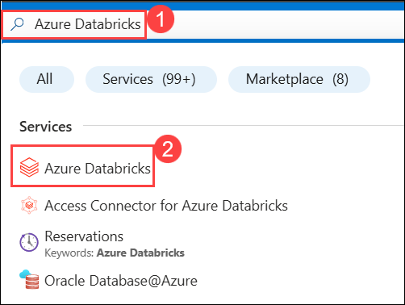

1. Review the pre-created Azure Databricks workspace named **dbw-purview-<inject key="DeploymentID" enableCopy="false"/>**. You will use this Databricks workspace for this lab and continue using the same resource throughout. Click on it.

    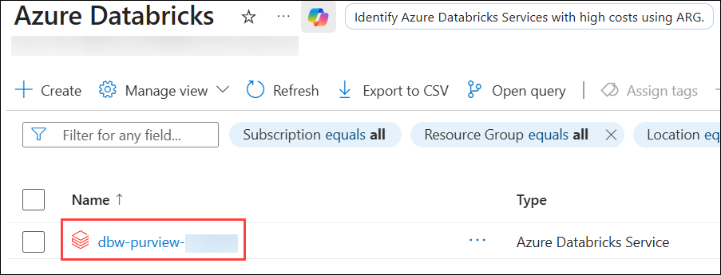
   
1. From the Overview page, click on **Launch Workspace** to verify access.

   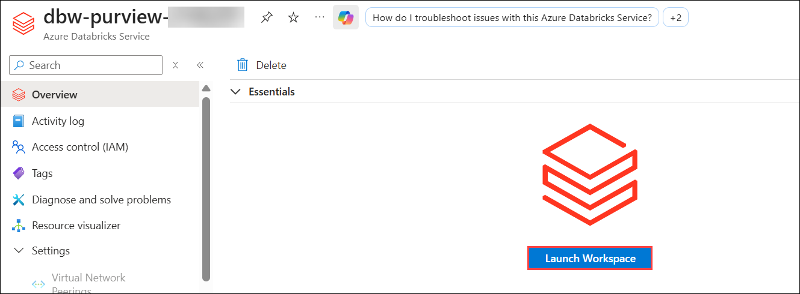
   
1. On the **Databricks** page, from the left sidebar, click **SQL Warehouses (1)** and verify that a warehouse (e.g., Starter Warehouse) exists. Then click on it **(2)**.
   
   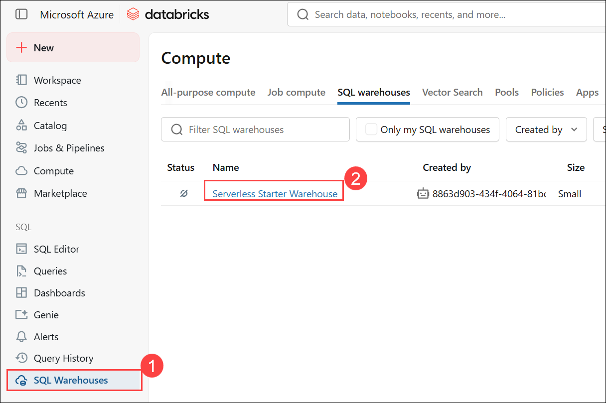

1. Verify that the status is in a **Running state**.
   
   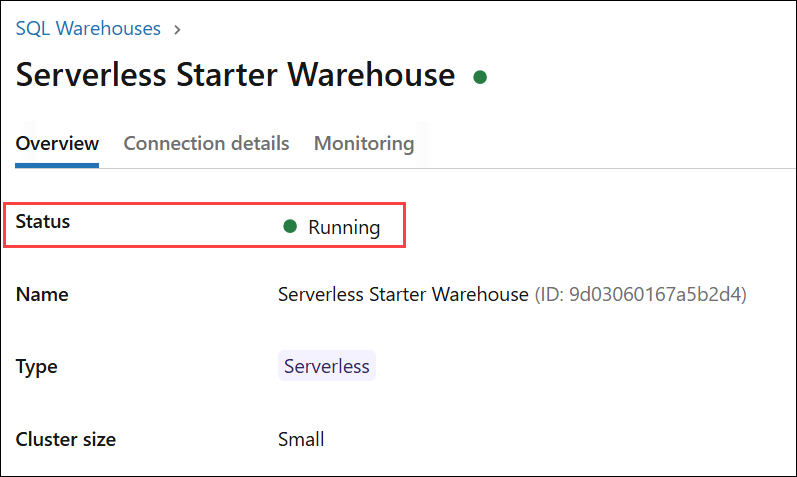

1. Click on **Connection details (1)**, then copy and record the **Server hostname (2)** and **HTTP path (3)**.

   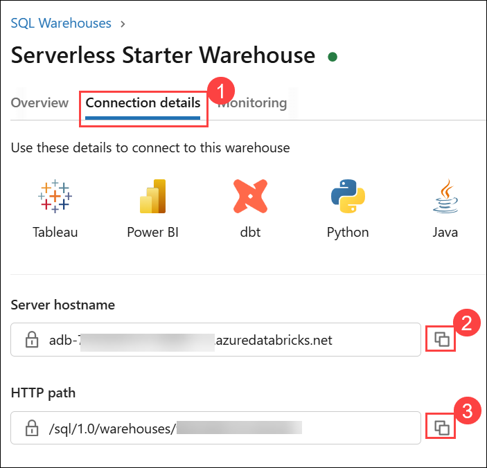
   
1. In the Databricks workspace, click **Catalog (1)** in the left sidebar. In the Catalog Explorer, click on the **Settings icon (2)** and select the **Metastore (3)** name.

   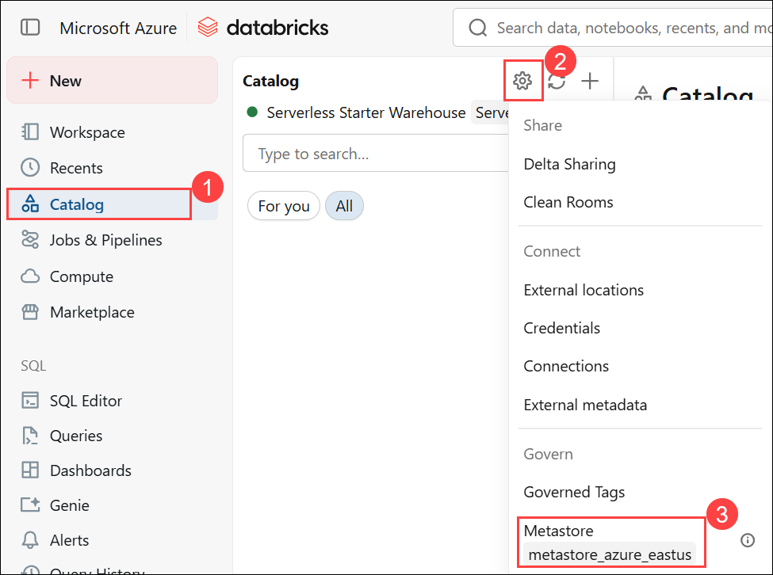

1. On the metastore details page, locate and copy the Metastore ID.

   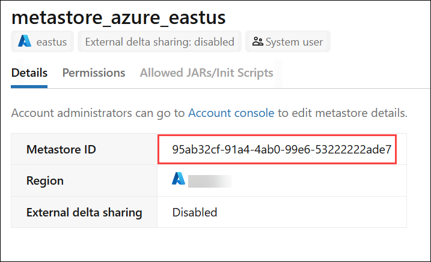

## Task 1: Register Databricks Workspace as a Data Source (10 min)

1. Switch to the **Purview portal** then click **Data Map** > **Data sources**.

   

1. On the **Data sources** page, click **Register (1)**. Search for and select **Azure Databricks Unity Catalog (2)**, then click **Continue (3)**.

   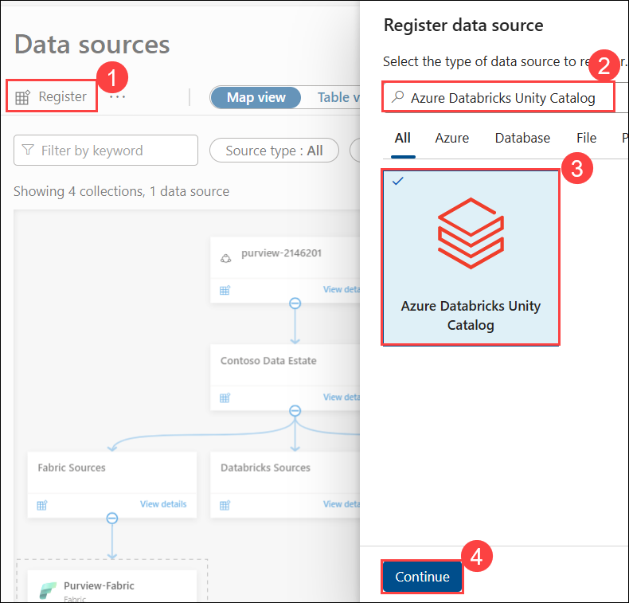
   
1. On the **Register data source (Azure Databricks Unity Catalog)** window, specify the following values, then click **Register (4)**:
    - Name: **Purview-Databricks-UC** **(2)**
    - Metastore ID: Paste the **Metastore** ID which you recorded in notepad **(3)**
    - Collection: Select **Databricks Sources (4)** (the sub-collection created in Lab 1)

      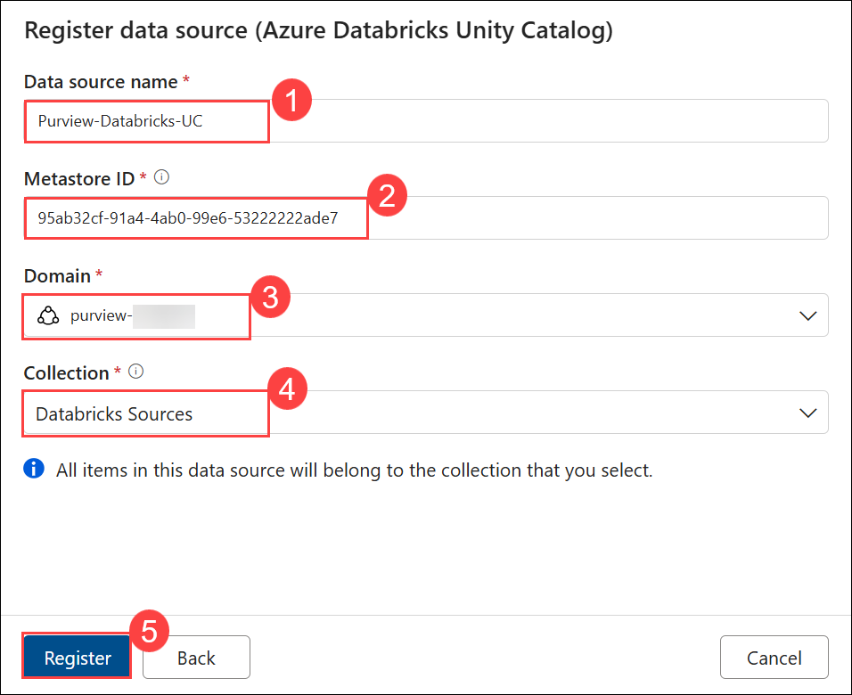
      
1. Verify **Purview-Databricks-UC** appears under **Databricks Sources** in the data map.

    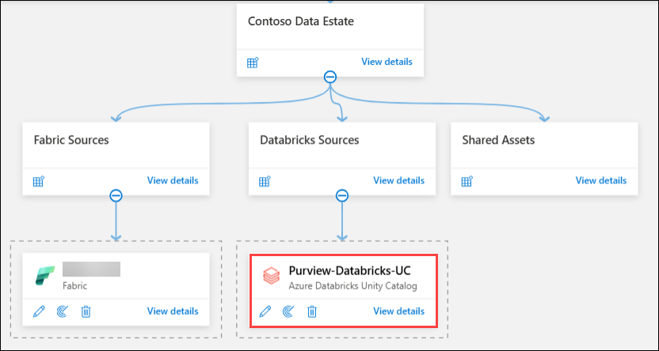

## Task 2: Configure Unity Catalog Connector (20 min)

> Purview authenticates to Databricks Unity Catalog using a **Personal Access Token (PAT)**. You'll generate a PAT in Databricks, store it in Azure Key Vault, then create a credential in Purview that references the Key Vault secret.

**Step 1: Generate a Personal Access Token in Databricks**

1. In the **Databricks workspace**, click your **username** (top-right corner) → **Settings**
2. Click **Developer** (under User section)
3. Next to **Access tokens**, click **Manage**
4. Click **Generate new token**
5. Configure:
   - **Comment**: `Purview scan token`
   - **Lifetime (days)**: `90`
6. Click **Generate** → **copy the token immediately** (you won't see it again)
   > Save it somewhere temporarily — you'll store it in Key Vault next

**Step 2: Store the PAT in Azure Key Vault**

7. In the **Azure portal**, go to your Key Vault (`kv-purview-{deploymentId}`)
8. Click **Secrets** (under Objects) → **+ Generate/Import**
9. Configure:
   - **Name**: `databricks-pat`
   - **Secret value**: paste the PAT from step 6
10. Click **Create**
11. Verify the secret `databricks-pat` appears in the secrets list

**Step 3: Connect Key Vault to Purview**

12. Go to the **Purview portal** (`https://purview.microsoft.com`)
13. Click **Data Map** → **Credentials** → **Manage Key Vault connections**
14. Click **+ New** and configure:
    - **Name**: `Purview-KeyVault`
    - **Subscription**: select your subscription
    - **Key Vault name**: `kv-purview-{deploymentId}`
15. Click **Create** → verify it shows **Connected**
    > If it fails: go to Key Vault → Access control (IAM) → add **Key Vault Secrets User** role to the Purview managed identity

**Step 4: Create a Credential in Purview**

16. In the Purview portal → **Data Map** → **Credentials** → **+ New**
17. Configure:
    - **Name**: `Databricks-PAT-Credential`
    - **Authentication method**: **Access Token**
    - **Key Vault connection**: `Purview-KeyVault`
    - **Secret name**: `databricks-pat`
18. Click **Create**

**Step 5: Test the Connection**

19. Go to **Data Map** → **Data sources** → click your Databricks source (`Purview-Databricks-UC`)
20. Click **+ New scan**:
    - **Connect via integration runtime**: Azure AutoResolveIntegrationRuntime
    - **Credential**: `Databricks-PAT-Credential`
    - **Workspace URL**: `https://adb-xxxxxxxxxx.xx.azuredatabricks.net` (your Databricks workspace URL from the Azure portal)
    - **HTTP path**: paste the SQL Warehouse HTTP path from "Before You Begin" step 4
21. Click **Test connection**
22. Wait for **Connection successful**
    > If it fails: verify the SQL Warehouse is Running, the PAT was copied correctly into Key Vault, and the Key Vault is connected to Purview
23. Click **Cancel** (we'll configure the full scan in Task 3)

**Expected Result**: PAT stored in Key Vault. Credential created in Purview. Connection test passes.

---

## Task 3: Scan Catalogs, Schemas, and Tables (15 min)

> The scan connects to Unity Catalog via the SQL Warehouse and extracts metadata for all catalogs, schemas, tables, and views that the PAT owner has access to.

**Step 1: Create the Scan**

1. In **Purview portal** → **Data Map** → **Data sources** → click your Databricks source
2. Click **+ New scan** and configure:
   - **Name**: `Scan-Databricks-UC`
   - **Connect via integration runtime**: Azure AutoResolveIntegrationRuntime
   - **Credential**: `Databricks-PAT-Credential`
   - **Workspace URL**: your Databricks workspace URL
   - **HTTP path**: your SQL Warehouse HTTP path
   - **Lineage extraction**: **Off** (keep it simple for this lab)
3. Click **Test connection** → verify it passes
4. Click **Continue**
   > The Unity Catalog connector scans all accessible catalogs — scoped scan is not available for this source type
5. Click **Continue** → **Scan rule set**: **System default**
6. **Scan trigger**: **Once**
7. Click **Continue** → review → **Save and Run**

**Step 2: Monitor Scan Progress**

8. Go to **Data sources** → your Databricks source → **Recent scans**
9. Wait for **Completed** status (typically 3-5 minutes)
10. Review scan summary — it should discover assets from the `samples` catalog:

    | Unity Catalog Level | What Purview Discovers |
    |--------------------|-----------------------|
    | **Metastore** | The Unity Catalog metastore asset |
    | **Catalog** | `samples` catalog |
    | **Schemas** | `nyctaxi`, `tpch`, `information_schema`, etc. |
    | **Tables** | Individual tables within each schema (e.g., `trips`, `customer`, `orders`) |
    | **Workspace** | Databricks workspace asset |

**Expected Result**: Scan completes successfully. Assets from the `samples` catalog discovered.

---

## Task 4: Validate Databricks Assets in Unified Catalog (15 min)

> Now verify that Databricks Unity Catalog assets appear in Purview alongside the Fabric assets from Lab 2.

**Step 1: Search for Databricks Tables**

1. Go to **Unified Catalog** → **Discovery** → **Data assets**
2. Search for `samples` → you should see the catalog and schema assets
3. Search for `trips` (from nyctaxi schema) → click on the table asset
4. Review:
   - **Schema**: column names and data types
   - **Hierarchy**: Metastore → samples → nyctaxi → trips
   - **Properties**: table type, storage location, catalog info

**Step 2: Explore the Catalog Hierarchy**

5. Go back → search for `tpch` → explore the TPC-H benchmark tables:
   - `customer`, `orders`, `lineitem`, `nation`, `part`, `region`, `supplier`, `partsupp`
6. Click on `customer` → review the **Schema** tab:
   - Columns like `c_custkey`, `c_name`, `c_address`, `c_nationkey`, `c_phone`, etc.
7. Note the hierarchy: **Metastore** → **Catalog** (`samples`) → **Schema** (`tpch`) → **Table** (`customer`)
   - This mirrors the Unity Catalog 3-level namespace: `catalog.schema.table`

**Step 3: Cross-Platform Search**

8. Now search for `dimension_customer` (from Fabric Lakehouse in Lab 2) — it should still appear
9. Compare the two customer tables side by side:

   | Attribute | Fabric (Lakehouse Table) | Databricks (Unity Catalog Table) |
   |-----------|------------------------|--------------------------------|
   | **Source** | Microsoft Fabric | Azure Databricks Unity Catalog |
   | **Location** | `Purview-Lab-WS` workspace | `samples.tpch` schema |
   | **Format** | Delta (OneLake) | Delta (Databricks managed) |
   | **Schema** | Customer Key, Customer, Category | c_custkey, c_name, c_address |
   | **Hierarchy** | Workspace → Lakehouse → Table | Metastore → Catalog → Schema → Table |

10. Key governance takeaway: From **one search bar** in Purview Unified Catalog, you can now find assets from both Fabric and Databricks. This is the value of a unified data catalog.

**Expected Result**: Databricks tables visible alongside Fabric assets in Unified Catalog. Cross-platform search works.

---

## Lab 3 Summary

| Task | What You Did | Time |
|------|-------------|------|
| 1 | Registered Databricks Unity Catalog as a data source | 10 min |
| 2 | Generated PAT, stored in Key Vault, created credential, tested connection | 20 min |
| 3 | Scanned Unity Catalog — discovered catalogs, schemas, and tables | 15 min |
| 4 | Validated Databricks assets and tested cross-platform search | 15 min |
| | **Total** | **60 min** |

**Next**: Lab 4 — Apply Classifications and Explore Data Lineage

