# Day 1 — Lab 3: Connect Databricks Unity Catalog to Purview

**Verify your Databricks workspace:**

1. In the Azure portal, from the search bar, search for and select **Azure Databricks**.

    

1. Review the pre-created Azure Databricks workspace named **dbw-purview-<inject key="DeploymentID" enableCopy="false"/>**. You will use this Databricks workspace for this lab and continue using the same resource throughout. Click on it.

    
   
1. From the Overview page, click on **Launch Workspace** to verify access.

   
   
1. On the **Databricks** page, from the left sidebar, click **SQL Warehouses (1)** and verify that a warehouse (e.g., Starter Warehouse) exists. Then click on it **(2)**.
   
   

1. Verify that the status is in a **Running state**.
   
   

1. Click on **Connection details (1)**, then copy and record the **Server hostname (2)** and **HTTP path (3)**.

   
   
1. In the Databricks workspace, click **Catalog (1)** in the left sidebar. In the Catalog Explorer, click on the **Settings icon (2)** and select the **Metastore (3)** name.

   

1. On the metastore details page, locate and copy the Metastore ID.

   

### Task 1: Register Databricks Workspace as a Data Source (10 min)

1. Switch to the **Purview portal** then click **Data Map** > **Data sources**.

   

1. On the **Data sources** page, click **Register (1)**. Search for and select **Azure Databricks Unity Catalog (2)**, then click **Continue (3)**.

   
   
1. On the **Register data source (Azure Databricks Unity Catalog)** window, specify the following values, then click **Register (4)**:
    - Name: **Purview-Databricks-UC** **(2)**
    - Metastore ID: Paste the **Metastore** ID which you recorded in notepad **(3)**
    - Collection: Select **Databricks Sources (4)** (the sub-collection created in Lab 1)

      
      
1. Verify **Purview-Databricks-UC** appears under **Databricks Sources** in the data map.

    

## Task 2: Configure Unity Catalog Connector (20 min)

> Purview authenticates to Databricks Unity Catalog using a **Personal Access Token (PAT)**. You'll generate a PAT in Databricks, store it in Azure Key Vault, then create a credential in Purview that references the Key Vault secret.

### Task 2.1: Generate a Personal Access Token in Databricks

1. In the **Databricks workspace**, click your **username (2)** (top-right corner) > **Settings (1)**.

   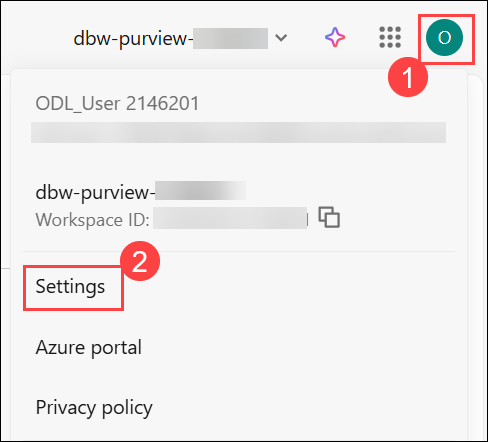
   
3. Click **Developer (1)** under User section, then next to **Access tokens**, click **Manage (2)**.

    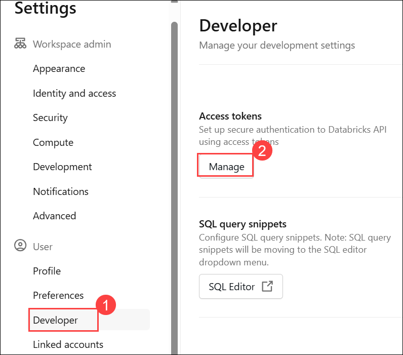

5. Click **Generate new token**.

   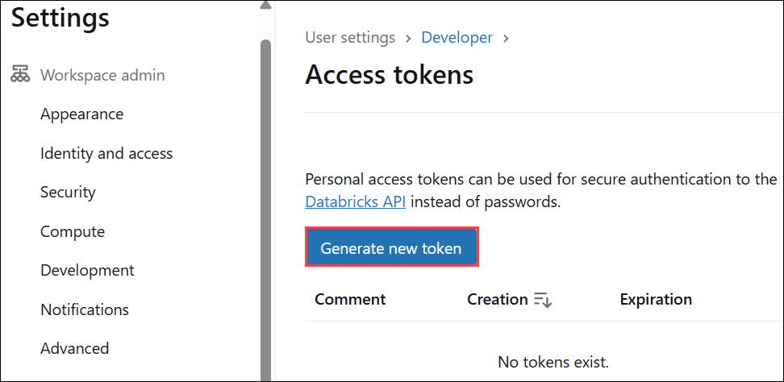
   
7. Configure:
   - **Comment**: **`Purview scan token` (1)**
   - **Lifetime (days)**: **`6` (2)**
   - Click **Generate (3)**

     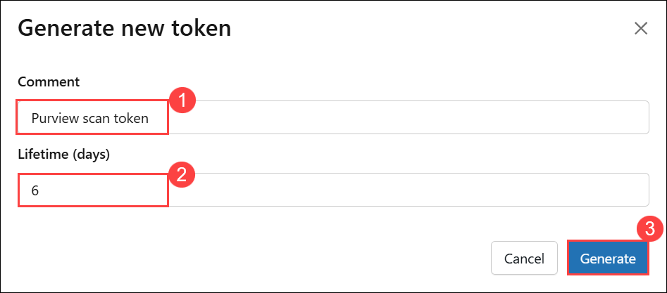

9. **Copy the token immediately (1)** (you won't see it again) then click on **Done(2)**.

    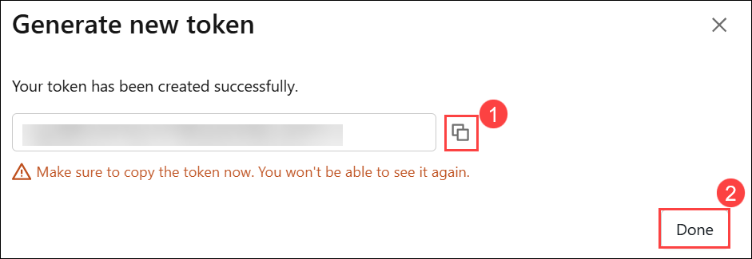

   > Record it **Notepad** later ypu will store it in Key Vault next

### Task 2.2: Store the PAT in Azure Key Vault**

1. In the Azure portal, from the search bar, search for and select **Key vaults**.

    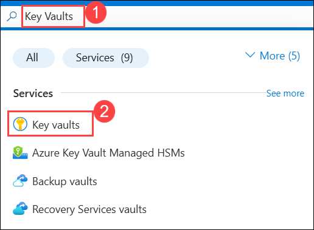

1. Select **Key vaults** name **kv-purview-<inject key="DeploymentID" enableCopy="false"/>**.

   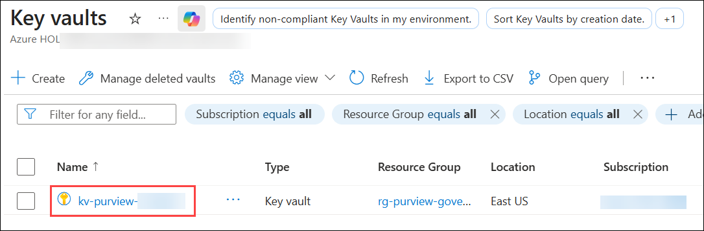

1. From the left navigation pane, under **Objects (1)** select **Secrets (2)**, then click on **+ Generate/Import (3)**.

   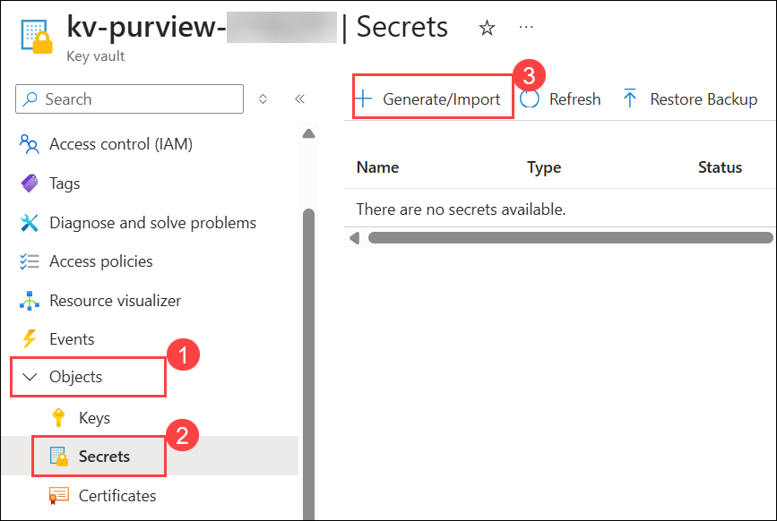

1. Configure:
   - **Name**: **`databricks-pat` (1)**
   - **Secret value**: paste the **PAT (2)** from step 6.
   - Click **Create (3)**.

     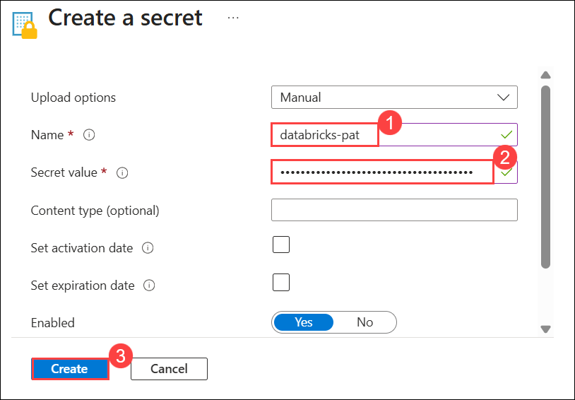
     
1. Verify the secret **`databricks-pat`** appears in the secrets list

     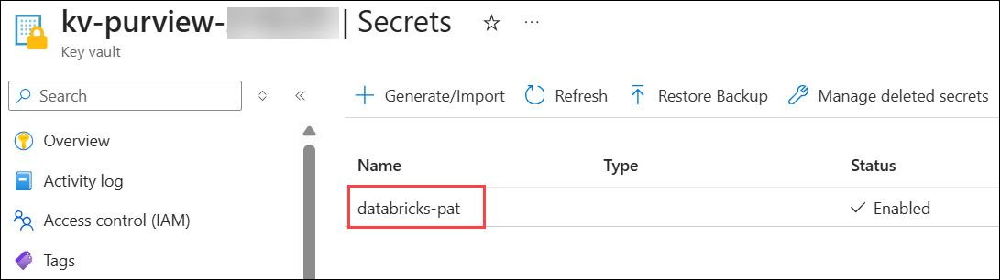
    
### Task 2.3: Connect Key Vault to Purview**

1. Navigate back to **Purview portal**.
1. Click **Data Map (1)** then expand **Source management (2)** then select **Credentials (3)** and click on **Manage Key Vault connections (4)**.

    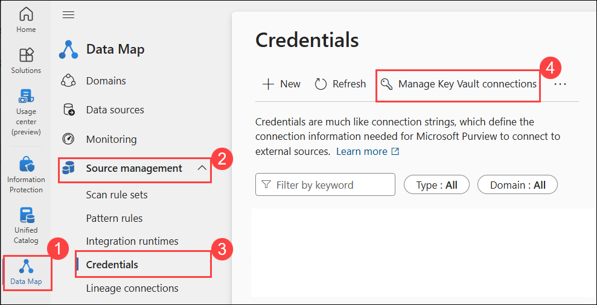

1. On the Manage Key Vault connections window, click **+ New** and specify the following:
    - **Name**: **`Purview-KeyVault`**
    - **Subscription**: **select your subscription**
    - **Key Vault name**: **`kv-purview-<inject key="DeploymentID" enableCopy="false"/>`**
    -  Click **Create**.
      
### Task 2.4: Create a Credential in Purview

1. Back on **Credentials** page, click on **+ New (1)** then specify the following details:

    - **Name**: **`Databricks-PAT-Credential` (2)**
    - **Authentication method**: **Access Token (3)**
    - **Key Vault connection**: **`Purview-KeyVault`(4)**
    - **Secret name**: **`databricks-pat` (5)**
    - Click **Create (6)**

      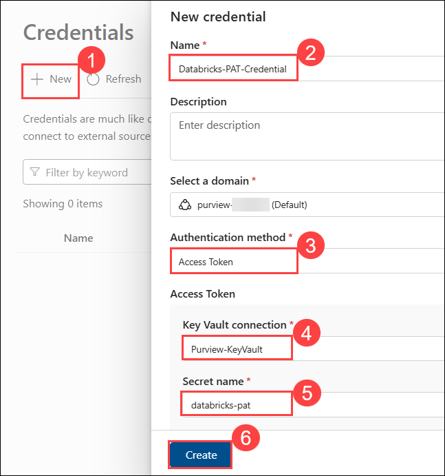

### Task 2.5: Test the Connection**

1. Go to **Data Map** click on **Data sources (1)** then under **Purview-Databricks-UC** select **+ New scan (2)**.

    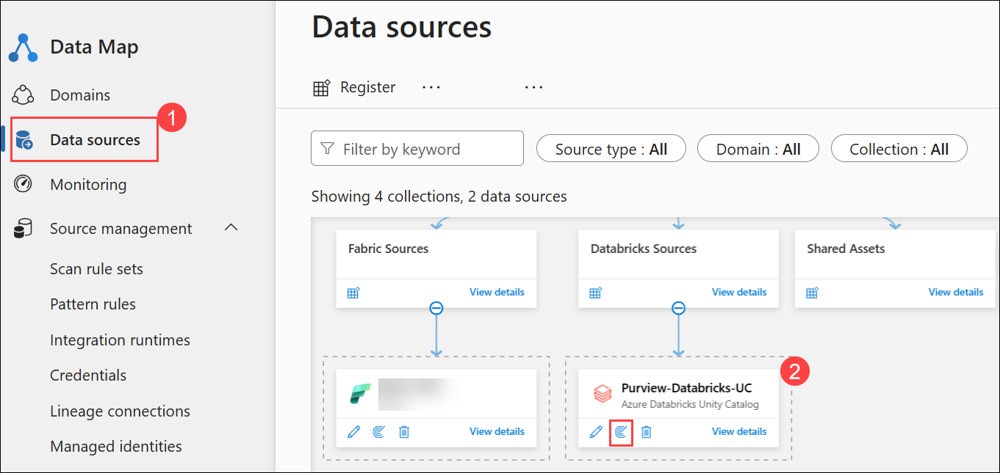

1. On Scan **Purview-Databricks-UC** window, specify the following details.
    - **Name**: **`Scan-Databricks-UC` (1)**
    - **Connect via integration runtime**: **Azure AutoResolveIntegrationRuntime (2)**
    - **Credential**: **`Databricks-PAT-Credential` (3)**
    - **Workspace URL**: paste the SQL Warehouse Server hostname `https://adb-xxxxxxxxxx.xx.azuredatabricks.net` **(4)**
    - **HTTP path**: paste the SQL Warehouse HTTP path **(5)**
    -  Click on **Test connection (6)**.
  
      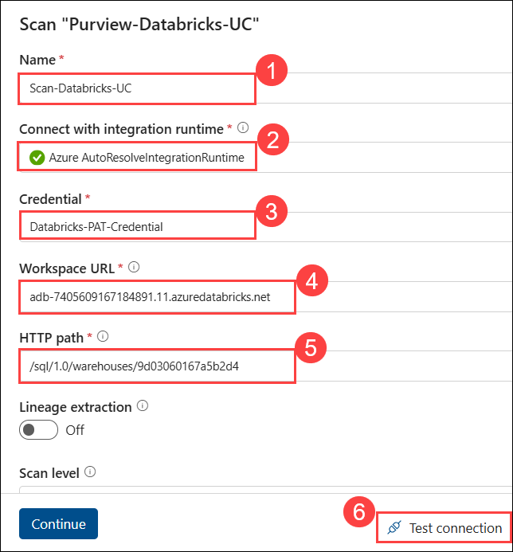

1. Wait for **Connection successful** then click on **Continue**.

    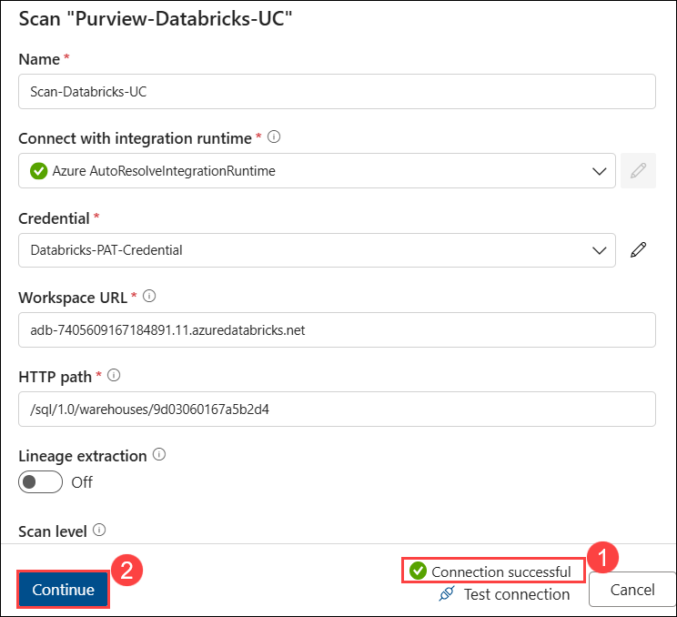

1. On the **Set a Scan trigger** select **Once**.

   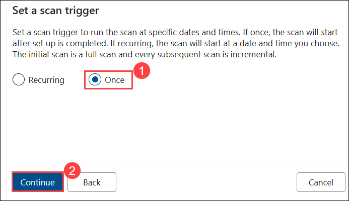
   
1. Click on **Save and Run**.

   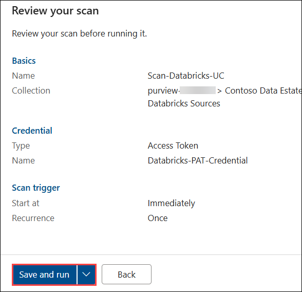

### Task 2.6: Monitor Scan Progress**

1. Go back to **Data sources** page then under **Purview-Databricks-UC** click on **View details**.

   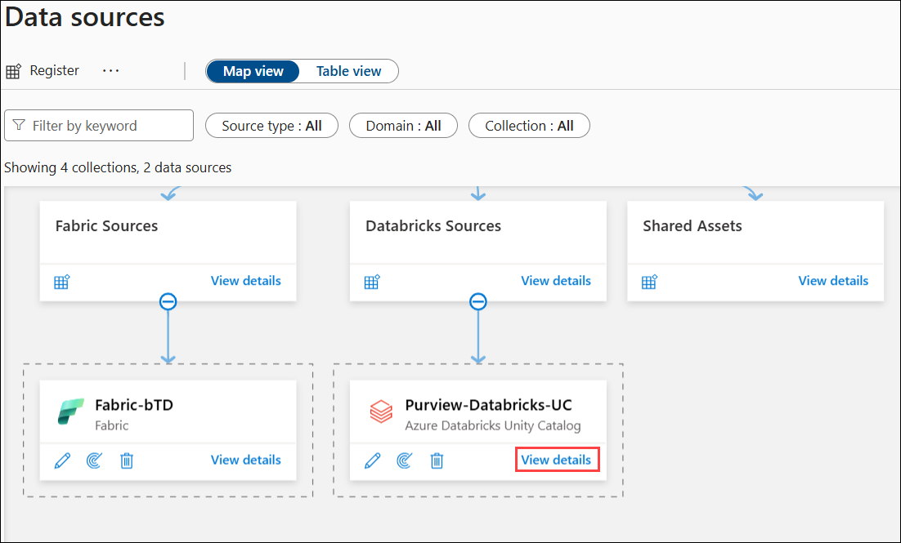
   
1. Wait for **Completed** status (typically 3-5 minutes)

    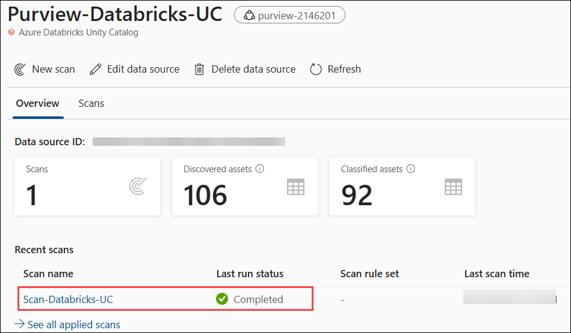

1. Review scan summary 

    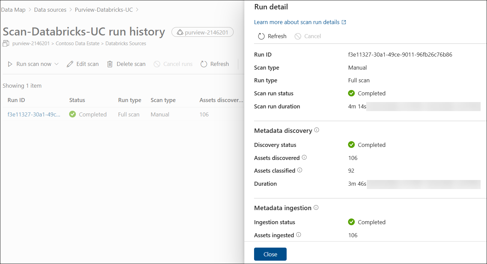

## Task 4: Validate Databricks Assets in Unified Catalog (15 min)

> Now verify that Databricks Unity Catalog assets appear in Purview alongside the Fabric assets from Lab 2.

### Task 4.1: Search for Databricks Tables**

1. Go to **Unified Catalog** → **Discovery** → **Data assets**
1. Search for `trips` (from nyctaxi schema) → click on the table asset

    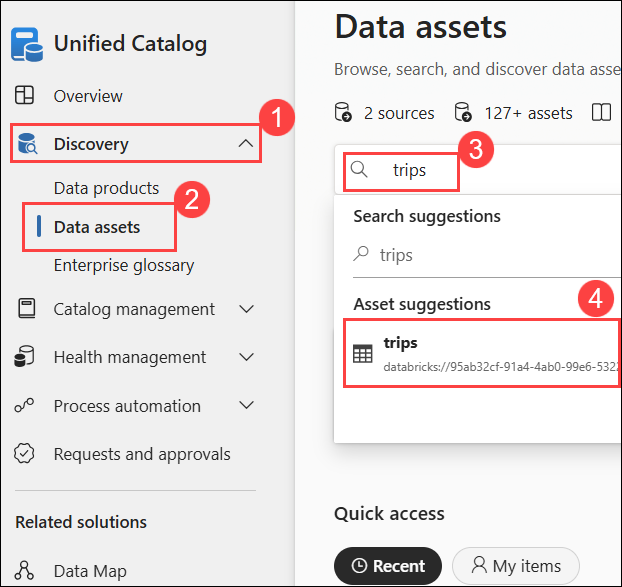

1. Review:
   - **Schema**: column names and data types
   - **Hierarchy**: Metastore → samples → nyctaxi → trips
   - **Properties**: table type, storage location, catalog info

     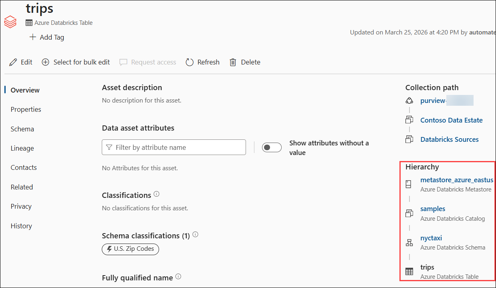
     
     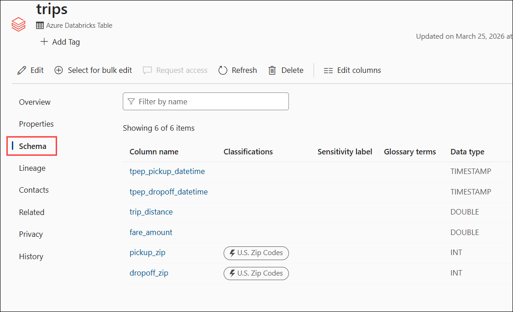

### Task 4.2: Explore the Catalog Hierarchy**

1. Go back → search for `tpch` → explore the TPC-H benchmark tables:
   - `customer`, `orders`, `lineitem`, `nation`, `part`, `region`, `supplier`, `partsupp`

   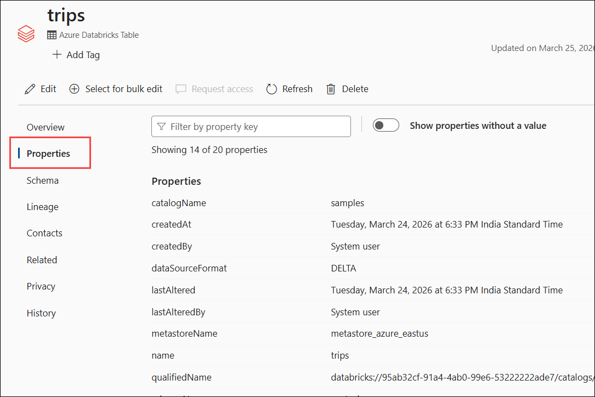
   
1. Click on `customer` → review the **Schema** tab:
   - Columns like `c_custkey`, `c_name`, `c_address`, `c_nationkey`, `c_phone`, etc.

      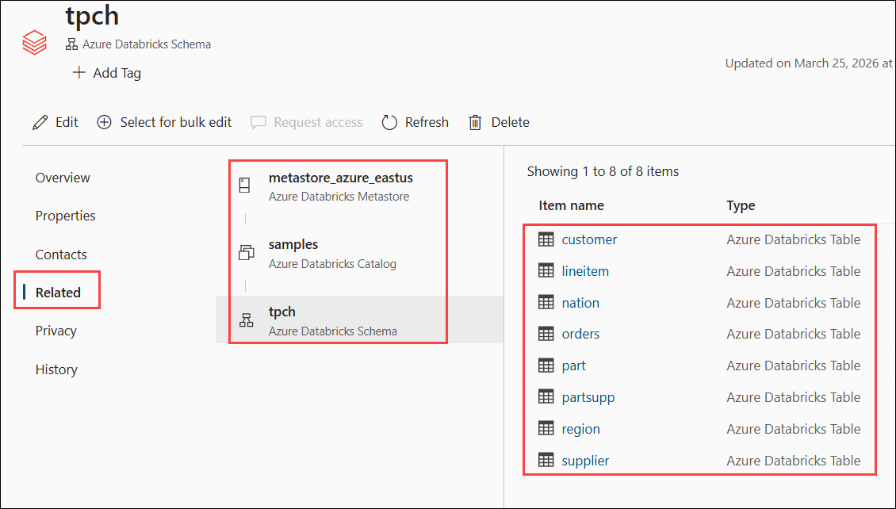
    
1. Note the hierarchy: **Metastore** → **Schema** (`tpch`) → **Table** (`customer`)
    
    - This mirrors the Unity Catalog 3-level namespace: `catalog.schema.table`
